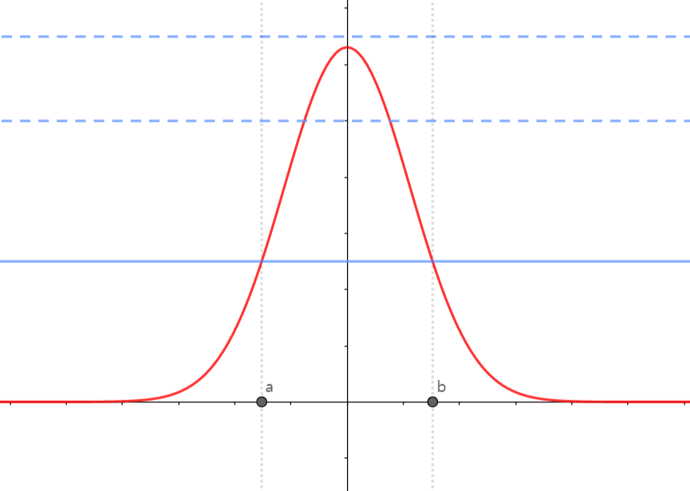

이번 포스트에서는 베이지안 통계에서의 전반적인 추론 방법에 대해 알아보겠습니다.

 

### 1. Bayesian inference

 

#### 1) Bayesian inference

 

Bayesian에서 $\theta$를 해석하기 위해 $\theta$의 posterior distribution을 이용합니다. Posterior distribution을 구하기 위해서는 $\theta$의 prior distribution과 likelihood function이 필요합니다.

 

##### (1) Prior distribution

Prior distribution은 두 종류로 구분할 수 있습니다. 

* Subjective prior : $\theta$에 대한 정보를 담고 있는 prior이며, posterior distribution에 큰 영향을 끼칩니다. 과거 $\theta$에 대한 정보가 있는 경우 사용합니다.
* Objective prior : $\theta$에 대한 정보가 적은 prior이고, posterior distribution에 영향을 크게 끼치지 않습니다. $\theta$에 대한 정보가 없을 때 사용합니다. 

사전 정보가 존재하는 경우 subjective prior를, 사전 정보가 없는 경우 objective prior를 사용합니다.

 

*example*

$\theta$ : 공장에서 불량품이 나오는 비율

이전 공장 조사를 통해서, $\theta \approx 0.2$알고 있다고 가정해봅시다.

이 경우, prior distribution을 설정할 때, 0.2 근방에서의 확률이 높도록 설정할 수 있습니다. 

예를 들어, prior distribution을 $\theta \sim Beta(\alpha, \beta)$로 설정해봅시다. 

이 때, $E(\theta)=\frac{\alpha}{\alpha+\beta}$임을 이용하여, $E(\theta)=0.2$가 되는 $\alpha, \beta$를 설정할 수 있습니다.

이 경우 사전 정보를 이용하여 prior distribution을 설정하였으므로, 이 prior는 subjective prior라고 말할 수 있습니다.

 

##### (2) Bayesian inference

 

관측된 data를 통하여 $\theta$를 추정하는 것이 목표입니다. Bayesian에서 이는 $\theta$의 posterior distribution

$$
\pi(\theta|x)
$$

를 구하는 것과 같습니다.

posterior distribution은 bayes theorem을 이용하여 prior와 likelihood에 관한 식으로 나타내어집니다.

$$
\pi(\theta | x) = \frac{\pi(\theta)f(x|\theta)}{f(x)}
$$

where 

$$
f(x) = \int \pi(\theta)f(x|\theta)d\theta
$$

observation을 통해서 $\theta$의 분포를 prior에서 posterior로 update하게 됩니다. 또한 posterior distribution을 통해 우리가 알고 싶은 정보는 $\theta$이므로, posterior distribution에서 $f(x)$의 중요도는 약간 떨어집니다. ($f(x)$는 distribution이 되도록 만들어주는 normalizing constant입니다.)

 

##### (3) Poseterior summaries

 

Posterior distribution을 알면 $\theta$에 대한 정보를 알 수 있고, posterior distribution의 mean, median, variance, 등등 다양한 통계량을 사용할 수 있습니다. 

* Posterior mean 

  

  
  $$
  E(\theta | x) = \int\theta\pi(\theta|x)d\theta
  $$
  
* Maximum a posteriori : MAP

$$
\hat{\theta} = \arg\max_\theta\pi(\theta|x)
$$

* Posterior variance

$$
\begin{aligned}

Var(\theta|x) &= E((\theta-E(\theta|x))^2 | x)\\
&=E(\theta^2|x) - (E(\theta|x))^2

\end{aligned}
$$

 

##### (4) Credible interval

 

Bayesian에서도 신뢰구간과 비슷한 역할을 하는 개념인 신용구간이 존재합니다.

 

**Definition : Confidence interval**

A random interval $(L(X), U(X))$ has $100(1-\alpha)\%$ frequentist coverage for $\theta$ if, before the data are gathered,

$$
P(L(X)<\theta<U(X) | \theta) = 1-\alpha
$$

위의 개념을 다시 정리하면, 반복적으로 추출한 데이터 set $X^{(1)}, X^{(2)}, ..., X^{(N)}$에 대해서

$$
\lim_{N\rightarrow \infty} \frac{1}{N}\Sigma_{i=1}^NI(L(X^{(i)})<\theta<U(X^{(i)})) = 1-\alpha
$$
를 만족합니다. 즉, 반복적으로 추출된 data로부터 구해진 신뢰구간 중 약 $1-\alpha$ 비율의 신뢰구간이 $\theta$를 포함합니다.

 

**Definition : Credible interval**

An interval $(L(x), U(x))$, based on the observed data $X=x$, has $100(1-\alpha)\%$ Bayesian coverage for $\theta$ if

$$
\pi(L(x)<\theta<U(x) | x) = 1-\alpha
$$

$\theta$를 random variable로 인식하기 때문에, credible interval을 정의할 때 posterior distribution에서의 확률값으로 정의합니다. 

또한 반복추출을 가정하였을 때의 결과를 다루는 confidence interval과는 달리, credible interval은 관측한 observation을 바탕으로 정의합니다.

$\theta$가 univariate가 아닌 multivariate인 경우에도 똑같이 credible interval을 정의할 수 있습니다. 다만 변수가 늘어나서 interval이라는 용어의 뜻과 맞지 않을수도 있어, **credible set**으로 정의합니다.

 

* **Definition : Credible set**

For some positive $\alpha$, a $100(1-\alpha)\%$ credible set $C_{\alpha}$ for $\theta$ is

$$
\begin{aligned}

\pi(\theta \in C_{\alpha} |x) &= \int_{C_{\alpha}}\pi(\theta|x)d\theta \\
&=1-\alpha

\end{aligned}
$$

하나의 posterior distribution에서 위의 정의를 만족하는 credible set은 무수히 많습니다. $(L(x), U(x))$를 적절히 조절해가면서 확률값이 $1-\alpha$가 되도록 만들면 되기 때문입니다. 따라서 credible set 중 특별한 방법을 통해 **highest posterior density set**을 정의합니다.

 

* **Definition : Hightes Posterior Density (HPD) set**

A $100(1-\alpha)\%$ HPD set for $\theta$ is a subset $C_\alpha \in \Theta$ defined by

$$
C_\alpha = \{\theta : \pi(\theta | x) \geq k\}
$$

where $k$ is the largest number such that

$$
\int _{\theta:\pi(\theta|x)\geq k}\pi(\theta|x)d\theta = 1-\alpha
$$

그래프를 통해 시각적으로 HPD의 의미를 이해할 수 있습니다.

지금 보이는 빨간색 그래프가 $\theta$의 posterior distribution입니다. 그리고 파란색 실선과 점선이 다른 $k$값을 나타냅니다. 위 그래프에서 가장 큰 k의 경우, posterior distribution과 만나지 않기 때문에,

$$
C_\alpha = \{\theta : \pi(\theta | x) \geq k\} = \emptyset
$$

입니다. 

두 번째와 세 번째 $k$의 경우 posterior distribution과 만나기 때문에, $C_{\alpha}$가 공집합이 아닙니다. 즉, 

$$
\int _{\theta:\pi(\theta|x)\geq k}\pi(\theta|x)d\theta \neq0
$$

을 만족합니다. 여기서, k값을 점점 작게 만든다면,  

$$
\int _{\theta:\pi(\theta|x)\geq k}\pi(\theta|x)d\theta
$$

값이 커지게 될 것입니다. 따라서 계속 작게 만들어 파란색 실선부분에서

$$
\int _{\theta:\pi(\theta|x)\geq k}\pi(\theta|x)d\theta = \int_a^b \pi(\theta|x)d\theta = 1-\alpha
$$

를 만족한다면, 이 때

$$
C_\alpha=(a, b)
$$

를 $\theta$의 $100(1-\alpha)\%$ highest credible set이라고 합니다.

 

#### 2) Pros and Cons

 

Bayesian approach에서의 장점은 다음과 같습니다.

* frequentist 입장에서의 결과보다 직관적으로 해석이 가능합니다.
* **prior distribution**을 통해 사전 정보를 고려하여 분석이 가능합니다.
* 여러 복합적인 문제(missing data, correlation, ..)에 대해 불확실성을 효과적으로 다룰 수 있습니다.

Bayesian approach에서의 단점은 다음과 같습니다.

* **Prior distribution** 선택에서 주관이 개입됩니다.
* frequentist 관점에서 접근하는 방법론, 해석이 유용하게 쓰이는 경우가 존재합니다.
* **계산 속도가 빠르지 않고, 문제가 복잡해질 경우 불안정합니다.**

 

지금까지 베이지안 통계에서의 전반적인 추론 방법에 대해 알아보았습니다. 질문과 오류 있으면 댓글 남겨주세요! 감사합니다!
