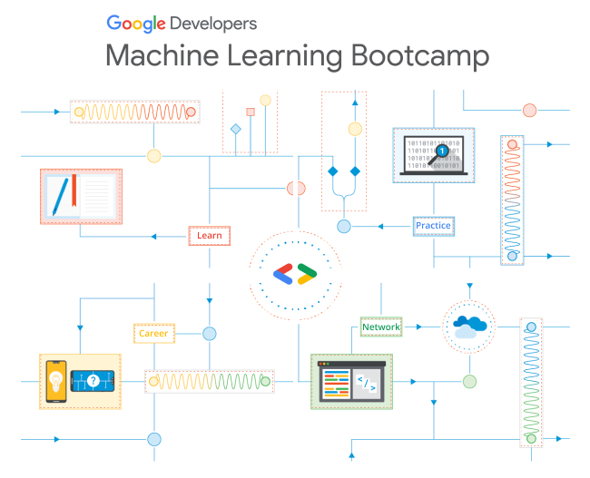

2022 여름에 진행되는 Google 머신러닝 부트캠프에 합격하였다! 

5월 중순 학기 발표 과제 준비로 정신이 없었던 와중, 커뮤니티에서 Machine Learning Bootcamp 선발 공고문을 보게 되었고, 부트캠프를 진행하면 이번 여름 방학은 의미있게 보낼 수 있겠다 싶어서 지원하였다.

그런데 왠걸? 지원서에 기본적인 프로그래밍 문제와 지원동기, 성공 경험, 장점 등등의 기본적인 자기소개서가 포함되어 있었다. 

통계학과 수학에는 나름 강점을 가지고 있지만 컴퓨터 프로그래밍에는 한없이 약해서, 문제를 푸는데 꽤 오래 걸렸다. 구글링과 책과 직접 코드를 돌려가며 문제를 겨우 풀고, 자기소개서에서는 이전 팀프레시 스타트업에서 프로젝트한 경험과 겨울방학 때 진행한 공모전 경험, 선형대수학 튜터로 활동한 성균공부방 내용을 기반으로 작성을 하였다. 

그리고 발표 당일, 합격 메일을 받고, 지금까지 열심히 진행중이다. 

(경쟁률이 무려 10:1이었다고 한다! 뿌듯!)

부트캠프에서 메인으로 다루는 내용 중 하나가 딥러닝인데, 제대로 배워본 적이 없어 이번 부트캠프를 계기로 기본적인 딥 러닝 관련 내용을 정리해볼까 한다. 

딥 러닝에 대한 기본적인 개념과 코드 적용이 주가 될 예정이다. 

방학동안 열심히 해서 좋은 경험을 얻을 수 있으면 좋겠다.

