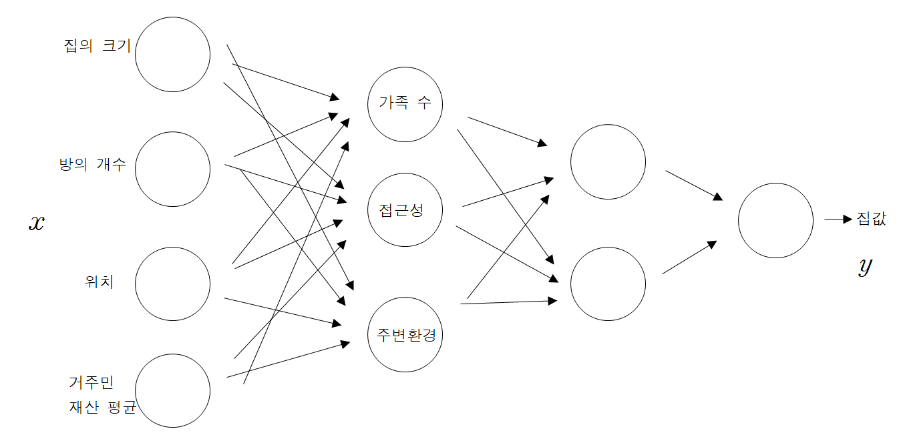
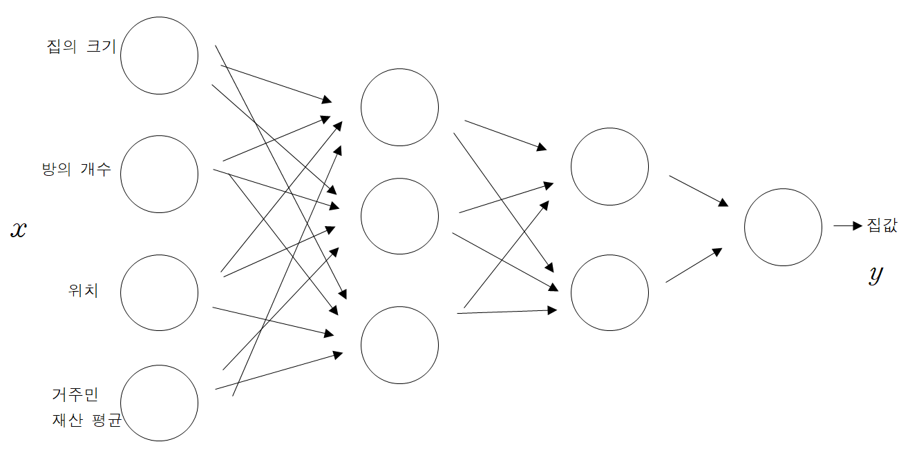
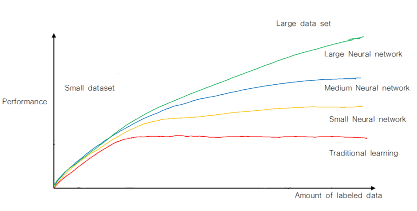

이번 포스트에서는 딥러닝이 무엇인지, 왜 딥러닝이 현재 유명해졌는지 알아보도록 하겠습니다.

 

### 1) Deep Learning

 

#### (1) Introduction to Deep learning

 

이전부터, 수학적, 통계적 모델링에서는 많은 모델들이 사용이 되어왔습니다. 문제 상황에 따라 적절한 모델을 사용하였는데, 예를 들어 예측, 추론해야 하는 결과값(response variable, outcome)이 연속(continuous)인 경우 회귀(regression) 모형을 사용하였고, outcome이 범주형(categorical)인 경우에는 분류(classification) 모형을 사용을 하였습니다. 각각의 분야에 속해있는 모형 또한 매우 많습니다. 수많은 모형 중 딥러닝은 어떤 모형을 말하는 것일까요? 다음의 예제를 살펴봅시다.

 

*example*

현재 우리나라의 부동산 집값을 예측하려고 합니다. 이를 예측하기 위해서 사용된 설명 변수(explanatory variable, feature)는 집의 크기, 방의 수, 위치, 집에 사는 사람들의 재산 평균이 있다고 가정해봅시다. 통계적/수학적 모형을 사용하지 않고, 추론할 수 있는 feature와 outcome간의 관계를 생각해봅시다.

1. 집의 크기가 크고 방의 수가 많을수록 가족 수가 많을 것이다. 또는 가족 수가 많을수록 집의 크기는 크고, 방의 수는 많을 것이다. 
   - 한 사람당 지낼 수 있는 일정한 공간이 필요하기에 가족 수가 많을수록 집의 크기가 클 경향을 가질 수 있습니다.
2. 집의 위치를 통해 접근성을 확인할 수 있다.
   - 즉, 위치를 통해 편의 시설과 얼마나 가까운지, 또는 먼지 확인할 수 있습니다.
3. 집의 크기, 방의 수, 집에 사는 사람들의 재산 평균 값을 통해 집 주변 환경을 확인할 수 있다.
   - 집이 위치한 곳의 환경을 집의 크기와 집에 사는 사람들의 재산을 통해 유추할 수 있습니다. 

4개의 feature들을 적절히 조합해서, 3개의 새로운 중간 feature를 만들었습니다. 이 3개의 중간 feature을 통해서 또다른 feature를 만들 수 있고, 이와 같은 작업을 계속 반복하여 최종적으로 집값이라는 결과값을 추론할 수 있습니다. 이를 도식화하면 다음과 같습니다. 

일반적으로, 어떤 집의 가격을 예상해보라고 하였을 때 다음과 같은 두 가지 답변이 있다고 생각해봅시다.

* 답변 1 : 이 집의 방의 크기는 상당히 크고 방 개수가 많고, 서울에 위치한 걸로 보아, 가격은 얼마 정도 될거야.
* 답변 2 : 이 집의 방의 크기와 방 개수를 보았을 때, 혼자 사는 것 같고, 집에 사는 사람의 재산을 보니 주변 환경 또한 좋을거야. 그리고 위치가 서울 중심이어서 접근성이 매우 좋고, 이러한 결과를 종합해보면 가격은 얼마 정도 될거야.

답변 1보다 답변 2를 들었을 때 조금 더 합리적인 답변이라고 생각할 수 있습니다. 물론 위에서 제시한 관계 1, 2, 3이 맞는지 확인하는 작업 또한 거쳐야 하지만, 만약 관계 1, 2, 3이 모두 맞다면, 답변 1보다 답변 2가 조금 더 그럴듯해 보이고, 납득 가능하다고 말할 수 있습니다.

그렇다면, 답변 2와 같은 메커니즘의 수학적, 통계적 모델을 만들어 봅시다. 답변 2처럼 주어진 feature를 적절히 조합하여 중간단계 feature을 만들고, 중간 단계 feature을 적절히 조합하여 다음 단계의 feature를 만드는 과정을 반복하여 최종적으로 예측한 outcome $\hat y$를 만들 수 있습니다.  

$x$값에 주어진 feature 값을 넣어주면, feature를 이용하여 중간 단계의 feature를 만들고, 중간단계의 feature을 이용하여 다음 단계의 feature을 만드는 작업을 반복하여 마지막 outcome값을 만들어주는 모델을 생각할 수 있습니다. 이를 적용한 모델이 딥러닝 모델, Neural network입니다! 여기서, input feature과 output을 제외한 중간단계의 feature들을 hidden unit이라고 합니다. 또한, input feature을 나타내는 층을 input layer, output을 나타내는 값을 output layer, hidden unit을 구성하는 각각의 층을 hidden layer라고 합니다. (notation에 대해서는 다음 포스트에 다시 설명하도록 하겠습니다.)

그렇다면 딥 러닝 모델이 2000년대 이후부터 많이 사용된 이유는 무엇일가요? 이에 대해서 두 가지 이유를 설명할 수 있습니다.

 

#### (2) Why Deep learning?

 

최근 딥러닝이 많이 사용되어진 이유를 다음의 그래프로 설명할 수 있습니다.

현재 그래프의 x축은 데이터의 양이고, y값은 모델의 성능입니다. 4개의 모델이 존재하는데, 빨간 그래프는 전통적인 머신러닝 모델(선형 모델, 트리 기반 모델, SVM 등등등...), 노란색 그래프는 layer의 수가 적은 neural network, 파란색 그래프는 layer 수가 적당히 있는 neural network, 녹색 그래프는 layer의 수가 매우 많은 neural network입니다.

2000년대 이전까지만 해도 데이터의 수가 그렇게 많지 않았습니다. 위의 그래프에서 데이터의 수가 적은 부분을 살펴보면, 4개의 모델 성능에 차이가 그렇게 많이 나지 않습니다. 모델링에 있어 시간이 오래 걸리고, 결과 해석에 약점을 가지는 딥러닝보다는 속도도 빠르고, 해석력도 좋은 다른 모형을 사용을 했다고 합니다. 하지만, 2000년대 이후 기술의 급격한 발전으로 인해 저장된 데이터의 양이 매우 많아졌고, 추가적으로 layer의 수가 큰 neural network를 빠르게 학습시킬 수 있게 되었습니다. 데이터의 양이 많은 부분을 살펴보면, 기존의 모델들보다 neural network의 성능히 월등히 증가한 것을 알 수 있습니다. 이로 인해 데이터의 양이 많은 문제 상황에 대해서 neural network를 사용하게 되었고, neural network가 지금까지 많이 사용하는 모델 중 하나가 되었습니다.

정리하면 neural network가 급격하게 발전하게 된 이유는

1. 학습에 사용할 수 있는 데이터의 양이 증가
2. large neural network를 학습할 수 있는 환경

두 가지로 정리할 수 있습니다. 

 

지금까지 딥러닝의 기초적인 방법론은 무엇인지, 왜 딥러닝이 현재 많이 사용하는 모델 중 하나가 되었는지에 대해 알아보았습니다. 다음 포스트에서는 neural network의 가장 기본적인 구조를 알아볼 수 있는 logistic regression에 대해서 알아보도록 하겠습니다.  질문이나 오류가 있으면 댓글 남겨주세요! 감사합니다!

 

