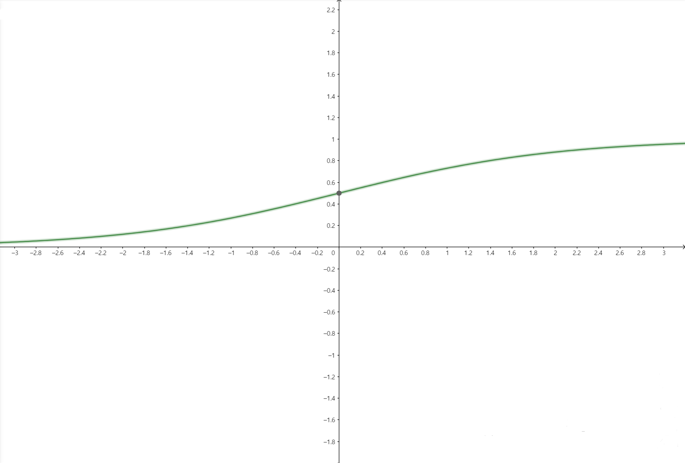
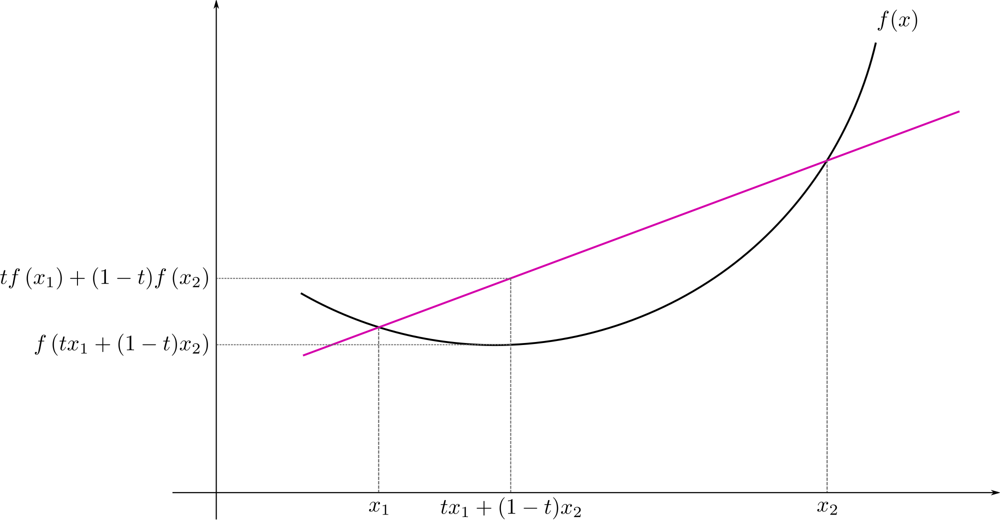
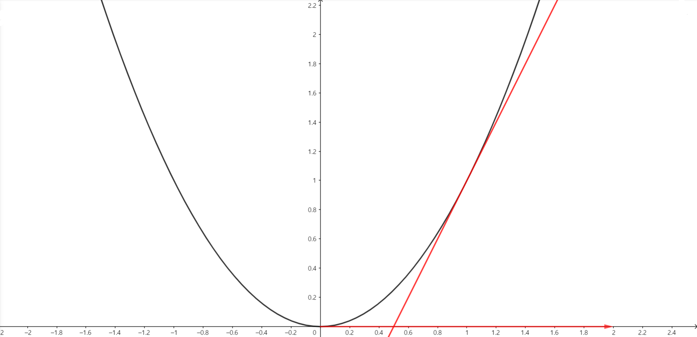

이번 포스트에서는 logistic regression에 대해서 알아보도록 하겠습니다.

 

### 1) Notation

 

앞으로 모형을 설명할 때 사용할 변수와 관측값을 다음과 같이 정의를 하겠습니다.

* $(\boldsymbol x, \boldsymbol y)$ : $\boldsymbol x \in \mathbb R^{n_x}$ : feature, $\boldsymbol y \in \mathbb R^{n_y}$ : Outcome입니다. 

* $\{(\boldsymbol x^{(1)}, \boldsymbol y^{(1)}), ..., (\boldsymbol x^{(m)}, \boldsymbol y^{(m)})\}$ : $m$개의 training example입니다. 위첨자에 $()$를 이용하여 정의합니다.

* $m$개의 train data, $M$개의 test data가 존재합니다. 

* 해당 training example을 하나의 matrix로 만들 수 있습니다. 다음과 같이
  $$
  X = \begin{bmatrix}\boldsymbol x^{(1)} & \boldsymbol x^{(2)}&...&\boldsymbol x^{(m)} \end{bmatrix}
  $$
  만들 수 있으며, 해당 matrix의 size는 $\boldsymbol n_x \times m$입니다. 또한, $\boldsymbol y$ 또한 matrix로
  $$
  Y = \begin{bmatrix}\boldsymbol y^{(1)} & \boldsymbol y^{(2)} & ... & \boldsymbol y^{(m)} \end{bmatrix}
  $$
  만들 수 있습니다. 이 때 $Y$는 $ n_y \times m$ matrix입니다.

 

### 2) Logistic Regression

 

#### (1) Types of Machine learning problem

 

머신러닝에서 다루는 문제를 크게 Supervised Learning, Unsupervised learning으로 구분합니다.

 

* **Supervised Learning**

  데이터가 주어질 때 설명변수(feature, explanatory variable)과 반응변수(outcome, response variable)이 주어지는 문제입니다. Outcome의 종류에 따라 regression과 classfication으로 구분합니다.

  * **Regression**

    Outcome 값이 연속적인 값을 가질 때 Regression 문제라고 합니다. 집 값 예측 문제, 주식 가격 예측 문제 등이 regression 문제에 해당합니다.

    

  * **Classification**

    Outcome 값이 범주형 값을 가질 때 Classification 문제라고 합니다. 사진이 고양이인지 아닌지 예측하기, 특정 질병 유무 예측하기 등이 classfication 문제에 해당합니다.

* **Unsupervised Learning**

  데이터가 주어질 때 feature만 주어지는 문제입니다. 맞추어야 할 값인 outcome이 없기 때문에, 데이터의 feature 분포를 통해 데이터의 특징을 찾아내는 작업을 진행합니다. 

이 중 supervised learning 중 classification 문제에서, outcome이 가질 수 있는 값이 2개인 문제에서 사용하는 모델 중 하나가 logistic regression입니다. 

 

#### (2) Logistic Regression

 

Outcome이 가질 수 있는 값이 2개(Binary)일 때, logistic regression을 생각해볼 수 있습니다. Classification 문제에서, feature 값을 이용하여 해당 observation의 $y$값이 무엇인지 확인하려면, $y$가 가질 수 있는 label 각각에 대한 확률을 확인해보아야 합니다. 즉

$$
P(y = 1 \mid x), P(y=0 \mid x)
$$

두 확률을 구한 뒤, 확률값이 큰 label을 예측값으로 도출할 수 있습니다. 즉, 데이터가 주어졌을 때, outcome label을 가질 확률을 모델링함으로써 outcome값을 예측 또는 추정할 수 있습니다. 이 때, 무턱대고 다음과 같이

$$
P(y=1 \mid x) = \beta_0 + \beta_1x
$$

와 같이 선형식으로 작성하게 되면 문제가 발생합니다. 이는 $x$의 값이 연속이라면, $\beta_1$이 0이 아닌 이상 $\beta_0+\beta_1 x$가 가질 수 있는 값은 실수 전체값입니다. 하지만 $P(y=1 \mid x)$는 확률값이기 때문에, 0과 1의 값 사이에서 정의되어야 합니다. 즉, 선형식으로 작성하게 되면 $x$값에 따라 확률 범위를 벗어나 문제가 발생할 수 있습니다.

따라서 우변의 식에 특정한 함수를 합성시켜 치역값이 0과 1 사이의 값이 되도록 조정을 해줍니다. Logistic regression에서 조정해주는 함수를 sigmoid 함수라고 합니다.(통계에서는 expit 함수라고 합니다.)

$$
\sigma(x) = \frac{\exp(x)}{1+\exp(x)}
$$

만약 $x$값이 무한히 커진다면($\infty$), $\sigma(x)$의 값은 1로 수렴합니다. 한편, $x$값이 무한히 작아진다면($-\infty$), $\sigma(x)$의 값은 0으로 수렴합니다. 그리고 $x$가 0일 때, $\sigma(0)=\frac{1}{2}$가 됩니다. 

위의 $\beta_0+\beta_1x$ 식을 $x$가 $\mathbb R^{n_x}$에 속할 때에도 적용하기 위해, 벡터를 이용하여 정의하기 위해 weight vector $\boldsymbol w$와 bias  $b$를 적용하면 다음과 같이 표현할 수 있습니다.

$$
P(y=1 \mid \boldsymbol x) = \sigma(\boldsymbol w^T\boldsymbol x + b) = \frac{\exp(\boldsymbol w^T\boldsymbol x + b)}{1 + \exp(\boldsymbol w^T\boldsymbol x + b)}
$$

모든 $y$가 가질 수 있는 outcome에 대해서 확률의 합은 1이 되어야 하므로

$$
P(y =1  \mid \boldsymbol x) = 1-P(y=1 \mid \boldsymbol x) = \frac{1}{1+\exp(\boldsymbol w^T\boldsymbol x + b)}
$$

 가 됩니다.

 

#### (3) Cost function

 

위에서와 같이 $\boldsymbol x$가 주어졌을 때 $y=1$일 확률을 

$$
P(y=1 \mid \boldsymbol x) = \sigma(\boldsymbol w^T\boldsymbol x + b) = \frac{\exp(\boldsymbol w^T\boldsymbol x + b)}{1 + \exp(\boldsymbol w^T\boldsymbol x + b)}
$$

다음과 같이 정의하였을 때, 우리의 목표는 $\boldsymbol w, b$를 찾는 것입니다. (이를 제외한 나머지 값은 다 알고 있기 때문입니다.) 그렇다면 어떤 $\boldsymbol w, b$를 찾아야 할까요. 주어진 데이터 $(\boldsymbol x^{(1)}, y^{(1)}), ..., (\boldsymbol x^{(m)}, y^{(m)})$에 대해서 만약

$$
y^{(i)} = 1
$$

이라면, 

$$
P(y=1 \mid \boldsymbol x = \boldsymbol x^{(i)})
$$

값이 커야 합니다. $y=1$이기 때문이죠. 반대로, 

$$
y^{(i)} = 0
$$

이라면

$$
P(y=0 \mid \boldsymbol x = \boldsymbol x^{(i)}) = 1- P(y=0 \mid \boldsymbol x = \boldsymbol x^{(i)})
$$

의 값이 커야 합니다. 위 두식을 한번에 정의하는 방법은 다음과 같습니다.

$$
P(y=j \mid \boldsymbol x = \boldsymbol x^{(i)}) = P(y=1 \mid x=\boldsymbol x^{(i)})^jP(y=0 \mid x= \boldsymbol x^{(i)})^{1-j}
$$

만약 $j=1$이라면, $P(y=0 \mid x=\boldsymbol x^{(i)})$항이 사라지고, $j=0$이라면, $P(y=1 \mid x=\boldsymbol x^{(i)})$항이 사라집니다. 여기서

$$
\hat{y}^{(i)} = \sigma(\boldsymbol w^T\boldsymbol x^{(i)} + b)
$$
로 설정하면 위의 식에 logistic regression 모형을 적용하면

$$
P(y=y^{(i)} \mid \boldsymbol x = \boldsymbol x^{(i)}) = (\hat{y}^{(i)})^{y^{(i)}}(1-\hat{y}^{(i)})^{1-y^{(i)}}
$$

가 됩니다. 계산의 편의를 위해 양변에 log를 취하면

$$
\log P(y=y^{(i)} \mid \boldsymbol x = \boldsymbol x ^{(i)}) =y^{(i)}\log(\hat{y}^{(i)})+(1-y^{(i)})\log(1-\hat{y}^{(i)})
$$

가 됩니다. 해당 값이 클수록 실제 y값을 맞출 확률이 크다는 뜻이니, 위의 값이 커야 합니다. 여기서 계산상의 편의를 위해 양변에 -를 곱한

$$
L(\hat{y}^{(i)}, y^{(i)}) = -\log P(y=y^{(i)} \mid \boldsymbol x = \boldsymbol x ^{(i)}) = -y^{(i)}\log(\hat{y}^{(i)})-(1-y^{(i)})\log(1-\hat{y}^{(i)})
$$

값을 $i$번 째 observation에 대한 **loss**이고 이를 일반화한
$$
L(\hat{y}, y )= -y\log(\hat{y})-(1-{y})\log(1-\hat{y})
$$

다음 식을 logistic regression에서의 **loss function**이라고 합니다. Loss는 작을수록 실제 $y$값을 얻을 확률이 큽니다.

 이러한 observation이 $m$개 있으므로, $m$개의 데이터에 대해 위의 값을 모두 더하고(더하는 이유를 알려면 likelihood와 log-likelihood에 대해 알아야 합니다. appendix 참고) 개수로 나눈

$$
J(\boldsymbol w, b) =\frac{1}{m}\sum_{i=1}^mL(\hat{y}^{(i)}, y^{(i)})
$$

를 **Cost function**이라고 합니다. 즉, 우리가 찾는 $\boldsymbol w, b $는 다음 cost function을 최소화시키는 값입니다. 

우리가 구해야 하는 값과 최소화시켜야 하는 함수를 알게 되었으니, 다음은 어떤 방법으로 최소화를 시킬까입니다. 이 때 사용되는 방법이 Gradient descent입니다. 

 

#### (4) Gradient Descent

 

위에서 계산상의 편의를 위해 log 함수를 붙이거나, -를 붙이는 작업을 하였습니다. 이러한 작업을 한 이유가 Gradient Descent를 간단히 적용하기 위해서인데요. Gradient Descent 방법을 적용하기 위해서는 convex 함수에 대해서 알아야 합니다. 

 

**Definition : Convex function**

$f$ is called convex if and only if

For all $0\leq t < 1$ and all $x_1, x_2 \in X$, 

$$
f(tx_1 +(1-t)x_2) \leq tf(x_1) +(1-t)f(x_2)
$$

다음 조건을 만족하는 함수를 convex function이라고 정의합니다. 2차원 평면에서 함수를 그렸을 때 아래로 볼록한 함수를 convex function으로 정의를 합니다. 

Monotone(감소하지 않는 함수 또는 증가하지 않는 함수)이 아닌 Convex function이 가지는 중요한 특징은 다음과 같습니다. 

1. **최솟값이 하나로 존재한다.**
2. 최댓값은 존재하지 않는다.

또한 만약 convex function이 충분히 smooth해서 미분이 충분히 가능하다면, convex function이 최소가 되는 지점은 그 지점에서 미분했을 때 0이 됩니다. 즉

$$
f(c) : minimum \ of \ f(\cdot) \Rightarrow f'(c) =0
$$

만약, $\boldsymbol x$가 벡터라면, $\boldsymbol x = \boldsymbol c$에서 $f$가 최솟값을 가지면, $\boldsymbol x = \boldsymbol c$에서의 gradient가 0이 됩니다. 

$$
f(\boldsymbol c) : minimum \ of \ f(\cdot) \Leftrightarrow gradient \ of \ f(\cdot) \ at \ \boldsymbol x = \boldsymbol c \ is \ 0
$$

현재 우리가 구해야 하는 cost function

$$
J(\boldsymbol w, b)
$$

를 최소로 만드는 $\boldsymbol w, b$에서의 $J$의 gradient는 0이 됩니다.

하지만, 현재 $J(\boldsymbol w, b)$의 gradient를 구한다고 하더라도, $\boldsymbol w$의 차원에 따라 풀어야할 식이 많아지기 때문에, 실제로 정확한 값으로 나오지는 않습니다. 따라서 정확한 값을 구하는 대신 근사한 값으로 대체하는 방법인 gradient descent를 사용합니다.

 

**Meaning of Gradient**

Gradient의 의미를 확인하기 위해 다음 함수를 생각해봅시다.

$$
f(x) = x^2
$$

$f(x)$의 gradient인 derivative

$$
f'(x) = 2x
$$

입니다. $x=1$일 때의 값은

$$
f'(1) = 2
$$

입니다. 여기서, 중요한 점은 결과값의 부호를 살펴보시기 바랍니다.

검은색 그래프가 $f(x) =x^2$, 빨간색 직선 그래프가 $x=1$에서의 $f(x)$의 접선인 $y=2x-1$, 마지막으로 x축에 표시된 벡터가 $(2, 0)$ 벡터입니다. 

이 때 벡터의 $x$값만 살펴보면 $2$로, $x=1$에서의 gradient 값을 뜻합니다. 

**핵심은 방향입니다. $x$가 $f(x)$의 $x=1$에서의 gradient방향으로 증가하면 $f(x)$는 어떻게 되나요? 바로 증가하게 됩니다!** 

마찬가지로, $x=-1$에서의 gradient를 구하면 $-2$가 되는데, 이 방향으로 $x$를 변화시키면 $f(x)$는 증가하게 됩니다.

정리하면, **Gradient 방향으로 $\boldsymbol x$값을 이동시켰을 때, $f(\boldsymbol x)$값이 가장 급격하게 증가합니다.**  이를 뒤집어서 생각하면

* **Gradient 반대 방향으로 $\boldsymbol x$값을 이동시켰을 때, $f(x)$값이 가장 급격하게 감소합니다.**

이 원리를 이용하여 최솟값을 찾는 방법이 gradient descent 방법입니다. 

 

**Gradient Descent**

Cost function $J(\boldsymbol w, b)$에 대해 gradient descent는 다음의 순으로 진행됩니다.

1. 초기값 $\boldsymbol w, b$를 설정합니다.
2. 반복적으로
   1. $\boldsymbol w, b$에서의 gradient를 구합니다. 해당 gradient를 $\frac{\partial J(\boldsymbol w,b)}{\partial\boldsymbol w}, \frac{\partial J(\boldsymbol w, b)}{\partial b}$라고 정의합니다.
   2. $\boldsymbol w := \boldsymbol w -\alpha \frac{\partial J(\boldsymbol w,b)}{\partial\boldsymbol w} $
   3. $b := b - \alpha \frac{\partial J(\boldsymbol w, b)}{\partial b}$
3.  $\frac{\partial J(\boldsymbol w,b)}{\partial\boldsymbol w}, \frac{\partial J(\boldsymbol w, b)}{\partial b}$이 0에 가까워질 때까지, 또는 특정 횟수까지 2번을 반복합니다. 

**Gradient의 반대방향으로 이동시켰을 때 $J(\boldsymbol w, b)$값이 가장 급격하게 감소하기 때문에, 주어진 $\boldsymbol w, b$에서 gradient의 반대방향으로 조금씩 이동하여 최솟값을 찾는 방법이 Gradient descent 방법입니다.**

 

지금까지 Logistic regression과 Cost function, Gradient descent에 대해 알아보았습니다. 다음 포스트에서는 이어서 computation graph을 통한 실제 gradient descent 계산 방법에 대해서 알아보도록 하겠습니다. 질문이나 오류 있으면 댓글 남겨주세요! 감사합니다!

 

### Appendix : Maximum Likelihood Estimation

 

확률변수 $Y_1, ..., Y_n$이 있고, 이들은 각각 독립적으로 다음과 같은 확률밀도함수를 가집니다.

$$
Y_i \sim  f_{Y_i}(y ; \theta)
$$

$\theta$는 확률밀도함수를 구성하는 값(또는 모집단을 설명하는 값)으로 parameter(모수)라고 합니다. 만약 $\theta$의 값을 정확하게 알고 있다면, $Y_i$의 분포를 정확하게 알고 있으므로, $Y_i$에 대해 완벽하게 설명을 할 수 있습니다. 하지만 $\theta$를 모르기 때문에, 우리는 위의 밀도함수로부터 추출된  $Y_1, ..., Y_n$인 $y_1, ..., y_n$을 통하여 $\theta$를 추정하게 됩니다. 그렇다면 어떤 방식으로 추정을 하는 것일까요?

$f_{Y_i}(y;\theta)$는 $Y_i=y$일 때의 확률 값입니다. 그렇다면, 현재 주어진 observation $y_1, ..., y_n$이 나올 확률은 다음과 같습니다.

$$
P(Y_1 = y_1, ..., Y_n=y_n) = P(Y_1=y_1)\cdots P(Y_n=y_n) = f_{Y_1}(y_1;\theta)\cdots f_{Y_n}(y_n; \theta)
$$

()$Y_i$들이 분리되는 이유는 $Y_i$끼리 독립이기 때문입니다.)

Maximum likelihood estimation은 다음과 같은 아이디어에서 출발합니다. **해당 observation이 나온 이유는 해당 observation이 나올 확률이 가장 크기 때문이다!**

따라서 해당 확률 값을 parameter인 $\theta$의 입장($\theta$를 변수로 표현)에서 작성한 식인

$$
L(\theta) = f_{Y_1}(y_1;\theta)\cdots f_{Y_n}(y_n;\theta)
$$

를 **likelihood**라고 하며 **해당 값을 최대로 만드는 $\theta$를 Maximum likelihood estimator(mle)라고 합니다. 또한 likelihood를 최대로 만드는 $\theta$를 estimator로 쓰는 방법을 maximum likelihood estimation이라고 합니다.** 

위에서 배운 logistic regression에서의 cost function은 사실 해당 likelihood 값에 -를 곱한 값입니다(convex 함수로 만들기 위해서죠.). 따라서 logistic regression에서 cost function을 이용하여 구한 $\boldsymbol w, b$값은 maximum likelihood estimation 방법을 이용하여 구한 mle입니다.

