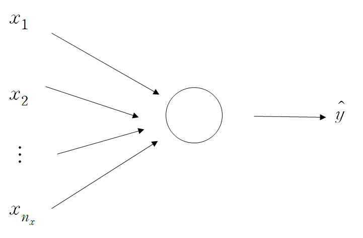
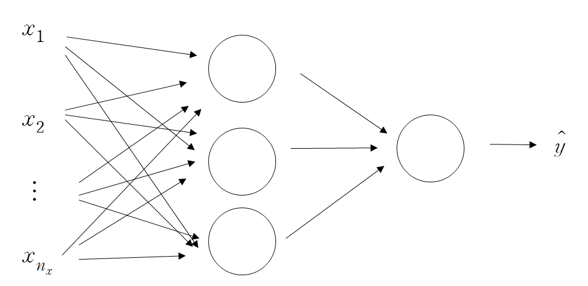

이번 포스트에서는 Neural network에 대해서 알아보겠습니다.

 

### 1) Neural Network

 

#### (1) Neural Network

 

이전 포스트에서 logistic regression을 배웠습니다. Neural Network는 logistic regression에서의 computation graph를 일반화한 것이라고 생각하면 되겠습니다. 

주어진 변수 $x_1, ..., x_{n_x}$에 대해서 다음과 같은 모형을 생각해봅시다.

$x_1, ..., x_{n_x}$는 변수이고, 이러한 변수들의 linear combination + bias 연산 후 sigmoid 함수를 합성한 결과물이 동그라미입니다. 즉 동그라미 결과는 logistic regression에서 loss function 직전 단계까지의 결과를 나타냅니다. 정리하면 동그라미 결과는 두 과정을 통해 얻어집니다.

1. $x_1, ..., x_{n_x}$의 linear combination + bias term 구하기.
2. 1.에서 구한 식에 sigmoid 함수 합성하기.

**위의 모델에서 우리가 알아야 하는 값은 $x_1, ..., x_{n_x}$의 linear combination을 구성하는 각 coefficient 값과 상수항인 bias 항입니다. 이 값들이 모두 parameter가 됩니다.**

**위 과정이 Neural network에서 하나의 node를 구성하는 방법입니다! ** 이러한 node가 여러 개가 있고, 여러 층으로 이루어져 최종 output인 $\hat y$를 출력하는 모델이 neural network입니다. 여러개의 node를 구성한 neural network를 살펴보겠습니다.

하나의 동그라미를 구성하는 모형과 지금의 모형의 차이는 동그라미의 수입니다. 동그라미가 하나였던 이전 모델과는 달리 3개의 동그라미가 $x_1, ..., x_{n_x}$ 이후 구성됩니다. 각각의 동그라미를 형성하는 과정은 하나의 동그라미를 형성하는 과정과 같습니다.(선형 결합 후 합성함수 적용)

세 동그라미를 또한 적절히 조합하여 새로운 동그라미를 만들어줍니다. 이 과정에서 앞에서 만들어진 세 개의 동그라미가 새로운 input이 되고, 이를 이용해 만들어지는 하나의 동그라미가 결과값이 됩니다. 즉, 세 개의 동그라미를 이용하여 선형결합 후 합성함수를 적용하여 만들어진 동그라미가 마지막 동그라미가 됩니다. 

마지막 동그라미 값을 이용하여 $\hat y$값을 출력하게 됩니다. 즉, 동그라미 만드는 과정을 병렬적으로(하나의 층에서), 연속적으로 (층을 이동하면서) 진행된다고 생각하면 되겠습니다. 

  

#### (2) Notation

 

위에서 neural network를 설명할 때 사용한 동그라미, 층에 대해 명확한 용어가 있습니다. 이에 대해서 알아보도록 합시다.

