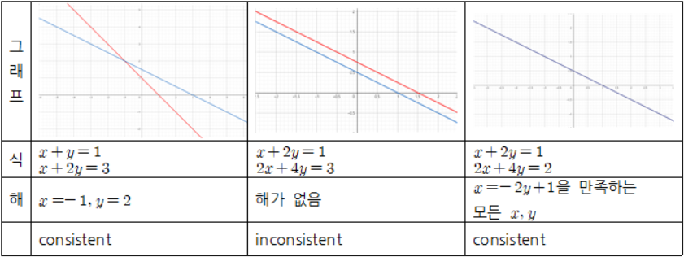

첫 번째 선형대수학 포스트에서는 linear equation과 system of linear equation, solution of linear system에 대해 다루어 보겠습니다.

 

### 1) Linear Equation

 

n개의 변수(variable) $x_1, x_2, ..., x_n$ 에 대해 다음과 같은 형식을 가지는 방정식을 linear equation이라고 합니다.

$
a_1x_1+a_2x_2+...+a_nx_n=b
$

여기서 $a_1, a_2, ..., a_n, b$는 상수(constant)이고, 모든 $a_i$는 0이 되면 안됩니다. 간단하게 일차방정식이라고 생각해주면 되겠습니다.

 

*example*

$x+2y=5$ (변수: $x, y$ )

$2x-y+3z=10$ (변수: $x, y, z$)

$x_1+x_2+...x_n=1$ (변수: $x_1, ..., x_n$)

 

### 2) System of Linear Equation(Linear system)

 

System of linear equation은 하나 이상의 linear equation들을 모아놓은 것입니다.

하나의 system에 있는 linear equation들은 다루는 변수가 같아야 합니다. 

Linear system이라고도 합니다. (쉽게 이해하면 연립일차방정식으로 생각해주면 되겠습니다.)

$a_{11}x_1 + a_{12}x+...+a_{1_n}x_n=b_1$

$a_{21}x_1 + a_{22}x+...+a_{2_n}x_n=b_2$

...

$a_{m1}x_1 + a_{m2}x+...+a_{m_n}x_n=b_m$

 

*example*

$2x_1 - x_2 + 5x_3 = 1$

$x_1 + 3x_3=0$

(두번째 linear equation에서 $x_2$가 없는 것을 $0 \times x_2$로 해석할 수 있습니다. 따라서 두 linear equation은 다루는 variable이 같습니다.)

 

### 3) Solution of system

 

위에서 정의한 linear equation, system of linear equation 모두 방정식입니다. 따라서 방정식에서는 해, solution이 있습니다. 

Linear system에 존재하는 모든 linear equation을 참으로 만드는 값 $(s_1, s_2, ..., s_n)$을 그 **linear system의 solution**이라고 합니다.

linear system에 따라 해가 존재할수도, 존재하지 않을수도, 여러개 존재할 수 있습니다. 따라서 linear system의 solution을 모두 모아놓은 집합을 linear system의 **solution set**이라고 합니다.

solution set을 이용하여 두 개 이상의 linear system을 비교할 수 있습니다.

만약 두 개의 linear system의 solution set이 같다면, **두 linear system이 equivalent**하다라고 합니다.

 

*example*

$x+y = 1$

$x + 2y=0$

이 linear system을 풀면 $x=2, y=-1$가 됩니다. 따라서 $(2, -1)$가 위 linear system의 solution이 됩니다.

 

### 4) Solution 종류

 

모든 Linear system의 solution의 유형은 다음과 같은 세 가지로 분류할 수 있습니다. 

(1) No solution

(2) Exactly one solution

(3) infinitely many solution

여기서 solution이 없는 linear system을 **inconsistent**하다라고 정의하고, 하나 또는 무수히 많은 solution을 가지는 linear system을 **consistent**라고 정의합니다. 

 

*example*

$x+y = 1$

$x + 2y=3$

위 linear system의 solution은 $(-1, 2)$ 하나밖에 존재하지 않습니다. 따라서 위 linear system의 solution은 하나이고, consistent합니다.

 

*example*

$x+2y=1$

$2x+4y=3$

위 linear system의 첫번째 식 전체에 2를 곱해준 뒤 밑의 식을 빼주면, $0=-1$만 남게 됩니다. 위의 등식은 성립하지 않으므로, 위 linear system을 만족하는 solution은 존재하지 않습니다. 따라서 위 linear system의 solution은 없고, inconsistent합니다.

 

*example*

$x+2y=1$

$2x+4y=2$

위 linear system의 첫번째 식 전체에 2를 곱해주면 밑의 식과 똑같아 집니다. 따라서 정리를 해주면, $x=-2y+1$을 만족하는 모든 $x, y$에 대해 linear system이 성립합니다. 따라서 위 linear system의 solution은 $x=-2y+1$을 만족하는 모든 $x, y$이고, solution이 무수히 많으며, consistent합니다.

위 세 example을 그래프로 나타내면 다음과 같습니다. 

 

### 5) Matrix notation

 

Linear system을 matrix를 이용하여 간단하게 표현할 수 있습니다. 

$a_{11}x_1 + a_{12}x+...+a_{1_n}x_n=b_1$

$a_{21}x_1 + a_{22}x+...+a_{2_n}x_n=b_2$

...

$a_{m1}x_1 + a_{m2}x+...+a_{m_n}x_n=b_m$

여기서 변수 부분을 제외하고 계수와 상수부분을 나타낸 다음의 matrix를 linear system의 **augmented matrix**라고 합니다.

$\begin{bmatrix}a_{11}&a_{12}&...&a_{1n}&b_1 \\\a_{21}&a_{22}&...&a_{2n}&b_2\\\ & & ... & \\\a_{m1}&a_{m2}&...&a_{mn}&b_m\\ \end{bmatrix}$

위 linear system에서 계수부분만 나타낸 다음의 matrix를 linear system의 **coefficient matrix**라고 합니다.

$\begin{bmatrix}a_{11}&a_{12}&...&a_{1n} \\\a_{21}&a_{22}&...&a_{2n}\\\ & & ...  \\\a_{m1}&a_{m2}&...&a_{mn}\\ \end{bmatrix}$

위 두 matrix는 linear system을 풀 때(solution을 찾을 때) 유용하게 사용되는 matrix입니다.

다음 포스팅에서는 linear system의 해를 구하는 방법에 대해서 알아보겠습니다.

오류나 수정사항, 질문이 있으면 댓글로 남겨주시기 바랍니다. 감사합니다!

