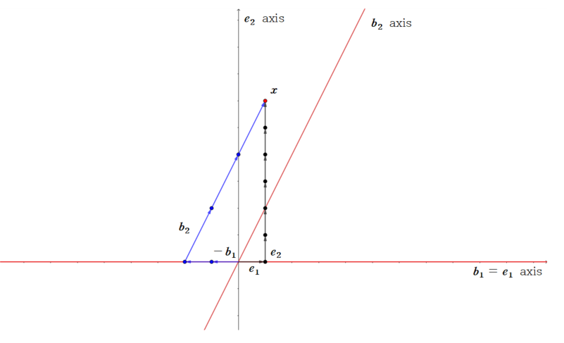

이번 포스트에서는 Coordinate system에 대해서 알아보겠습니다. 

 

### 1) Coordinate System

 

Coordinate system은 우리가 좌표평면이나 좌표공간에서 점을 표시할 때 쓰는 순서쌍과 관련이 있습니다. 이전 basis 포스트에서 좌표평면, 좌표공간에서의 $x, y, z$축이 basis에 속하는 벡터의 방향을 나타내는 것을 확인했었습니다. 좌표평면/공간 위의 점을 $x,  y, z$ 축을 이용하여 순서쌍으로 나타내는 것이구요. coordinate system은 basis를 이용하여 벡터를 순서쌍(후에 coordinate vector로 정의합니다.)으로 나타내는 방법에 대한 내용입니다. 

Coordinate system을 정의하기 위해서는 다음의 정리가 필요합니다. 

 

**Theorem : The uniqueness representtion theorem** 

Let $B=\{\boldsymbol{b_1}, \boldsymbol{b_2}, ..., \boldsymbol{b_n}\}$ be a basis for a vector space $V$. Then for each $\boldsymbol{x}$ in $V$, there exists a unique set of scalars $c_1, ..., c_n$ such that

$$
\boldsymbol{x} = c_1\boldsymbol{b_1} + ... + c_n\boldsymbol{b_n}
$$

위 정리가 의미하는 것은 다음 두 가지입니다.

1. **$V$의 모든 vector는 basis 원소의 linear combination으로 표현 가능합니다.**
2. **Linear combination으로 표현할 때, unique하게 표현됩니다.**

 

**Definition : Coordinate**

Suppose $B=\{\boldsymbol{b_1}, \boldsymbol{b_2}, ..., \boldsymbol{b_n}\}$ is a basis for $V$ and $\boldsymbol{x}$ is in $V$. The coordinates of $\boldsymbol{x}$ relative to the basis $B$(or the $B$-coordinate of $\boldsymbol{x}$) are the weights $c_1, ..., c_n$ such that $\boldsymbol{x} = c_1\boldsymbol{b_1} + ... + c_n\boldsymbol{b_n}$

If $c_1, ..., c_n$ are the $B$-coordinate of $\boldsymbol{x}$, then the vector in $\mathbb R^n$

$$
\left[\boldsymbol{x}\right]_B = \begin{bmatrix}c_1 \\ c_2 \\ \vdots \\ c_n\end{bmatrix}
$$

is the coordinate vector of $\boldsymbol{x}$, or the $B$-coordinate vector of $\boldsymbol{x}$

The mapping $\boldsymbol{x} \rightarrow [\boldsymbol{x}]_B$ is the coordinate mapping (determined by $B$)

$\boldsymbol{x}$를 basis에 속한 벡터들의  linear combination으로 표현하였을 때, 각각의 basis에 속하는 벡터 $\boldsymbol{b_1} , ... , \boldsymbol{b_n}$의 계수들을 $B$-coordinate of $\boldsymbol{x}$라고 합니다. 이 $B$-coordinate를 벡터로 나타낸 값이 $B$-coordinate vector of $\boldsymbol{x}$이고, $[\boldsymbol{x}]_B$라고 합니다.

마지막으로, $\boldsymbol{x}$에서 $\boldsymbol{x}$의 $B$-coordinate vector $[\boldsymbol{x}]_B$로 보내는 mapping을 Coordinate mapping이라고 합니다.

$\boldsymbol{x}$ 를 basis에 속한 벡터와 $[\boldsymbol{x}]_B$ 로 나타내면

$$
\begin{aligned}

\boldsymbol x &= c_1\boldsymbol{b}_1 + \cdots + c_n \boldsymbol{b}_n \\
&= \begin{bmatrix}\boldsymbol{b_1} & ... & \boldsymbol{b_n} \end{bmatrix}\begin{bmatrix}c_1 \\ \vdots \\ c_n\end{bmatrix} \\
& = \begin{bmatrix}\boldsymbol{b_1} & ... & \boldsymbol{b_n} \end{bmatrix}[\boldsymbol{x}]_B

\end{aligned}
$$

가 됩니다.

 

*example*

Consider a standard basis $\epsilon=\{\boldsymbol{e_1}, \boldsymbol{e_2}\}$, and a basis $B_2=\{\boldsymbol{b_1}, \boldsymbol{b_2}\}$ for $\mathbb R^2$, where $\boldsymbol{e_1}=\begin{bmatrix}1 \\ 0\end{bmatrix}$, $\boldsymbol{e_2}=\begin{bmatrix}0 \\ 1\end{bmatrix}$, $\boldsymbol{b_1}=\begin{bmatrix}1 \\ 0\end{bmatrix}$, $\boldsymbol{b_1}=\begin{bmatrix}1 \\ 2\end{bmatrix}$

$\mathbb R^2$에 존재하는 벡터 $\boldsymbol{x}$의 $B_2$-coordinate vector가 $[\boldsymbol{x}]_{B_2}=\begin{bmatrix}-2 \\ 3\end{bmatrix}$입니다. 이 말은

$$
\boldsymbol{x} = -2\boldsymbol b_1 + 3\boldsymbol b_2
$$

를 뜻하고, 이를 계산하면

$$
\boldsymbol{x}= -2\begin{bmatrix}1 \\ 0\end{bmatrix} + 3 \begin{bmatrix}1 \\ 2\end{bmatrix} = \begin{bmatrix}1 \\ 6\end{bmatrix}
$$

이 됩니다. 이 때 $\begin{bmatrix}1 \\ 6\end{bmatrix}$은

$$
\begin{bmatrix}1 \\ 6\end{bmatrix} = 1\boldsymbol{e_1} + 6\boldsymbol{e_2}
$$
가 되어, $\boldsymbol{x}_{\epsilon}$을 뜻합니다.

이를 좌표평면을 통해 시각적으로 표현하면 다음과 같습니다.

  

다음 좌표평면에서 기본 $x, y$축(가로축, 세로축)이 $\epsilon$ basis 축을 나타낸 것입니다.(검은색 축) 한편, 빨간색 축은 $B_2$ basis를 축으로 나타낸 것입니다. (가로축이 $\boldsymbol{b_1}$, 대각선 축이 $\boldsymbol{b_2}$) $\boldsymbol{x}$는 좌표평면 상 빨간색 점이고, 이를 $\epsilon$ basis로 나타낼수도, $B_2$ basis로 나타낼 수 있습니다. 

$\boldsymbol{x}$를 $\epsilon$ basis로 나타낸 것이

$$
\begin{bmatrix}1 \\ 6\end{bmatrix} = 1\boldsymbol{e_1} + 6\boldsymbol{e_2}
$$
 

입니다. 검은색 벡터(화살표)로 표시하였습니다.  

그리고 $\boldsymbol{x}$를 $B_2$ basis로 나타낸 것이 

$$
\begin{bmatrix}1 \\ 6\end{bmatrix} = -2\boldsymbol{b_1} + 3\boldsymbol{b_2}
$$

 입니다. 파란색 벡터(화살표로 표시하였습니다.)

이 때, $[\boldsymbol{x}]_{B_2}$ 이 뜻하는 바는 다음과 같습니다. 만약 우리가 좌표평면을 $\epsilon$을 이용하여 표시하는 것이 아닌 (x축, y축) $B_2$를 이용하여 표현한다고 생각해봅시다.(빨간색 축)  $\boldsymbol{x}$를 빨간색 축을 기반으로 하여 나타낸 순서쌍이

$$
[\boldsymbol{x}]_{B_2} = \begin{bmatrix} -2 \\  3 \end{bmatrix}
$$
  

이 됩니다. ($\boldsymbol{b_1}$ 방향과 크기로 -2, $\boldsymbol{b_2}$ 방향과 크기로 3의 값을 가지는 점이 $\boldsymbol{x}$입니다.)

즉, **$B$-Coordinate vector는 $B$를 이용하여 vector space의 벡터를 표현할 때의 순서쌍(좌표)을 의미합니다.**

 

*example*

$\epsilon_1$ basis의 coordinate vector를 생각해봅시다.

$$
\begin{aligned}

\boldsymbol{x} &= 1\boldsymbol{e_1} + 6\boldsymbol{e_2} \\
&= \begin{bmatrix} \boldsymbol{e_1} & \boldsymbol{e_2} \end{bmatrix} \begin{bmatrix}1 \\ 6\end{bmatrix}  \\
&= I_2\begin{bmatrix}1 \\ 6\end{bmatrix}

\end{aligned}
$$

다음과 같이 표현할 수 있기 때문에

$$
[\boldsymbol{x}]_{\epsilon} = \begin{bmatrix}1 \\ 6 \end{bmatrix} = \boldsymbol{x}
$$

인 것을 알 수 있습니다. 

이는 $\mathbb R^n$에서도 똑같이 적용됩니다. 

$\mathbb R^n$에서의 standard basis $\epsilon = \{\boldsymbol{e_1}, ..., \boldsymbol{e_n}\}$에 대해서 $\boldsymbol x$의 $\epsilon$-coordinate vector는

$$
\begin{aligned}

\boldsymbol{x} &= x_1\boldsymbol{e_1} + ... + x_n\boldsymbol{e_n} \\
&=\begin{bmatrix}\boldsymbol{e_1} & ... & \boldsymbol{e_n} \end{bmatrix}\begin{bmatrix}x_1 \\ \vdots \\ x_n\end{bmatrix} \\
&= I_n[\boldsymbol x]_\epsilon \\
&=[\boldsymbol x]_\epsilon
\end{aligned}
$$

즉

$$
[\boldsymbol x]_\epsilon = \boldsymbol{x}
$$

인 것을 알 수 있습니다.

 

### 2) Coordinate mapping

 

#### (1) Coordinates in $\mathbb R^n$

 

Vector space의 basis $B$를 알면, 특정 $\boldsymbol x$의 $B$-coordinate vector는 쉽게 구할 수 있습니다. 

$B = \{\boldsymbol{b_1}, ..., \boldsymbol{b_n}\}$이 어떤 $\mathbb R^n$의 basis라고 가정해봅시다. $[\boldsymbol x]_B$를 구하기 위해서는 

$$
\begin{aligned}

\boldsymbol{x} &= c_1\boldsymbol{b_1} + \cdots + c_n\boldsymbol{b_n} \\

 &= \begin{bmatrix}\boldsymbol{b_1} & ... & \boldsymbol{b_n} \end{bmatrix} [\boldsymbol x]_B

\end{aligned}
$$

위 식을 만족해야 합니다. 이 때 matrix $\begin{bmatrix}\boldsymbol{b_1} & ... & \boldsymbol{b_n} \end{bmatrix} = P_B$라고 하면

$$
P_B[\boldsymbol x]_B = \boldsymbol{x}
$$

의 solution을 구하면 됩니다. 이 때, $P$의 column이 $\mathbb R^n$의 basis이므로 linearly independent하므로, $P$는 invertible합니다. 따라서

$$
[\boldsymbol x]_B = P_B^{-1}\boldsymbol x
$$

임을 알 수 있습니다.

 

#### (2) Coordinate mapping

 

$\mathbb R^n$에 속하는 vector $\boldsymbol{x}$의 $B$-coordinate vector는 다음의 식을 통해 구할 수 있었습니다.

$$
P_B[\boldsymbol x]_B = \boldsymbol{x} \\
$$

$P$가 invertible하므로

$$
[\boldsymbol x]_B = P_B^{-1}\boldsymbol x
$$

임을 알 수 있습니다.

첫 번째 식을 살펴봅시다. $\boldsymbol{x}$의 $B$-coordinate vector에 $P_B$ matrix를 곱해서 $\boldsymbol{x}$를 얻을 수 있었습니다. 그런데, $\boldsymbol{x} = [\boldsymbol{x}]_\epsilon$, 즉 standard basis의 coordinate vector가 $\boldsymbol x$인 것을 이용하면, 첫 번째 식은 **$B$-coordinate vector를 standard basis coordinate vector로 바꿔주는 matrix transformation으로 생각할 수 있습니다.**

$$
T_{[\epsilon]} : [\boldsymbol{x}]_B \rightarrow \boldsymbol{x} \\
T_{[\epsilon]}([\boldsymbol{x}]_B) = P_B[\boldsymbol{x}]_B =\boldsymbol{x}
$$

한편, 두 번째 식은 $\boldsymbol{x}$에 $P_B^{-1}$를 곱해서 $[\boldsymbol{x}]_B$를 얻는 식입니다. 즉, **standard basis coordinate vector를 $B$-coordinate vector로 바꿔주는 matrix trasformation으로 생각할 수 있습니다.**

$$
T_{[B]} : \boldsymbol{x} \rightarrow [\boldsymbol{x}]_B \\
T_{[B]}(\boldsymbol{x}) = P_B^{-1}\boldsymbol{x} =[\boldsymbol{x}]_B
$$

즉, **coordinate vector를 만드는 mapping은 linear operator이고, one to one입니다.**

여기서 정의된 

$$
P_B = \begin{bmatrix} \boldsymbol{b_1} & ... & \boldsymbol{b_n} \end{bmatrix}
$$

을 **change of coordinates matrix form $B$ to the standard basis in $\mathbb R^n$ **이라 정의합니다.

 

**Theorem**

Let $B=\{\boldsymbol{b_1}, ..., \boldsymbol{b_n}\}$ be basis for a vector space $V$. Then the coordinate mapping $\boldsymbol{x} \rightarrow [\boldsymbol{x}]_B$ is a one-to-one linear transformation from $V$ onto $\mathbb R^n$.

위 정리는 $\mathbb R^n$의 subspace 뿐만 아니라 일반적인 vector space $V$에 대한 coordinate mapping이 linear transformation이면서 one-to-one이 된다는 것을 뜻합니다. 일반적인 vector space $V$에 대해 coordinate mapping을 하기 때문에 정의역은 $V$, 공역은 $\mathbb R^n$인 것을 알 수 있습니다. 만약 vector space $V$가 직관적으로 알기 쉽지 않는 경우, basis를 알고 있다면 coordinate mapping을 통해 보다 친숙한 $\mathbb R^n$ vector space에서 해석할 수 있습니다. 따라서 coordinate mapping은 **일반적인 vector space에 속한 벡터를 $\mathbb R^n$으로 바꾸어주는 mapping입니다.** (증명은 appendix 참고)

위 정리를 이용하면 하나의 벡터 뿐만 아니라 여러 벡터들의 linear combination에 대해서도 coordinate mapping이 가능합니다. coordinate mapping이 linear transformation이기 때문입니다. 

$\boldsymbol{u_1}, ..., \boldsymbol{u_p} \in V$, $c_1, ..., c_p \in \mathbb R$ 에 대해서

$$
[c_1\boldsymbol{u_1}+\cdots +c_p\boldsymbol{u_p}]_B = c_1[\boldsymbol{u_1}]_B+\cdots +c_p[\boldsymbol{u_p}]_B
$$
 

가 성립합니다.

지금까지 coordinate system에 대해 알아보았습니다. 다음 포스트에서는 change of basis에 대해서 알아보겠습니다. 질문이나 오류 있으면 댓글로 남겨주세요! 감사합니다!

 

### Appendix : Proof of theorem

 

**Theorem**

Let $B=\{\boldsymbol{b_1}, ..., \boldsymbol{b_n}\}$ be basis for a vector space $V$. Then the coordinate mapping $\boldsymbol{x} \rightarrow [\boldsymbol{x}]_B$ is a one-to-one linear transformation from $V$ onto $\mathbb R^n$.

 

* **Proof**

위 정리에 밝혀야할 것은

1. Coordinate mapping is linear transformation
2. Coordinate mapping is one to one
3. Coordinate mapping is onto

세 가지입니다.

 

 

* Proof of 1

$$
B =\{\boldsymbol{b_1}, ..., \boldsymbol{b_n}\}
$$

를 $V$의 basis라 하고, coordinate mapping $T_B$를

$$
T_B : V \rightarrow \mathbb R^n \\
T_B(\boldsymbol{x}) = [\boldsymbol{x}]_B
$$

다음과 같이 정의합니다. $T_B$가 linear transformation인 것을 밝히기 위해 vector addition, scalar multiple 조건을 만족하는지 확인하면 됩니다. 

$$
\boldsymbol{v, u} \in V \\
\boldsymbol{v} = c_1\boldsymbol{b_1} + \cdots + c_n\boldsymbol{b_n} \\
\boldsymbol{u} = d_1\boldsymbol{b_1} + \cdots + d_n\boldsymbol{b_n}
$$

이 되고,

$$
[\boldsymbol{v}]_B =\begin{bmatrix}c_1 \\ \vdots \\ c_n \end{bmatrix}, \ \ [\boldsymbol {u}]_B =\begin{bmatrix}d_1 \\ \vdots \\ d_n \end{bmatrix}
$$

임을 알 수 있습니다. 이 때

$$
\boldsymbol{v} + \boldsymbol{u} = (c_1+d_1)\boldsymbol{b_1} + \cdots + (c_n +d_n)\boldsymbol{b_n}
$$

이 되어

$$
T_B(\boldsymbol{v+u})=[\boldsymbol{v}+\boldsymbol{u}]_B =\begin{bmatrix}c_1+d_1 \\ \vdots \\ c_n+d_n \end{bmatrix} =\begin{bmatrix}c_1 \\ \vdots \\ c_n \end{bmatrix} +\begin{bmatrix}d_1 \\ \vdots \\ d_n \end{bmatrix} = [\boldsymbol{v}]_B + [\boldsymbol{u}]_B = T_B(\boldsymbol{v})+T_B(\boldsymbol{u})
$$

따라서 addition 조건을 만족합니다. 다음으로 $\boldsymbol{v}$와 scalar $k$에 대해서

$$
k\boldsymbol{v} = kc_1\boldsymbol{b_1} + \cdots + kc_n\boldsymbol{b_n}
$$

이므로

$$
T_B(k\boldsymbol{v})=[k\boldsymbol{v}]_B =\begin{bmatrix}kc_1 \\ \vdots \\ kc_n \end{bmatrix} = k \begin{bmatrix}c_1 \\ \vdots \\ c_n \end{bmatrix} = k[\boldsymbol{v}]_B = kT_B(\boldsymbol{v})
$$

을 만족하므로, $T_B$는 linear transformation입니다.

 

* Proof of 2

$T_B$가 linear transformation이므로, $T_B$가 one to one임을 밝히는 것은 $Ker(T_B)=\{0\}$임을 밝히는 것과 같습니다. $T_B$의 kernel은

$$
Ker(T_B) = \{\boldsymbol{x} \in V \mid T_B(\boldsymbol{x}) = 0\}
$$

이를 확인하기 위해

$$
T_B(\boldsymbol{x}) = [\boldsymbol{x}]_B=0
$$

을 만족하는 $\boldsymbol{x}$는

$$
\boldsymbol{x} = 0\cdot\boldsymbol{b_1} + \cdots + 0\cdot \boldsymbol{b_n} = 0
$$

즉 zero vector밖에 존재하지 않습니다. 따라서

$$
Ker(T_B) = \{0\}
$$

을 만족하기 때문에 $T_B$는 one to one 입니다. 

(one to one의 정의를 통해서도 증명할 수 있습니다.)

 

* Proof of 3

$\mathbb R^n$에 있는 임의의 vector $\boldsymbol{a}$에 대해서

$$
T_B(\boldsymbol{x}) =\boldsymbol{a}
$$

를 만족하는 $\boldsymbol{x}$가 $V$에 적어도 하나 존재해야 함을 밝혀야 합니다. $\boldsymbol{a}$를

$$
\boldsymbol{a} = \begin{bmatrix}a_1 \\ \vdots \\ a_n \end{bmatrix}
$$

이라 한다면,

$$
\boldsymbol{x} = a_1 \boldsymbol{b_1} + \cdots + a_n\boldsymbol{b_n}
$$

인 $\boldsymbol{x}$에 대해서

$$
T_B(\boldsymbol{x}) =[\boldsymbol{x}]_B = \boldsymbol{a}
$$

를 만족합니다. 따라서 임의의 $\boldsymbol a \in \mathbb R^n$에 대해서 

$$
T_B(\boldsymbol x) =\boldsymbol{a}
$$

를 만족하는 $\boldsymbol{x}$가 반드시 존재하므로, $T_B$는 onto입니다.