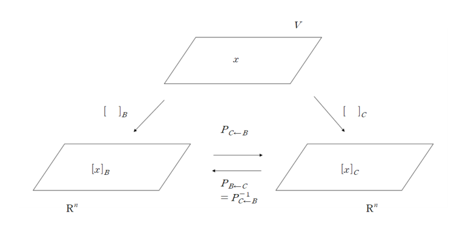

이번 포스트에서는 change of basis에 대해 알아보겠습니다. 

 

### 1) Change of basis

 

이전 포스트에서 vector space의 basis와 vector space에 속하는 벡터들에 대해 basis 벡터의 linear combination으로 표현을 하면, 그 때의 coefficient를 coordinate vector라고 하였습니다. 이 coordinate vector는 basis가 정해지면 벡터마다 unique하게 결정이 됩니다. 또한 벡터를 coordinate vector로 변환하는 과정이 coordinate mapping이고, one-to-one, onto, linear transformation인 것을 알 수 있었습니다. 이 점을 이용하여 basis를 변화하였을 때 coordinate vector가 어떻게 변화하는지 다루어보겠습니다. 

다음 예시를 살펴봅시다.

 

*example*

어떤 vector space의 basis가 

$$
B = \{\boldsymbol{b_1}, \boldsymbol{b_2}\}, \ \ \ C = \{\boldsymbol{c_1}, \boldsymbol{c_2}\}
$$

이고, 이 vector space에 속한 $\boldsymbol{x}$가 

$$
\boldsymbol{x} = 3\boldsymbol{b_1} +\boldsymbol{b_2}, \ \ \ \boldsymbol{x} =6\boldsymbol c_1 + 4\boldsymbol c_2
$$

다음과 같이 표현된다면, $\boldsymbol{x}$의 basis $B, C$에 대한 coordinate vector는

$$
[\boldsymbol{x}]_B = \begin{bmatrix}3 \\ 1\end{bmatrix}, [\boldsymbol{x}]_C= \begin{bmatrix}6 \\ 4\end{bmatrix}
$$

 입니다.

여기서

$$
\boldsymbol{b_1}=4\boldsymbol{c_1} + \boldsymbol{c_2}, \ \ \ \ \boldsymbol{b_2}=-6\boldsymbol{c_1}+\boldsymbol{c_2}
$$

라는 것을 알고 있다면, $\boldsymbol{x}$를 모르더라도, $B$의 coordinate vector를 이용하여 $[\boldsymbol{x}]_C$를 구할 수 있습니다. 

$$
\boldsymbol{x} = 3\boldsymbol{b_1} + \boldsymbol{b_2} = a_1\boldsymbol{c_1}+a_2\boldsymbol{c_2}
$$

이 식을 만족하는 $a_1, a_2$를 찾아야 합니다. 이 때 $\boldsymbol{b_1}, \boldsymbol{b_2}$ 에 $\boldsymbol{c_1}, \boldsymbol{c_2}$에 대한 식을 대입하면

$$
3\boldsymbol{b_1} + \boldsymbol{b_2} = 3(4\boldsymbol{c_1} + \boldsymbol{c_2}) + (-6\boldsymbol{c_1} + \boldsymbol{c_2}) = 6\boldsymbol{c_1} + 4\boldsymbol{c_2}
$$

가 됩니다. 다음 식의 coefficient를 다른 방식으로 표현하면

$$
[\boldsymbol{x}]_C = \begin{bmatrix}6 \\ 4\end{bmatrix} = \begin{bmatrix}3\times 4 +1 \times (-6) \\ 3\times 1 + 1\times 1\end{bmatrix} = \begin{bmatrix}4 & -6\\1 & 1 \end{bmatrix}\begin{bmatrix}3 \\ 1\end{bmatrix} = \begin{bmatrix}[\boldsymbol{b_1}]_C & [\boldsymbol{b_2}]_C\end{bmatrix}[\boldsymbol{x}]_B
$$

인 것을 알 수 있습니다. **즉, $B$ basis에 속한 벡터들의 $C$-coordinate vector와 $\boldsymbol{x}$의 $B$-coordinate vector를 이용하여 $\boldsymbol{x}$의 $C$-coordinate vector를 구할 수 있습니다.**

 

**Theorem**

Let $B = \{\boldsymbol{b_1}, \boldsymbol{b_2}, ..., \boldsymbol{b_n}\}$ and  $C = \{\boldsymbol{c_1}, \boldsymbol{c_2}, ..., \boldsymbol{c_n}\}$ be bases of a vector space $V$.

 Then there is a unique $n \times n $ matrix $P_{C\leftarrow B}$ such that

$$
[\boldsymbol{x}]_C = P_{C\leftarrow B}[\boldsymbol{x}]_B
$$

The columns of $P_{C\leftarrow B}$ are the $C$-coordinate vectors of the vectors in the basis $B$

$$
P_{C\leftarrow B} = \begin{bmatrix} [\boldsymbol{b_1}]_C & ... & [\boldsymbol{b_n}]_C \end{bmatrix}
$$

The matrix **$P_{C\leftarrow B}$ is called the change-of-coordinates matrix from $B$ to $C$.**

Multiplication by $P_{C\leftarrow B}$ converts $B$-coordinates into $C$-coordinates.

$B$ basis의 $C$-coordinate vector를 column으로 가지는 matrix $P_{C\leftarrow B}$를 이용하여 $[\boldsymbol{x}]_B$를 $[\boldsymbol{x}]_C$로 변환할 수 있습니다. (증명은 appendix 참고)

현재 $B$가 basis이므로 $B$는 linearly independent set입니다. 따라서 basis의 $C$-coordinate vector 역시 linearly independent합니다. 따라서 $P_{C\leftarrow B}$는 linearly independent합니다. 또한, $P_{C\leftarrow B}$는 square matrix이므로, invertible합니다. 

$$
[\boldsymbol{x}]_C = P_{C\leftarrow B}[\boldsymbol{x}]_B
$$

의 양변에 $P_{C\leftarrow B}^{-1}$을 곱해주면

$$
P_{C\leftarrow B}^{-1}[\boldsymbol{x}]_C = [\boldsymbol{x}]_B
$$

가 됩니다. 이 때, 위 식을 해석하면 $\boldsymbol{x}$의 $C$-coordinate vector에 $P_{C\leftarrow B}^{-1}$을 곱하게 되면 $\boldsymbol{x}$의 $B$-coordinate vector가 됩니다. 따라서,

$$
P_{C\leftarrow B}^{-1} = P_{B\leftarrow C}
$$

인 것을 알 수 있습니다. 다음 상황을 시각적으로 표현하면 다음과 같습니다.

Vector space에 속하는 $\boldsymbol{x}$를 $B$ basis의 coordinate vector로 나타낸 mapping이 왼쪽 부분 mapping, $C$ basis의 coordinate vector로 나타낸 mapping이 오른쪽 부분 mapping입니다. 각 coordinate vector 끼리의 변환을 쌍방향 화살표로 나타내고, 그 때 곱해주는 matrix를 $P_{C\leftarrow B}, P_{B \leftarrow C}$로 나타낼 수 있습니다. 이 때, $P_{B\leftarrow C} = P_{C\leftarrow B}^{-1}$이 됩니다.

 

#### (1) Standard basis

 

만약 변환시키려는 basis가 standard basis $\epsilon = \{\boldsymbol{e_1}, ..., \boldsymbol{e_n}\}$이라면, 

$$
[\boldsymbol{x}]_\epsilon =\boldsymbol{x}
$$

이므로

$$
P_{\epsilon \leftarrow B} = \begin{bmatrix}[\boldsymbol{b_1}]_\epsilon & [\boldsymbol{b_2}]_\epsilon & ... & [\boldsymbol{b_n}]_\epsilon \end{bmatrix} = \begin{bmatrix}\boldsymbol{b_1} & \boldsymbol{b_2} & ... & \boldsymbol{b_n} \end{bmatrix} = P_B
$$

가 되어 이전 포스트에서 다루었던 change of coordinates matrix form $B$ to the standard basis in $\mathbb R^n$이 됩니다.

 

*example*

$$
\boldsymbol{b_1} = \begin{bmatrix} -9 \\ 1 \end{bmatrix}, \ \ \boldsymbol{b_2} = \begin{bmatrix} -5 \\ -1 \end{bmatrix}, \ \  \boldsymbol{c_1} = \begin{bmatrix} 1 \\ -4 \end{bmatrix}, \ \ \boldsymbol{c_2} = \begin{bmatrix} 3 \\ -5 \end{bmatrix}
$$

이고

$$
B=\{\boldsymbol{b_1}, \boldsymbol{b_2}\}, \ \ C=\{\boldsymbol{c_1}, \boldsymbol{c_2}\}
$$

가 각각 $\mathbb R^2$의 basis입니다. 이 때 $P_{C\leftarrow B}$와 $P_{B\leftarrow C}$를 구해보도록 하겠습니다. 

$$
P_{C\leftarrow B} = \begin{bmatrix}[\boldsymbol{b_1}]_C & [\boldsymbol{b_2}]_C \end{bmatrix}
$$

이므로,

$$
P_C[\boldsymbol{b_1}]_C = \boldsymbol{b_1} \\ \\
\begin{bmatrix}1 & 3 \\ -4 & -5\end{bmatrix}[\boldsymbol{b_1}]_C =\boldsymbol{b_1} \\ \\

[\boldsymbol{b_1}]_C = P_C^{-1}\boldsymbol{b_1} = \frac{1}{-5+12}\begin{bmatrix}-5 & -3 \\ 4 & 1 \end{bmatrix}\begin{bmatrix}-9 \\ 1 \end{bmatrix} = \frac{1}{7}\begin{bmatrix}42 \\-35 \end{bmatrix} = \begin{bmatrix} 6 \\ -5 \end{bmatrix}
$$

$$
[\boldsymbol{b_2}]_C = P_C^{-1}\boldsymbol{b_2} = \frac{1}{-5+12}\begin{bmatrix}-5 & -3 \\ 4 & 1 \end{bmatrix}\begin{bmatrix}-5 \\ -1 \end{bmatrix} = \frac{1}{7}\begin{bmatrix}28 \\-21 \end{bmatrix} = \begin{bmatrix} 4 \\ -3 \end{bmatrix}
$$

따라서

$$
P_{C\leftarrow B} =\begin{bmatrix}6 & 4 \\ -5 & -3 \end{bmatrix}
$$

이 됩니다.

$$
P_{B\leftarrow C} = P_{C\leftarrow B}^{-1}
$$

이므로

$$
P_{B\leftarrow C} = \frac{1}{2}\begin{bmatrix}-3 & -4 \\ 5 & 6 \end{bmatrix}
$$

이 됩니다.

지금까지 change of basis에 대해 알아보았습니다. 다음 포스트에서는 eigenvector, eigenvalue에 대해 알아보겠습니다. 질문이나 오류 있으면 댓글 남겨주세요! 감사합니다!

 

### Appendix : Proof of Theorem

 

**Theorem**

Let $B = \{\boldsymbol{b_1}, \boldsymbol{b_2}, ..., \boldsymbol{b_n}\}$ and  $C = \{\boldsymbol{c_1}, \boldsymbol{c_2}, ..., \boldsymbol{c_n}\}$ be bases of a vector space $V$.

 Then there is a unique $n \times n $ matrix $P_{C\leftarrow B}$ such that

$$
[\boldsymbol{x}]_C = P_{C\leftarrow B}[\boldsymbol{x}]_B
$$

The columns of $P_{C\leftarrow B}$ are the $C$-coordinate vectors of the vectors in the basis $B$

$$
P_{C\leftarrow B} = \begin{bmatrix} [\boldsymbol{b_1}]_C & ... & [\boldsymbol{b_n}]_C \end{bmatrix}
$$

 

* **Proof**

 

$V$에 있는 $\boldsymbol{x}$를 다음과 같이 $B$ basis 벡터로 표현가능합니다.

$$
\boldsymbol{x} =k_1\boldsymbol{b_1} + \cdots + k_n\boldsymbol{b_n} \\
$$

따라서

$$
[\boldsymbol{x}]_B = \begin{bmatrix} k_1 \\ \vdots \\ k_n\end{bmatrix}
$$

입니다. $\boldsymbol{b_1}, ..., \boldsymbol{b_n}$을 $\boldsymbol{c_1}, ..., \boldsymbol{c_n}$으로 다음과 같이 표현하면

$$
\boldsymbol{b_i} = d_{i1}\boldsymbol{c_1} + \cdots + d_{in}\boldsymbol{c_n}, \ \ \ i=1, ..., n
$$

즉,

$$
[\boldsymbol{b_i}]_C = \begin{bmatrix} d_{i1} \\ \vdots \\ d_{in} \end{bmatrix}
$$

으로 표현이 가능합니다. 이를 이용하여 $\boldsymbol{x}$를 표현하면 다음과 같이 표현됩니다.

$$
\begin{aligned}

\boldsymbol{x} &=k_1\boldsymbol{b_1} + \cdots + k_n\boldsymbol{b_n} \\ 
&=k_1(d_{11}\boldsymbol{c_1}+\cdots+d_{1n}\boldsymbol{c_n}) + \cdots + k_n(d_{n1}\boldsymbol{c_1}+\cdots+d_{nn}\boldsymbol{c_n}) \\
&=(k_1d_{11}+k_2d_{21}+\cdots+k_nd_{n1})\boldsymbol{c_1} + \cdots + (k_1d_{1n}+k_2d_{2n}+\cdots+k_nd_{nn})\boldsymbol{c_n}

\end{aligned}
$$

임을 알 수 있습니다. 따라서

$$
\begin{aligned}

\left[\boldsymbol{x}\right]_C =\begin{bmatrix}k_1d_{11}+\cdots+k_nd_{n1} \\ \vdots \\ k_1d_{1n}+\cdots+k_nd_{nn}\end{bmatrix}  = \begin{bmatrix}d_{11} & \cdots & d_{n1} \\ & \vdots & \\ d_{1n} & \cdots & d_{nn} \end{bmatrix}\begin{bmatrix}k_1 \\ \vdots \\ k_n \end{bmatrix} = \begin{bmatrix}[\boldsymbol{b_1}]_C & \cdots & [\boldsymbol{b_n}]_C \end{bmatrix}[\boldsymbol{x}]_B

\end{aligned}
$$

가 성립합니다.

