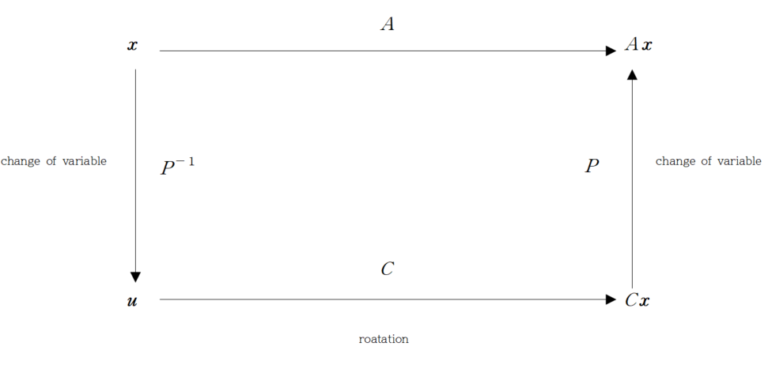

이번 포스트에서는 complex eigenvalue에 대해서 알아보겠습니다. 

 

### 1) Complex eigenvalue

 

Matrix의 characteristic equation은 $\lambda$에 대한 polynomial equation 형태로 나오게 됩니다. polynomial equation의 solution은 복소수이며, 실수가 아닌 복소수인 경우도 존재할 수 있습니다.

Complex eigenvector와 eigenvalue 역시 정의는 기존의 eigenvector와 eigenvalue와 같지만, eigenvector의 성분 값, eigenvalue가 복소수인 경우를 뜻합니다. 

 

*example*

$$
A=\begin{bmatrix}0 & -1 \\ 1 & 0\end{bmatrix}
$$

다음 matrix의 characteristic equation은

$$
\det(A-\lambda I) = \lambda^2 +1 =0
$$

이 되어

$$
\lambda = i, -i
$$

 로 complex eigenvalue를 가집니다. 이 때, 각각의 eigenvalue에 대응하는 eigenvector는

$$
\lambda=i \\

A\boldsymbol x = i\boldsymbol{x} \\
-x_2 = ix_1 \\
x_1 = ix_2
$$

가 되어

$$
\boldsymbol x = x_2\begin{bmatrix}i \\ 1 \end{bmatrix}, x_2 \  is  \ free
$$

가 되고, $\lambda=-i$인 경우

$$
A\boldsymbol{x} = -i\boldsymbol{x} \\
-x_2 = -ix_1 \\
x_1 = -ix_2
$$

가 되어

$$
\boldsymbol{x} = x_2 \begin{bmatrix} -i \\ 1 \end{bmatrix}, \ \ x_2 \ \ if \ free
$$
임을 알 수 있습니다. 따라서 eigenvector를 

$$
\begin{bmatrix}i \\ 1 \end{bmatrix},\begin{bmatrix} -i \\ 1 \end{bmatrix}
$$

으로 뽑을 수 있습니다.

 

#### (1) Real and Imaginary Parts of Vectors

 

다음 복소수

$$
x=a+bi
$$

에서 $a$를 실수부(real part), $b$를 허수부(imaginary part)로 둔 것처럼, vector에서도 실수부, 허수부를 나눌 수 있습니다. 또한 복소수에서 정의한 켤레복소수(conjugate)

$$
\bar x =a-bi
$$

또한 벡터에서 정의할 수 있습니다. 

complex vector $\boldsymbol{x} \in \mathbb C^n$의 real part와 imaginary part를 각각의 성분의 real part, imaginary part로 나누어 vector로 나타낸 것을 뜻합니다. 또한 $\boldsymbol{x}$의 conjugate는 $\boldsymbol{x}$의 imaginary part의 부호를 바꾼 벡터를 뜻합니다. 

$$
\boldsymbol{x} = \begin{bmatrix}a_1+b_1i \\ \vdots \\ a_n + b_n i \end{bmatrix} = \begin{bmatrix}a_1 \\ \vdots \\ a_n  \end{bmatrix} + i\begin{bmatrix}b_1\\ \vdots \\  b_n \end{bmatrix} = Re\boldsymbol{x} + i Im\boldsymbol{x}
$$

$\boldsymbol a$를 $\boldsymbol x$의 real part, $\boldsymbol b$를 $\boldsymbol x$의 imaginary part라고 하고 imaginary part의 부호를 바꾼

$$
\bar {\boldsymbol{x}} = Re\boldsymbol{x} -iIm\boldsymbol{x}
$$

를 $\boldsymbol{x}$의 conjugate라고 합니다.

이러한 정의를 matrix에서도 똑같이 정의할 수 있으며, $\mathbb C^{m\times n }$에 속하는 matrix $B$에 대해서 

$$
\bar B
$$
 

는 $B$의 entry 중 imaginary part의 부호를 바꾼 matrix입니다. 

이 때 conjugate에 대해 다음 성질을 만족합니다.

$$
\overline{r\boldsymbol{x}} = \bar{r}\bar{\boldsymbol x}, \ \overline{B\boldsymbol{x}} =\bar{B}\bar{\boldsymbol x}, \ \overline{BC}=\bar{B}\bar{C}, \ \overline{rB}=\bar{r}\bar{B}
$$

 

#### (2) Eigenvalues and Eigenvectors of a Real Matrix that acts on $\mathbb C^n$

 

$A$를 $n \times n $ real matrix라고 합시다. 이 때,

$$
\overline{A\boldsymbol{x}} = \bar{A}\bar{\boldsymbol{x}} = A\bar{\boldsymbol{x}}
$$

를 만족합니다. $\lambda$가 $A$의 eigenvalue이고, $\boldsymbol{x}$가 $\lambda$에 대한 eigenvector일 때

$$
A\bar{\boldsymbol{x}} = \overline{A\boldsymbol{x}} = \overline{\lambda \boldsymbol{x}} =\bar{\lambda}\bar{\boldsymbol{x}}
$$

임을 알 수 있습니다. 즉, $\bar{\lambda}$ 또한 $A$의 eigenvalue이고, $\boldsymbol{x}$는 $\bar{\lambda}$에 대응하는 eigenvector가 됩니다. 

 

*example*

$$
C = \begin{bmatrix} a & -b \\ b & a \end{bmatrix}, \ with \ a, b\in\mathbb R, \ a, b \neq0
$$

위 matrix의 eigenvalue는

$$
\det(C-\lambda I) = (a-\lambda)^2 +b^2 = 0 \iff \lambda = a \pm bi
$$

가 됩니다. 이 때, $r=\mid \lambda \mid = \sqrt {a^2+b^2}$ 이라 하면

$$
C = r\begin{bmatrix} a/r & -b/r \\ b/r & a/r \end{bmatrix} = \begin{bmatrix} r & 0 \\ 0 & r \end{bmatrix}\begin{bmatrix} \cos \theta & -\sin \theta \\ \sin\theta & \cos\theta \end{bmatrix}
$$

입니다. 여기서 $\theta$는 가로축이 실수부 축, 세로축이 허수부 축인 복소평면에서 $a+bi$를 좌표로 표시한 $(a, b)$와 원점을 이읏 선분과 실수부 축 사이의 각을 뜻합니다. 

만약 어떤 $\boldsymbol {x}$를 $C\boldsymbol{x}$로 바꾸는 transformation으로 생각하면 복소평면에서 $\theta$만큼 회전 후 $r$배 하는 transformation으로 해석할 수 있습니다.

 

*example*

$$
A = \begin{bmatrix} .5 & -.6 \\ .75 & 1.1 \end{bmatrix}, \ \ \lambda =.8-.6i, \ \boldsymbol{v}_1 = \begin{bmatrix}-2-4i \\ 5 \end{bmatrix}
$$

여기서 $\lambda$는 $A$의 eigenvalue이고, $\boldsymbol{v}_1$는 $\lambda$에 대응하는 eigenvector입니다. 여기서, $\boldsymbol{v}_1$의 real part와 imaginary part로 이루어진 matrix

$$
P = \begin{bmatrix} Re \boldsymbol{v_1} & Im \boldsymbol{v_1} \end{bmatrix} = \begin{bmatrix} -2 & -4 \\ 5 & 0 \end{bmatrix}
$$

로 설정하고, $C$를 $A$와 similar한 matrix

$$
C = P^{-1} AP= \begin{bmatrix}.8 & -.6 \\ .6 & .8 \end{bmatrix}
$$

로 정하면, $C$  matrix를 이용한 transformation은 회전 변환을 뜻하게 됩니다. ($\cos \theta =.8, \sin\theta =.6$) 여기서 양변에 $P^{-1}$와 $P$를 곱하면

$$
A = PCP^{-1}
$$

가 됩니다. $A$가 standard matrix인 matrix transformation을 생각하면 

$$
A\boldsymbol {x} = PCP^{-1}\boldsymbol{x}
$$

가 되는데, 이 때 

$$
\boldsymbol{x} = P\boldsymbol{u } \iff \boldsymbol u = P^{-1}\boldsymbol{x}
$$

를 고려하면 $\boldsymbol{u}$는 $\boldsymbol{x}$의 change of variable로 생각할 수 있습니다. 그 후

$$
C\boldsymbol u
$$

는 $\boldsymbol{u}$를 $\theta$만큼 회전시키는 transformation이 되고, 그 후 다시 $P$를 곱해 $C\boldsymbol u$를 다시 change of variable로 바꾸는 과정을 의미합니다. (본래 $\boldsymbol{x}$ variable로 말이죠.) 이를 도식화하면 다음과 같습니다. 

이를 일반화한 정리가 다음과 같습니다.

 

**Theorem**

Let $A$ be a real $2 \times 2$ matrix with a complex eigenvalue $\lambda =a-bi \ \ (b\neq0)$ and an associated eigenvector $\boldsymbol{v}$ in $\mathbb C^2$. Then

$$
A = PCP^{-1}, \ where \ P=\begin{bmatrix} Re \boldsymbol{v} & Im\boldsymbol{v} \end{bmatrix}, \ \ C = \begin{bmatrix} a & -b \\ b & a \end{bmatrix}
$$

즉 complex eigenvalue를 가지면,  $A$는 $C$와 similar합니다. 이 때 $A$를 standard matrix로 가지는 transformation을 생각하면, 해당 transformation은 먼저 $P$의 column의 linear combination의 coefficient로 변환 후, $C$에서 정의된 각 만큼 회전 후 다시 원래의 variable로 변환하는 과정을 거치는 transformation입니다.

 

지금까지 complex eigenvalue에 대해서 알아보았습니다. 다음 포스트에서는 새로운 챕터의 첫번째 단원인 inner product와 length, orthogonality에 대해 알아보겠습니다. 질문이나 오류 있으면 댓글 남겨주세요! 감사합니다. 

 

### Appendix : Proof of Theorem

 

**Theorem**

Let $A$ be a real $2 \times 2$ matrix with a complex eigenvalue $\lambda =a-bi \ \ (b\neq0)$ and an associated eigenvector $\boldsymbol{v}$ in $\mathbb C^2$. Then

$$
A = PCP^{-1}, \ where \ P=\begin{bmatrix} Re \boldsymbol{v} & Im\boldsymbol{v} \end{bmatrix}, \ \ C = \begin{bmatrix} a & -b \\ b & a \end{bmatrix}
$$

* **Proof**

위 정리를 증명하기 위해서는 다음을 먼저 밝혀야 합니다.

Claim : Let $A$  be an $n\times n$ real matrix, and $\boldsymbol x \in \mathbb C^n$. then 

 
$$
Re (A\boldsymbol{x}) = A (Re\boldsymbol{x}) \\
Im(A\boldsymbol{x}) = A(Im\boldsymbol{x})
$$

Proof of claim

$$
\boldsymbol {x} = Re(\boldsymbol x) + i Im(\boldsymbol x)
$$

으로 설정할 수 있고, 양변에 $A$를 곱하면

$$
A\boldsymbol{x} = A Re(\boldsymbol x) + i A Im(\boldsymbol{x})
$$

가 됩니다. 또한 $A\boldsymbol{x}$를

$$
A\boldsymbol{x} = Re(A\boldsymbol{x}) + i Im(A \boldsymbol{x})
$$

로 설정할 수 있습니다. 이 때, $A, Re(\boldsymbol{x}), Im(\boldsymbol{x})$의 entry, element가 모두 실수이므로, $ARe(\boldsymbol{x}), AIm(\boldsymbol{x})$ 의 element 모두 실수입니다. 따라서

$$
Re (A\boldsymbol{x}) = A (Re\boldsymbol{x}) \\
Im(A\boldsymbol{x}) = A(Im\boldsymbol{x})
$$

을 만족합니다. 

이를 이용하면

$$
AP = \begin{bmatrix} ARe(\boldsymbol{v})  & AIm(\boldsymbol{v}) \end{bmatrix} = \begin{bmatrix}Re(A\boldsymbol{v}) & Im(A\boldsymbol{v})\end{bmatrix}
$$

임을 알 수 있고, 

$$
A\boldsymbol{v} = \lambda\boldsymbol{v} = (a-bi)(Re(\boldsymbol{v}) +iIm(\boldsymbol{v})) 
$$

를 전개하면

$$
A\boldsymbol{v} = aRe(\boldsymbol{v})+bIm(\boldsymbol{v}) +i(-bRe(\boldsymbol{v}) + aIm(\boldsymbol{v}))
$$

가 되어

$$
\begin{bmatrix}Re(A\boldsymbol{v}) & Im(A\boldsymbol{v})\end{bmatrix} = \begin{bmatrix}aRe(\boldsymbol{v}) + bIm(\boldsymbol{v}) & -bRe(\boldsymbol{v})+ aIm(\boldsymbol{v})\end{bmatrix} = \begin{bmatrix}Re(A\boldsymbol{v}) & Im(A\boldsymbol{v})\end{bmatrix}\begin{bmatrix}a & -b \\ b & a \end{bmatrix} = PC
$$

즉

$$
AP = PC
$$

가 됩니다.

