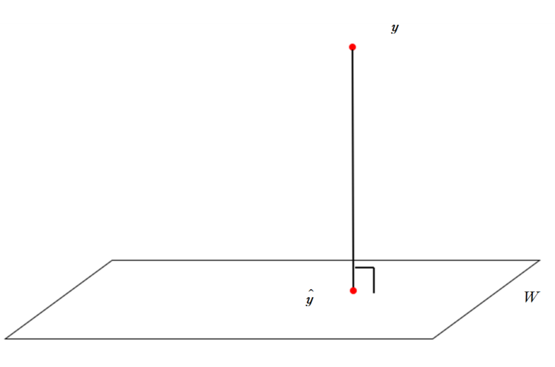
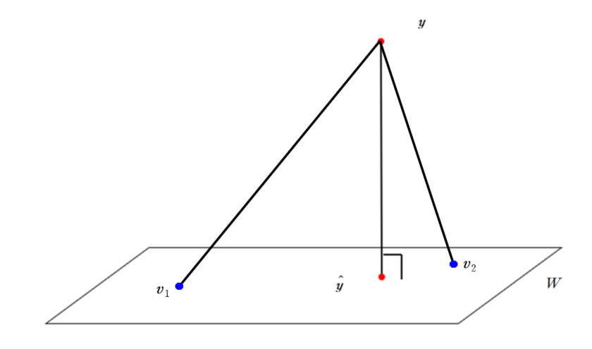

이번 포스트에서는 orthogonal projection에 대해 알아보겠습니다.

 

### 1) Orthogonal Projection

 

#### (1) Orthogonal projection

 

Orthogonal projection의 목표는 다음과 같습니다. 

$\mathbb R^n$의 subspace $W$와 벡터 $\boldsymbol y$에 대해서 **$W$에 속하는 벡터** 중 다음 조건을 만족하는 벡터 $\hat {\boldsymbol y}$을 찾고 싶습니다. 

1. $\boldsymbol{y}-\hat{\boldsymbol{y}}$가 $W$에 orthogonal합니다. 

$$
(\boldsymbol{y} - \hat{\boldsymbol y}) \perp W
$$

2. $\boldsymbol y$에서 $W$에 가장 가까운 벡터가 $\hat{\boldsymbol{y}}$입니다.

$$
\|\boldsymbol y -\hat{\boldsymbol y}\| \leq \|\boldsymbol{y}-\boldsymbol x\| \ \ for \ \ all \ \ x\in W
$$

해당 상황을 시각적으로 표현하면 다음과 같습니다. 

이러한 $\hat{\boldsymbol{y}}$는 unique하게 존재하는데, 왜 unique하게 존재하는지, 어떻게 해당 벡터를 찾을 수 있는지 알아보겠습니다. 

 

$\{\boldsymbol{u_1}, ..., \boldsymbol{u_n}\}$이 $\mathbb R^n$의 orthogonal basis면, $\boldsymbol y \in \mathbb R^n$은 

$$
\boldsymbol{y} = \boldsymbol{z_1} + \boldsymbol{z_2}
$$

로 표현이 가능합니다. 여기서, $\boldsymbol{z_1}$은 basis에 속한 몇 개의 벡터의 linear combination으로 표현되는 벡터이고, $\boldsymbol{z_2}$는 basis에 속한 벡터 중 $\boldsymbol{z_1}$에 포함된 벡터를 제외한 나머지 벡터들의 linear combination으로 표현되는 벡터입니다.

**이 때, $\boldsymbol{z_1}$과 $\boldsymbol{z_2}$는 orthogonal합니다.** 예를 들어

$$
\boldsymbol{z_1} = c_1\boldsymbol{u_1}+\cdots+c_k\boldsymbol{u_k}\\
\boldsymbol{z_2} = c_{k+1}\boldsymbol{u_{k+1}} + \cdots + c_n\boldsymbol{u_n}
$$

일 경우, 

$$
\boldsymbol{z_1} \perp \boldsymbol{z_2}
$$

 가 됩니다. 또한 $\boldsymbol{z_1}$을 표현할 때 사용한 벡터 $\{\boldsymbol{u_1}, ..., \boldsymbol{u_k}\}$를 basis로 하는 subspace $W$를 생각한다면, $\boldsymbol{z_1}\in W$을 만족합니다. 이 때, $\{\boldsymbol{u_1}, ..., \boldsymbol{u_n}\}$이 orthogonal basis이므로,

$$
\boldsymbol{z_2} \in W^\perp
$$

를 만족합니다. 또한, $\boldsymbol{z_2}$을 표현할 때 사용한 벡터 $\{\boldsymbol{u_{k+1}, ..., \boldsymbol{u_{n}}}\}$을 basis로 하는 subspace는 바로 $W^\perp$입니다.

이 성질을 이용하면 orthogonal projection의 목적에 부합하는 $\hat{\boldsymbol y}$를 찾을 수 있습니다.

 

**Theorem**

Let $W$ be a subspace of $\mathbb R^n$. Then each $\boldsymbol{y}$ in $\mathbb R^n$ can be written uniquely in the form

$$
\boldsymbol{y} =\hat{\boldsymbol{y}} +\boldsymbol{z}
$$

where $\hat{\boldsymbol{y}} \in W$ and $\boldsymbol z \in W^\perp$. 

In fact, if $\{\boldsymbol{u_1}, ..., \boldsymbol{u_p}\}$ is any orthogonal basis for $W$, then 

$$
\hat{\boldsymbol y} = \frac{\boldsymbol{u_1}\cdot \boldsymbol{y}}{\boldsymbol{u_1}\cdot \boldsymbol{u_1}}\boldsymbol{u_1} +
\frac{\boldsymbol{u_2}\cdot \boldsymbol{y}}{\boldsymbol{u_2}\cdot \boldsymbol{u_2}}\boldsymbol{u_2} + \cdots +
\frac{\boldsymbol{u_p}\cdot \boldsymbol{y}}{\boldsymbol{u_p}\cdot \boldsymbol{u_p}}\boldsymbol{u_p}
$$

and 

$$
\boldsymbol z = \boldsymbol y - \hat{\boldsymbol y}
$$

$\hat {\boldsymbol y}$ is called the orthogonal projection of $\boldsymbol y$ onto $W$

$$
\hat{\boldsymbol y} = proj_{W}\boldsymbol y
$$
 

이전 포스트에서 orthogonal basis를 알고 있다면, 해당 subspace에 있는 벡터를 orthogonal basis의 linear combination으로 표현할 수 있는 방법을 배웠습니다. 그 방법이 위 정리에 적용이 되었습니다. 또한, 앞서 말한 특정 subspace와 subspace의 orthogonal complement에 속한 두 개의 벡터로 쪼갤 수 있는 성질을 이용하여 위 정리를 나타낼 수 있습니다. 특히, **$\boldsymbol{y}$를 $W$에 속한 벡터와 $W^\perp$에 속한 벡터로 나타내었을 때, $W$에 속한 벡터인 $\hat{\boldsymbol y}$를 orthogonal projection of $\boldsymbol y$ onto $W$라고 합니다.**

 

*example*

Let $\{\boldsymbol{u_1}, ..., \boldsymbol{u_5}\}$ be an orthogonal basis for $\mathbb R^5$ and let

$$
\boldsymbol{y} = c_1\boldsymbol{u_1}+\cdots c_5\boldsymbol{u_5}
$$

Consider the subspace $W=Span\{\boldsymbol{u_1}, \boldsymbol{u_2}\}$

$\boldsymbol{u_1}, \boldsymbol{u_2}$가 orthogonal하기 때문에, $W$의 basis는 $\{\boldsymbol{u_1}, \boldsymbol{u_2}\}$입니다. 

$\boldsymbol{y}$ 벡터는 두 개의 벡터로 쪼개질 수 있습니다.

$$
\boldsymbol{y}=\hat{\boldsymbol{y}} + \boldsymbol{z} \\
\hat{\boldsymbol{y}} =c_1\boldsymbol{u_1}+c_2\boldsymbol{u_2} \\ \boldsymbol{z} = c_3\boldsymbol{u_3}+c_4\boldsymbol{u_4}+c_5\boldsymbol{u_5}
$$

이 때, $\hat{\boldsymbol{y}} \in W$이고, $\boldsymbol{z} \in W^\perp$을 만족합니다. 따라서 $\hat{\boldsymbol{y}} = proj_W\boldsymbol{y}$ 가 됩니다.

 

*example*

$$
\boldsymbol{u_1} = \begin{bmatrix} 2 \\ 5 \\ -1 \end{bmatrix}, \boldsymbol{u_2} = \begin{bmatrix}-2 \\ 1 \\ 1 \end{bmatrix}, \boldsymbol{y}=\begin{bmatrix} 1 \\ 2 \\ 3 \end{bmatrix}, W=Span\{\boldsymbol{u_1}, \boldsymbol{u_2}\}
$$

$proj_W \boldsymbol y$를 구해봅시다. 먼저

$$
\boldsymbol{u_1}\cdot \boldsymbol{u_2} = 0
$$

이므로 $\{\boldsymbol{u_1}, \boldsymbol{u_2}\}$는 $W$의 orthogonal basis입니다.

$$
\boldsymbol{u_1}\cdot \boldsymbol{y} = 9, \ \ \boldsymbol{u_2}\cdot \boldsymbol{y} = 3 , \ \ \boldsymbol{u_1}\cdot\boldsymbol{u_1} =30,  \ \ \boldsymbol{u_2} \cdot \boldsymbol{u_2} = 6
$$

을 이용하면
$$
\frac{\boldsymbol{u_1}\cdot\boldsymbol{y}}{\boldsymbol{u_1}\cdot\boldsymbol{u_1}}=\frac{3}{10}, \ \ \frac{\boldsymbol{u_2}\cdot \boldsymbol{y}}{\boldsymbol{u_2}\cdot \boldsymbol{u_2}} = \frac{1}{2}
$$

이므로

$$
proj_W\boldsymbol y = \frac{3}{10}\boldsymbol u_1 + \frac{1}{2}\boldsymbol{u_2}
$$

임을 알 수 있습니다.

 

#### (2) Properties of orthogonal projection

 

orthogonal projection과 projection vector에 대한 다양한 성질에 대해 알아보도록 하겠습니다.

 

**Theorem**

Let $\{\boldsymbol{u_1}, ..., \boldsymbol{u_p}\}$ be an orthogonal basis for a subspace $W$ of $\mathbb R^n$. For each $\boldsymbol{y}$ in $W$, the weights in the linear combination

$$
\boldsymbol{y}=c_1\boldsymbol{u_1}+\cdots + c_p\boldsymbol{u_p}
$$

where $c_i = \frac{\boldsymbol{u_i}\cdot \boldsymbol{y} }{\boldsymbol{u_i} \cdot \boldsymbol{u_i}}\boldsymbol{u_i}$

In this case $proj_W \boldsymbol{y} = \boldsymbol{y}$ 

Projection의 목적이 $W$ 밖에 있는 벡터를 $W$에 존재하는 벡터와 $W^\perp$에 존재하는 벡터로 분리하여 표현하는 것이 목적입니다. 따라서, 만약 $\boldsymbol{y}  \in W$이면, $\boldsymbol{y}$는 $W$의 orthogonal basis 벡터로 표현이 가능합니다.

$$
\boldsymbol{y} = \hat{\boldsymbol{y}}+\boldsymbol{z}
$$

로 표현하였을 때, $\boldsymbol{z}=0 \in W^\perp$가 되는 것이구요.

 

**Theorem : The best approximation theorem**

Let $W$ be a subspace of $\mathbb R^n$, let $\boldsymbol{y}$ be any vector in $\mathbb R^n$, and let $\hat{\boldsymbol{y}}$ be the orthogonal projection of $\boldsymbol{y}$ onto $W$. Then $\hat{\boldsymbol{y}}$ is the closest point in $W$ to $\boldsymbol{y}$, in the sense that

$$
\|\boldsymbol{y}-\hat{\boldsymbol{y}}\|<\|\boldsymbol{y}-\boldsymbol{v}\|
$$

for all $\boldsymbol{v}$ in $W$ distinct from $\hat{\boldsymbol{y}}$

위 정리를 통해서, $\boldsymbol{y}$의 $W$로의 orthogonal projection $\hat{\boldsymbol{y}}$가 $W$에 존재하는 벡터 중에 가장 $\boldsymbol{y}$와 가까운 것을 알 수 있습니다. 이를 시각적으로 나타내면 다음과 같습니다.

$\boldsymbol{y}$를 $W$에 projection시킨 벡터  $\hat{\boldsymbol{y}}$가 $W$에 속한 다른 벡터 $\boldsymbol{v_1}, \boldsymbol{v_2}$보다 가까운 것을 알 수 있습니다. 

 

**Caution and notation**

orthogonal projection 벡터는 해당 벡터에서 subspace $W$에 가장 가까운 벡터임을 알 수 있었습니다. 즉, $W$에 있는 벡터 중에서 가장 $\boldsymbol{y}$와 비슷한 벡터가 $\hat{\boldsymbol{y}}$입니다. 따라서 

$$
\hat{\boldsymbol{y}} = proj_W \boldsymbol{y}
$$

를 the best approximation to $\boldsymbol{y}$ by elements of $W$라고 표현합니다. 또한 the best approximation theorem에서 사용한 

$$
\|\boldsymbol{y}-\boldsymbol{v}\|
$$

지표를 error of using $\boldsymbol{v}$ in place of $\boldsymbol{y}$라고 합니다. 이 때, 이 error는 $\boldsymbol{v}=\hat{\boldsymbol{y}}$일 때 최소화됩니다. 

또한, $\hat{\boldsymbol{y}}$는 orthogonal basis에 의존하지 않습니다. 즉, 어떤 subspace $W$에 존재하는 orthogonal basis는 수없이 많을 수 있습니다. 하지만 $\hat{\boldsymbol{y}}$는 orthogonal basis와 상관없이 고정이되며, orthogonal basis가 바뀌었을 때 해당 orthogonal basis를 이용하여 $\hat{\boldsymbol{y}}$를 표현하는 방법(coefficient)만 달라집니다.

 

**Theorem**

If $\{\boldsymbol{u_1}, ..., \boldsymbol{u_p}\}$ is an orthonormal basis for a subspace $W$ of $\mathbb R^n$, then 

$$
\hat{\boldsymbol{y}} = (\boldsymbol{u_1}\cdot \boldsymbol{y})\boldsymbol{u_1} + \cdots + (\boldsymbol{u_p}\cdot \boldsymbol{y})\boldsymbol{u_p}
$$

If $U=\begin{bmatrix} \boldsymbol{u_1} & ... & \boldsymbol{u_p} \end{bmatrix}$, 

$$
proj_W\boldsymbol{y} = U^TU\boldsymbol{y}
$$

for all $\boldsymbol{y}\in\mathbb R^n$

orthonormal basis인 경우에는 basis에 속한 벡터의 length가 1이기 때문에, $\hat{\boldsymbol{y}}$를 계산할 때 각 coefficient부분의 분모부분을 계산하지 않아도 됩니다. 또한, 위 식을 matrix를 이용하여 표현 또한 가능합니다.

 

지금까지 orthogonal projection에 대해 알아보았습니다. 다음 포스트에서는 Gram-Schmidt Process에 대해 알아보겠습니다. 질문이나 오류 있으면 댓글 남겨주세요! 감사합니다!

 

### Appendix : Proof of Theorem

 

**Theorem**

Let $W$ be a subspace of $\mathbb R^n$. Then each $\boldsymbol{y}$ in $\mathbb R^n$ can be written uniquely in the form

$$
\boldsymbol{y} =\hat{\boldsymbol{y}} +\boldsymbol{z}
$$

where $\hat{\boldsymbol{y}} \in W$ and $\boldsymbol z \in W^\perp$. 

In fact, if $\{\boldsymbol{u_1}, ..., \boldsymbol{u_p}\}$ is any orthogonal basis for $W$, then 

$$
\hat{\boldsymbol y} = \frac{\boldsymbol{u_1}\cdot \boldsymbol{y}}{\boldsymbol{u_1}\cdot \boldsymbol{u_1}}\boldsymbol{u_1} +
\frac{\boldsymbol{u_2}\cdot \boldsymbol{y}}{\boldsymbol{u_2}\cdot \boldsymbol{u_2}}\boldsymbol{u_2} + \cdots +
\frac{\boldsymbol{u_p}\cdot \boldsymbol{y}}{\boldsymbol{u_p}\cdot \boldsymbol{u_p}}\boldsymbol{u_p}
$$

and 

$$
\boldsymbol z = \boldsymbol y - \hat{\boldsymbol y}
$$

 

* **Proof**

$\{\boldsymbol{u_1}, ..., \boldsymbol{u_p}\}$가 $W$의 orthogonal의 basis이고, $\hat{\boldsymbol{y}} \in W$이기 때문에

$$
\hat{\boldsymbol{y}} =c_1\boldsymbol{u_1}+\cdots + c_p\boldsymbol{u_p}
$$

를 만족해야 합니다. orthogonal basis의 성질을 이용하면

$$
c_j = \frac{\boldsymbol{u_j}\cdot \boldsymbol{y}}{\boldsymbol{u_j}\cdot \boldsymbol{u_j}}
$$

인 것을 알 수 있습니다. 즉, 

$$
\hat{\boldsymbol y} = \frac{\boldsymbol{u_1}\cdot \boldsymbol{y}}{\boldsymbol{u_1}\cdot \boldsymbol{u_1}}\boldsymbol{u_1} +
\frac{\boldsymbol{u_2}\cdot \boldsymbol{y}}{\boldsymbol{u_2}\cdot \boldsymbol{u_2}}\boldsymbol{u_2} + \cdots +
\frac{\boldsymbol{u_p}\cdot \boldsymbol{y}}{\boldsymbol{u_p}\cdot \boldsymbol{u_p}}\boldsymbol{u_p}
$$

입니다. 두 번째로, $\boldsymbol{z} = \boldsymbol{y}-\hat{\boldsymbol{y}}$가 $W^\perp$에 속하는지 확인하기 위해, 

$$
\boldsymbol{z}\cdot\boldsymbol{u_j} = (\boldsymbol{y}-\hat{\boldsymbol{y}})\cdot\boldsymbol{u_j} = \boldsymbol{u_j}\cdot \boldsymbol{y} - \frac{\boldsymbol{u_j}\cdot \boldsymbol{y}}{\boldsymbol{u_j}\cdot\boldsymbol{u_j}}\boldsymbol{u_j}\cdot\boldsymbol{u_j} = \boldsymbol{u_j}\cdot \boldsymbol{y} - \boldsymbol{u_j}\cdot\boldsymbol{y} = 0
$$

이 성립하므로, $\boldsymbol{z}$는 $W$의 orthogonal basis에 있는 모든 벡터와 orthogonal합니다. 따라서

$$
\boldsymbol{z} \in W^\perp
$$

를 만족합니다.

 

**Theorem**

Let $\{\boldsymbol{u_1}, ..., \boldsymbol{u_p}\}$ be an orthogonal basis for a subspace $W$ of $\mathbb R^n$. For each $\boldsymbol{y}$ in $W$, the weights in the linear combination

$$
\boldsymbol{y}=c_1\boldsymbol{u_1}+\cdots + c_p\boldsymbol{u_p}
$$

where $c_i = \frac{\boldsymbol{u_i}\cdot \boldsymbol{y} }{\boldsymbol{u_i} \cdot \boldsymbol{u_i}}\boldsymbol{u_i}$

In this case $proj_W \boldsymbol{y} = \boldsymbol{y}$ 

 

* **Proof**

$\boldsymbol y \in W$이므로, $\boldsymbol y$는 $W$의 basis 벡터의 linear combination으로 표현할 수 있습니다. 이 때 $\{\boldsymbol{u_1}, ..., \boldsymbol{u_p}\}$는 orthogonal basis이므로

$$
\boldsymbol{y}=\frac{\boldsymbol{u_1}\cdot\boldsymbol{y}}{\boldsymbol{u_1}\cdot\boldsymbol{u_1}}\boldsymbol{u_1}+\cdots \frac{\boldsymbol{u_p}\cdot\boldsymbol{y}}{\boldsymbol{u_p}\cdot\boldsymbol{u_p}}\boldsymbol{u_p}
$$

가 됩니다.

 

**Theorem : The best approximation theorem**

Let $W$ be a subspace of $\mathbb R^n$, let $\boldsymbol{y}$ be any vector in $\mathbb R^n$, and let $\hat{\boldsymbol{y}}$ be the orthogonal projection of $\boldsymbol{y}$ onto $W$. Then $\hat{\boldsymbol{y}}$ is the closest point in $W$ to $\boldsymbol{y}$, in the sense that

$$
\|\boldsymbol{y}-\hat{\boldsymbol{y}}\|<\|\boldsymbol{y}-\boldsymbol{v}\|
$$

for all $\boldsymbol{v}$ in $W$ distinct from $\hat{\boldsymbol{y}}$

 

* **Proof**

$$
\begin{aligned}

\|\boldsymbol{y}-\boldsymbol{v}\|^2 &= \|(\boldsymbol{y}-\hat{\boldsymbol{y}})-(\boldsymbol{v}-\hat{\boldsymbol{y}})\|^2 \\
&= \|\boldsymbol{y}-\hat{\boldsymbol{y}}\|^2 - 2(\boldsymbol{y}-\boldsymbol{\hat{\boldsymbol{y}}})\cdot(\boldsymbol{v}-\hat{\boldsymbol{y}}) + \|\boldsymbol{v}-\hat{\boldsymbol{y}}\|^2

\end{aligned}
$$

이 때, $\boldsymbol{y}-\hat{\boldsymbol{y}}$는 $W$에 orthogonal하므로, $\boldsymbol{v}-\hat{\boldsymbol{y}}$에도 orthogonal합니다. 즉

$$
\|\boldsymbol{y}-\boldsymbol{v}\|^2 = \|\boldsymbol{y}-\hat{\boldsymbol{y}}^2\| + \|\boldsymbol{v}-\hat{\boldsymbol{y}}\|^2
$$

가 됩니다. $\|\boldsymbol{v}-\hat{\boldsymbol{y}}\|\geq 0 $이므로

$$
\|\boldsymbol{y}-\boldsymbol{v}\|^2\geq\|\boldsymbol{y}-\hat{\boldsymbol{y}}\|^2
$$

을 만족합니다. 즉 

$$
\|\boldsymbol{y}-\boldsymbol{v}\|\geq\|\boldsymbol{y}-\hat{\boldsymbol{y}}\|
$$

을 만족합니다.

 

**Theorem**

If $\{\boldsymbol{u_1}, ..., \boldsymbol{u_p}\}$ is an orthonormal basis for a subspace $W$ of $\mathbb R^n$, then 

$$
\hat{\boldsymbol{y}} = (\boldsymbol{u_1}\cdot \boldsymbol{y})\boldsymbol{u_1} + \cdots + (\boldsymbol{u_p}\cdot \boldsymbol{y})\boldsymbol{u_p}
$$

If $U=\begin{bmatrix} \boldsymbol{u_1} & ... & \boldsymbol{u_p} \end{bmatrix}$, 

$$
proj_W\boldsymbol{y} = U^TU\boldsymbol{y}
$$

for all $\boldsymbol{y}\in\mathbb R^n$

 

* **Proof**

$$
\begin{aligned}

\hat{\boldsymbol{y}} &= (\boldsymbol{u_1}\cdot \boldsymbol{y})\boldsymbol{u_1} + \cdots + (\boldsymbol{u_p}\cdot \boldsymbol{y})\boldsymbol{u_p} \\

\end{aligned}
$$

는 다음과 같이 matrix와 벡터의 곱으로 나타낼 수 있습니다.

$$
\begin{bmatrix}\boldsymbol{u_1} & \cdots & \boldsymbol{u_p}\end{bmatrix} \begin{bmatrix}\boldsymbol{u_1}\cdot\boldsymbol{y} \\ \vdots \\ \boldsymbol{u_p}\cdot\boldsymbol{y} \end{bmatrix}
$$

$\boldsymbol{u_j}\cdot\boldsymbol{y} =\boldsymbol{u_j}^T\boldsymbol{y}$이므로

$$
\begin{bmatrix}\boldsymbol{u_1} & \cdots & \boldsymbol{u_p}\end{bmatrix} \begin{bmatrix}\boldsymbol{u_1}\cdot\boldsymbol{y} \\ \vdots \\ \boldsymbol{u_p}\cdot\boldsymbol{y} \end{bmatrix} = \begin{bmatrix}\boldsymbol{u_1} & \cdots & \boldsymbol{u_p}\end{bmatrix} \begin{bmatrix}\boldsymbol{u_1}^T\boldsymbol{y} \\ \vdots \\ \boldsymbol{u_p}^T\boldsymbol{y} \end{bmatrix} = \begin{bmatrix}\boldsymbol{u_1} & \cdots & \boldsymbol{u_p}\end{bmatrix} \begin{bmatrix}\boldsymbol{u_1}^T \\ \vdots \\ \boldsymbol{u_p}^T \end{bmatrix}\boldsymbol{y}
$$

가 되어

$$
U =\begin{bmatrix}\boldsymbol{u_1} & \cdots & \boldsymbol{u_p}\end{bmatrix} 
$$

일 때,

$$
\hat{\boldsymbol{y}} = UU^T\boldsymbol{y}
$$

가 됩니다.

