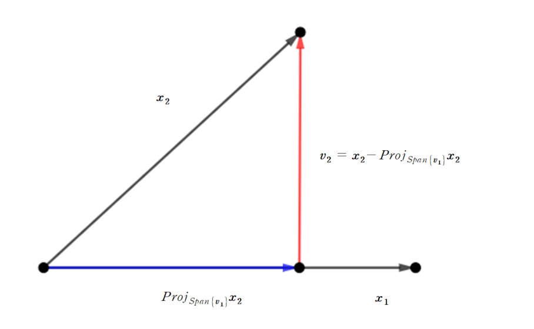

이번 포스트에서는 Gram-Schmidt Process에 대해 알아보겠습니다. 

 

### 1) The Gram-Schmidt Process

 

이전 포스트에서 orthogonal projection에 대해서 알아보았습니다. $\{\boldsymbol{u_1}, ..., \boldsymbol{u_p}\}$가 $W$의 orthogonal basis일 때, $\boldsymbol{y}$의 orthogonal projection onto $W$를 정의할 수 있었습니다. 그러면 모든 subspace에 대해 orthogonal basis가 존재할까요? 네 존재합니다. $\mathbb R^n$의 어떤 subspace이든, orthogonal basis를 만들 수 있습니다. **The Gram-Schmidt process는 subspace의 orthogonal basis를 찾아주는 알고리즘입니다. **

다음의 예시를 통해 어떻게 orthogonal basis를 찾을 수 있는지 확인해봅시다.

 

*example*

$$
W = Span\{\boldsymbol{x_1}, \boldsymbol{x_2}\}, \ \ \boldsymbol{x_1}=\begin{bmatrix}3 \\ 6 \\ 0\end{bmatrix},  \ \ \boldsymbol{x_2}=\begin{bmatrix} 1 \\ 2 \\ 2 \end{bmatrix}
$$

$\boldsymbol{x_1}, \boldsymbol{x_2}$는 linearly independent하므로, $\{\boldsymbol{x_1}, \boldsymbol{x_2}\}$는 $W$의 basis입니다. 하지만 $\boldsymbol{x_1}\cdot \boldsymbol{x_2} \neq 0 $이므로 orthogonal basis는 아닙니다. 위 두 벡터를 이용하여 orthogonal basis를 만들어보겠습니다. 

$$
\boldsymbol{v_1} = \boldsymbol{x_1} \\
\boldsymbol{v_2} = \boldsymbol{x_2} - proj_{Span{\boldsymbol\{v_1\}}}\boldsymbol{x_2}
$$

으로 설정해봅시다. 위와 같이 설정을 하면

$$
\boldsymbol{v_1} \cdot \boldsymbol{v_2} =0
$$

을 만족합니다. 또한, $\boldsymbol{v_1} \in W$이고, $Span\{\boldsymbol{v_1}\} \subset W$이므로, $proj_{Span\{\boldsymbol{v_1}\}}\boldsymbol{x_2} \in W$이고, 따라서

$$
\boldsymbol{v_2} \in W
$$

입니다. 실제로 값을 구해보면

$$
proj_{Span\{\boldsymbol{v_1}\}}\boldsymbol{x_2} = \frac{\boldsymbol{v_1}\cdot\boldsymbol{x_2}}{\boldsymbol{v_1}\cdot\boldsymbol{v_1}}\boldsymbol{v_1 } = \frac{15}{45}\boldsymbol{v_1 } = \begin{bmatrix}1 \\ 2 \\ 0 \end{bmatrix} 
$$

가 되어

$$
\boldsymbol{v_2} = \begin{bmatrix} 0 \\ 0 \\ 2\end{bmatrix}
$$

가 되어 

$$
\boldsymbol{v_1} \cdot \boldsymbol{v_2}=0
$$

을 만족합니다. 따라서 

$$
\{\boldsymbol{v_1}, \boldsymbol{v_2}\}
$$

는 $W$의 orthogonal basis입니다. 이를 시각적으로 표현하면 다음과 같습니다.

기본에 알고 있는 $\boldsymbol{x_1}, \boldsymbol{x_2}$를 이용하여 orthogonal한 두 벡터 $\boldsymbol{v_1}, \boldsymbol{v_2}$를 만들 수 있습니다. 즉 $\boldsymbol{v_1}$을 정하고 난 뒤, **그 다음 새로운 벡터 $\boldsymbol{v_2}$를 $\boldsymbol{x_2}$에서 $Span\{\boldsymbol{v_1}\}$에 projection한 vector를 빼서 만들 수 있습니다.** 이렇게 만들어진 두 벡터 $\boldsymbol{v_1}, \boldsymbol{v_2}$는 orthogonal합니다. 이를 일반화한 정리가 다음의 Gram-Schmidt Process입니다.

 

**Theorem : The Gram-Schmidt Process**

Given a basis $\{\boldsymbol{x_1}, ..., \boldsymbol{x_p}\}$ for a nonzero subspace $W$ of $\mathbb R^n$, define

$$
\begin{aligned}

\boldsymbol{v_1} &= \boldsymbol{x_1} \\
\boldsymbol{v_2} &= \boldsymbol{x_2} - \frac{\boldsymbol{v_1}\cdot\boldsymbol{x_2}}{\boldsymbol{v_1}\cdot\boldsymbol{v_1}}\boldsymbol{v_1}\\
\boldsymbol{v_3} &= \boldsymbol{x_3} - \frac{\boldsymbol{v_1}\cdot\boldsymbol{x_3}}{\boldsymbol{v_1}\cdot\boldsymbol{v_1}}\boldsymbol{v_1} - \frac{\boldsymbol{v_2}\cdot\boldsymbol{x_3}}{\boldsymbol{v_2}\cdot\boldsymbol{v_2}}\boldsymbol{v_2}\\
\vdots \\
\boldsymbol{v_p} & = \boldsymbol{x_p}-\frac{\boldsymbol{v_1}\cdot\boldsymbol{x_p}}{\boldsymbol{v_1}\cdot\boldsymbol{v_1}}\boldsymbol{v_1} - \cdots - \frac{\boldsymbol{v_{p-1}}\cdot \boldsymbol{x_p}}{\boldsymbol{v_{p-1}}\cdot\boldsymbol{v_{p-1}}}\boldsymbol{v_{p-1}}

\end{aligned}
$$

Then, $\{\boldsymbol{v_1}, ..., \boldsymbol{v_p}\}$ is an orthogonal basis for $W$. In addition,

$$
Span\{\boldsymbol{v_1}, ..., \boldsymbol{v_k}\} = Span\{\boldsymbol{x_1}, ..., \boldsymbol{x_k}\} \ \ for \ \ 1\leq k \leq p
$$

$\boldsymbol{v_j}$를 정의할 때, $\boldsymbol{x_j}$에서 특정 벡터를 빼서 정의합니다. 이 때 빼는 벡터는 바로

$$
proj_{Span\{\boldsymbol{v_1}, ..., \boldsymbol{v_{j-1}}\}}\boldsymbol{x_j}
$$

입니다. 즉

$$
\boldsymbol{v_j} = \boldsymbol{x_j} - proj_{Span\{\boldsymbol{v_1}, ..., \boldsymbol{v_{j-1}}\}}\boldsymbol{x_j}
$$

입니다. 

 

#### (1) Orthonormal basis

 

Orthogonal basis를 만들 수 있다면 orthonormal basis는 쉽게 만들 수 있습니다. orthogonal basis의 각각의 vector를 normalize시키면 바로 orthonormal basis가 됩니다.

 
$$
\boldsymbol{x_1} =\begin{bmatrix} 1 \\ 1 \\ 1 \\ 1 \end{bmatrix}, \ \ \boldsymbol{x_2} = \begin{bmatrix}0 \\ 1 \\ 1 \\ 1\end{bmatrix}, \ \ \boldsymbol{x_3} = \begin{bmatrix}0 \\ 0 \\ 1 \\ 1 \end{bmatrix}
$$

위 벡터들은 linearly independent하므로

$$
W = Span\{\boldsymbol{x_1}, \boldsymbol{x_2}, \boldsymbol{x_3}\}
$$

의 basis는 $\{\boldsymbol{x_1}, \boldsymbol{x_2}, \boldsymbol{x_3}\}$가 됩니다. 하지만 위 basis는 orthogonal basis는 아닙니다. Gram-Schmidt process를 이용하여 orthogonal basis를 만들어보겠습니다. 

$$
\boldsymbol{v_1} = \boldsymbol{x_1}
$$

으로 설정합니다. 두 번째로, $\boldsymbol{v_2}$는 $\boldsymbol{x_2}$에서 $Span\{\boldsymbol{v_1}\}$으로의  projection part를 제거해주면 됩니다.

$$
\begin{aligned}

\boldsymbol{v_2} &= \boldsymbol{x_2} - proj_{Span\{\boldsymbol{v_1}\}}\boldsymbol{x_2} \\
&=\boldsymbol{x_2} - \frac{\boldsymbol{v_1}\cdot\boldsymbol{x_2}}{\boldsymbol{v_1}\cdot\boldsymbol{v_1}}\boldsymbol{v_1} \\
& = \boldsymbol{x_2} - \frac{3}{4}\boldsymbol{v_1} \\
&=\begin{bmatrix}-\frac{3}{4} \\ \frac{1}{4} \\ \frac{1}{4} \\ \frac{1}{4} \end{bmatrix}

\end{aligned}
$$

입니다. 분수 형태로 나와 계산이 어려우니, 위 벡터에 $4$를 곱한

$$
\boldsymbol{v_2} = \begin{bmatrix} -3 \\ 1 \\ 1\\ 1 \end{bmatrix}
$$

을 사용하겠습니다. 위의 방법과 마찬가지로, $\boldsymbol{v_3}$를 구해주면 됩니다.

$$
\begin{aligned}

\boldsymbol{v_3} &= \boldsymbol{x_3} - proj_{Span\{\boldsymbol{v_1}, \boldsymbol{v_2}\}}\boldsymbol{x_3} \\
&=\boldsymbol{x_3} - \frac{\boldsymbol{v_1}\cdot\boldsymbol{x_3}}{\boldsymbol{v_1}\cdot\boldsymbol{v_1}}\boldsymbol{v_1} - \frac{\boldsymbol{v_2}\cdot\boldsymbol{x_3}}{\boldsymbol{v_2}\cdot\boldsymbol{v_2}}\boldsymbol{v_2} \\
&=\boldsymbol{x_3} - \frac{2}{4}\boldsymbol{v_1} - \frac{2}{12}\boldsymbol{v_2} \\
&=\begin{bmatrix}0 \\ -\frac{2}{3} \\ \frac{1}{3} \\ \frac{1}{3}\end{bmatrix}

\end{aligned}
$$

이 됩니다. 역시 분수가 나와 위 벡터에 3을 곱한

$$
\boldsymbol{v_3} = \begin{bmatrix}0 \\ -2 \\ 1 \\ 1 \end{bmatrix}
$$

을 사용하겠습니다. 즉

$$
\{\boldsymbol{v_1}, \boldsymbol{v_2}, \boldsymbol{v_3}\}
$$

가 $W$의 orthogonal basis가 됩니다. 여기서, orthonormal basis는 각 벡터를 normalizing시켜서 구할 수 있습니다. 

$$
\|\boldsymbol{v_1}\| = 2, \ \ \|\boldsymbol{v_2}\| = 2\sqrt 3, \ \ \|\boldsymbol{v_3}\| = \sqrt 6
$$

이므로

$$
\{\frac{1}{2}\boldsymbol{v_1}, \frac{1}{2\sqrt 3}, \frac{1}{\sqrt6}\boldsymbol{v_3}\}
$$

가 $W$의 orthonormal basis가 됩니다.

 

지금까지 Gram-Schumidt process에 대해 알아보았습니다. 다음 포스트에서는 Least-Squares problems에 대해 알아보겠습니다. 질문이나 오류 있으면 댓글로 남겨주세요! 감사합니다!

 

### Appendix : Proof of theorem

 

**Theorem : The Gram-Schmidt Process**

Given a basis $\{\boldsymbol{x_1}, ..., \boldsymbol{x_p}\}$ for a nonzero subspace $W$ of $\mathbb R^n$, define

$$
\begin{aligned}

\boldsymbol{v_1} &= \boldsymbol{x_1} \\
\boldsymbol{v_2} &= \boldsymbol{x_2} - \frac{\boldsymbol{v_1}\cdot\boldsymbol{x_2}}{\boldsymbol{v_1}\cdot\boldsymbol{v_1}}\boldsymbol{v_1}\\
\boldsymbol{v_3} &= \boldsymbol{x_3} - \frac{\boldsymbol{v_1}\cdot\boldsymbol{x_3}}{\boldsymbol{v_1}\cdot\boldsymbol{v_1}}\boldsymbol{v_1} - \frac{\boldsymbol{v_2}\cdot\boldsymbol{x_3}}{\boldsymbol{v_2}\cdot\boldsymbol{v_2}}\boldsymbol{v_2}\\
\vdots \\
\boldsymbol{v_p} & = \boldsymbol{x_p}-\frac{\boldsymbol{v_1}\cdot\boldsymbol{x_p}}{\boldsymbol{v_1}\cdot\boldsymbol{v_1}}\boldsymbol{v_1} - \cdots - \frac{\boldsymbol{v_{p-1}}\cdot \boldsymbol{x_p}}{\boldsymbol{v_{p-1}}\cdot\boldsymbol{v_{p-1}}}\boldsymbol{v_{p-1}}

\end{aligned}
$$

Then, $\{\boldsymbol{v_1}, ..., \boldsymbol{v_p}\}$ is an orthogonal basis for $W$. In addition,

$$
Span\{\boldsymbol{v_1}, ..., \boldsymbol{v_k}\} = Span\{\boldsymbol{x_1}, ..., \boldsymbol{x_k}\} \ \ for \ \ 1\leq k \leq p
$$

 

* **Proof**

 수학적 귀납법을 통해 위 정리를 증명할 것입니다. $1\leq k \leq p$에 대해서

$$
W_k = Span\{\boldsymbol{x_1}, ..., \boldsymbol{x_k}\}
$$

로 $W_k$를 정의하면 $k=1$일 때,

$$
\boldsymbol{v_1} = \boldsymbol{x_1}
$$

로 정의할 수 있고, 따라서

$$
Span\{\boldsymbol{v_1}\} = Span\{\boldsymbol{x_1}\} = W_1
$$

을 만족합니다. 

$1\leq k$일 때 $W_k$의 orthogonal basis가 

$$
\{\boldsymbol{v_1}, ..., \boldsymbol{v_k}\}
$$

라고 가정해봅시다. 

이 때, 

$$
\boldsymbol{v_{k+1}} = \boldsymbol{x_{k+1}} - proj_{W_k}\boldsymbol{x_{k+1}}
$$

로 정의하면 $\boldsymbol{v_{k+1}}$는 $W_k$에 orthogonal합니다. 또한

$$
W_{k+1} = Span\{\boldsymbol{x_1}, ..., \boldsymbol{x_{k+1}}\}
$$

이므로 $\boldsymbol{x_{k+1}}\in  W_{k+1}$, $proj_{W_k}\boldsymbol{x_{k+1}} \in W_{k+1}$을 만족하기 때문에

$$
\boldsymbol{v_{k+1}} \in W_{k+1}
$$

이고, $\boldsymbol{x_{k+1}} \notin W_k$이므로 $\boldsymbol{v_{k+1}}\neq0$을 만족합니다. 따라서

$$
\{\boldsymbol{v_1}, ..., \boldsymbol{v_{k+1}}\}
$$

은 orthogonal set이 되고, 따라서 $W_{k+1}$의 orthogonal basis가 됩니다. 

즉, $k$일 때 위 정리가 성립하면 $k+1$일 때 또한 성립하기 때문에 모든 자연수 $1\leq k \leq p$에 대해서 위 정리가 성립합니다.

