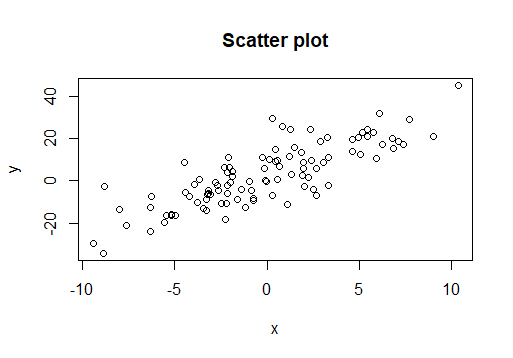
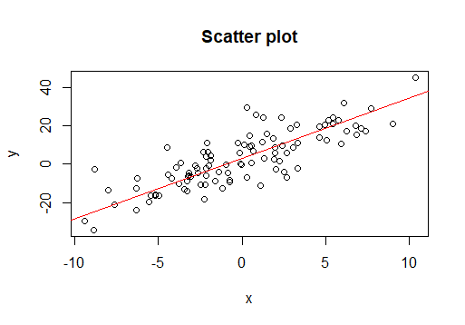

이번 포스트에서는 orthogonal projection의 응용인 linear regression(선형 회귀)에 대해서 알아보겠습니다.

 

### 1) Linear regression

 

#### (1) Linear regression

 

두 변수 간의 관계를 확인하고 싶을 때 데이터를 이용하여 관계를 확인할 수 있습니다. 예를 들어 다음과 같이 $x,  y$변수에 대한 data가 $(x_1, y_1), ..., (x_n, y_n)$으로 존재하고, 산점도가 다음과 같이 존재한다면

우리는 $x$와 $y$간 양의 상관관계를 가지고 있다고 생각할 수 있습니다. ($x$가 증가할 때 $y$도 증가하는 경향이 있습니다.) 그렇다면 $x$와 $y$간의 관계를 데이터를 이용하여 함수식으로 표현할 수 있을까요? 가장 간단한 함수인 일차함수를 생각해봅시다. 위 데이터를 이용하여

$$
y=\beta_1x+\beta_0
$$

를 표현할 수 있다면 $x$와 $y$간의 관계를 수치적으로 이야기할 수 있고($x$가 1증가하면 $y$는 $\beta_1$만큼 증가합니다.), 임의의 $x$에 대해 $y$값을 예측할수도 있습니다. 

이를 시각적으로 표현하면 다음과 같습니다. 빨간색 직선의 기울기($\beta_1$)와 y절편($\beta_0$)이 우리가 구해야하는 값입니다. 

 

#### (2) Notation and solution

 

data가 $(x_1, y_1), ..., (x_n, y_n)$으로 있을 때 우리는

$$
y=\beta_0 + \beta_1 x
$$

식에서 $\beta_0, \beta_1$을 구하는 것이 목표가 됩니다. 해당 data에 대해 위 식이 성립하므로

$$
y_1 = \beta_0 + \beta_1x_1 +\epsilon_1\\
y_2 = \beta_0 + \beta_1x_2 +\epsilon_2\\
\vdots \\
y_n = \beta_0 + \beta_1x_n +\epsilon_n
$$

을 만족해야 합니다.(여기서 $\epsilon$은 error term입니다. 모든 데이터가 직선위에 존재하지 않기 때문입니다. 따라서 통제할 수 없는 오차 값을 따로 정의를 해줍니다.) 위 식을 생각해보면, $\beta_0, \beta_1$에 대한 linear system으로 생각할 수 있습니다. 이를 matrix로 표현하기 위해서 다음을 정의합니다.

$$
Y=\begin{bmatrix}y_1 \\ y_2 \\ \vdots \\ y_n\end{bmatrix}, \ \ X=\begin{bmatrix}1 & x_1 \\ 1 & x_2 \\ \vdots & \vdots \\ 1 & x_n \end{bmatrix}, \ \ \boldsymbol \beta = \begin{bmatrix}\beta_0 \\ \beta_1\end{bmatrix}, \ \ \boldsymbol \epsilon =\begin{bmatrix} \epsilon_1 \\ \epsilon_2 \\ \vdots \\ \epsilon_n \end{bmatrix}
$$

으로 정의하면, 위 linear system은

$$
Y =X\boldsymbol \beta + \boldsymbol \epsilon
$$

가 됩니다. 만약 직선이 데이터를 잘 설명한다면, 

$$
Y \approx X\boldsymbol \beta
$$

가 만족되어야 합니다. 즉 $X\boldsymbol \beta$와 $Y$가 최대한 비슷해야 합니다. 비슷하다를 우리는 distance를 통해 정의를 하였습니다. 두 값이 비슷할수록

$$
\|Y-X\boldsymbol{\beta}\|
$$

두 벡터 사이의 거리는 작아질 것입니다. 따라서, 위 데이터를 가장 잘 설명하는 직선($\boldsymbol{\beta}$)를 찾는 것은 두 벡터 사이의 거리를 최소화시키는 $\boldsymbol \beta$를 찾는 것과 같아집니다. 즉 least square problem을 푸는 것과 같아집니다.

$$
\hat{\boldsymbol \beta} = \arg\min_{\boldsymbol \beta}\|Y-X\boldsymbol \beta\|
$$

이전 포스트에서, 해당 least sqaures problem의 solution은 다음의 equation을 푸는 것과 같다고 배웠습니다.

$$
(X^TX)\boldsymbol \beta = X^TY
$$

만약 $X^TX$가 invertible하다면 

$$
\hat{\boldsymbol{\beta}} = (X^TX)^{-1}X^TY
$$

로 $\boldsymbol \beta$를 구할 수 있습니다.

 

#### (3) Extension : Multiple linear regression

 

$y$와 특정 변수 하나 $x$와의 관계 뿐만 아니라 여러 변수들 간의 관계를 나타내는 식을 구할수도 있습니다. 만약 데이터가

$(x_{11}, ..., x_{1p}, y_1), (x_{21}, ..., x_{2p}, y_2), ..., (x_{n1}, ..., x_{np}, y_n)$으로 주어져 있고, $y$와 각 변수간의 관계를 다음 식

$$
y =\beta_0 +\beta_1x_1+\cdots + \beta_px_p
$$

으로 가정할 수 있습니다. 이 때, 우리가 구해야 하는 것은 $\beta_0, ..., \beta_p$입니다. 

해당 문제 또한 변수가 하나였을 때와 똑같은 방법을 적용할 수 있습니다. 다만 $X$ matrix와 $\boldsymbol \beta$ 벡터가 조금 달라집니다.

해당 데이터가 위의 식으로 표현되어야 하므로

$$
y_i = \beta_0 + \beta_1x_{i1}+\cdots + \beta_px_{ip} +\epsilon_i, \ \ i=1,...,n
$$

으로 나타낼 수 있습니다. 이를 matrix로 표현하기 위해 

$$
Y=\begin{bmatrix}y_1 \\ y_2 \\ \vdots \\ y_n\end{bmatrix}, \ \ X=\begin{bmatrix}1 & x_{11} & \cdots & x_{1p} \\ 1 & x_{21} & \cdots & x_{2p} \\ \vdots & \vdots \\ 1 & x_{n1} & \cdots & x_{np} \end{bmatrix}, 
\ \ \boldsymbol \beta = \begin{bmatrix}\beta_0 \\ \beta_1 \\ \vdots \\ \beta_p\end{bmatrix}, \ \ \boldsymbol \epsilon =\begin{bmatrix} \epsilon_1 \\ \epsilon_2 \\ \vdots \\ \epsilon_n \end{bmatrix}
$$

 로 설정합니다. 이 경우 $Y\in \mathbb R^n, \ \boldsymbol{\beta}\in\mathbb R^p, \boldsymbol \epsilon\in \mathbb R^n$d이고, $X$는 $n \times p$ matrix가 됩니다. 해당 notation을 이용하면

$$
Y =X\boldsymbol \beta + \boldsymbol \epsilon
$$

이 되고, 변수가 하나였을 때와 마찬가지로

$$
\|Y-X\boldsymbol \beta\|
$$

를 최소화하는 $\boldsymbol{\beta}$가 solution이 되고 만약 $X^TX$가 invertible하면

$$
\hat{\boldsymbol \beta} = (X^TX)^{-1}X^TY
$$

가 됩니다.

 

#### (3) Interpretation and Projection

 

위의 식을 이용하여 $\hat{\boldsymbol{\beta}}$를 구했다면 이 값을 통해 $Y$의 추정값(estimates)를 구할 수 있습니다. 

$$
\hat Y = X\hat{\boldsymbol{\beta}}
$$

가 됩니다. 이를 각 data별로 설명하면

$$
\hat y_i = \hat \beta_0 + \hat \beta_1 x_{i1} + \cdots + \hat \beta x_{in}, \ \ i=1,...,n
$$

으로 표현됩니다. 해당 식의 의미를 확인하기 위해 least-sqaures problem을 살펴봅시다.

$$
\|Y-X\boldsymbol \beta\|
$$

를 최소화시키는 $\boldsymbol \beta$가 least-squares solution이 됩니다. 이 때 

$$
X\boldsymbol\beta
$$
 

를 살펴봅시다. 위 식은 $X$의 column space에 속한 벡터입니다. 즉 임의의 벡터 $\boldsymbol{\beta}$에 대해서

$$
X\boldsymbol \beta \in ColX
$$

를 만족합니다. 따라서 위 **least squares problem은 $ColX$에서 $Y$와 가장 가까운 벡터를 만들어주는 $\boldsymbol{\beta}$를 찾는 문제가 됩니다.** orthogonal projection의 성질에 의해 해당 조건을 만족하는 $\boldsymbol \beta$에 대해 $X\boldsymbol{\beta}$는 $proj_{ColX}Y$가 되는 것이구요. 따라서

$$
\hat Y = X\hat{\boldsymbol \beta} = X(X^TX)^{-1}X^TY
$$

는 **projection of $Y$ onto $ColX$가 됩니다.** 여기서 

$$
H_X = X(X^TX)^{-1}X^T
$$

**를 hat matrix 또는 projection matrix라고 합니다.**

 

### 2) Weighted Least-Squares Problem

 

#### (1) Weighted Least-Squares Problem

 

Multiple linear regression에서의 least-squares problem

$$
\|Y-X\boldsymbol \beta\|
$$

에서

$$
\|Y-X\boldsymbol \beta\|^2
$$

을 풀어서 쓰면 다음과 같습니다.

$$
\|Y-X\boldsymbol \beta\|^2 = \Sigma_{i=1}^n (y_i-(\beta_0+\beta_1x_{i1}+\cdots+\beta_px_{ip}))^2
$$

여기서 각 observation마다 직선 식과 실제 $y$값의 차이의 제곱을 모두 더한 값이 $\|Y-X\boldsymbol \beta\|^2$이 됩니다. 여기서 특정 observation이 다른 observation보다 중요하여, 가중치를 두는 상황이 발생할 수 있고, 반대로, 특정 observation이 부정확한 데이터여서, 해당 데이터에 대한 가중치를 낮추는 상황도 발생할 수 있습니다. 이 경우 해당 식을 다음과 같이 수정할 수 있습니다.

$$
\Sigma_{i=1}^n w_i(y_i-(\beta_0+\beta_1x_{i1}+\cdots+\beta_px_{ip}))^2
$$

여기서 $w_i$가 가중치를 뜻하고, $w_i>0$을 만족합니다. 해당 식을 matrix로 표현하기 위해 다음 matrix

$$
W = diag(w_1, ..., w_n)
$$

을 정의하면 해당 식은

$$
\Sigma_{i=1}^n w_i(y_i-(\beta_0+\beta_1x_{i1}+\cdots+\beta_px_{ip}))^2 = (Y-X\boldsymbol \beta)^TW(Y-X\boldsymbol{\beta})
$$

로 표현할 수 있습니다. 여기서

$$
W^{\frac{1}{2}} = diag(\sqrt{w_1}, ..., \sqrt{w_n})
$$

 으로 설정하면($w_i>0$이므로 설정 가능합니다.) 위의 식은

$$
(Y-X\boldsymbol \beta)^TW(Y-X\boldsymbol{\beta}) = \|W^{\frac{1}{2}}(Y-X\boldsymbol{\beta})\|^2
$$

이 됩니다. 다음과 같이

$$
\|W^{\frac{1}{2}}(Y-X\boldsymbol{\beta})\|^2
$$

를 최소화시키는 $\boldsymbol \beta$를 찾는 문제를 **Weighted-Least-Squares Problem**이라고 합니다.  

 

#### (2) Solving weighted-least-squares problem

 

Weighted-least-squares problem을 풀기 위해서 $\mathbb R^n$에서의 새로운 inner product를 정의합니다.

$$
\langle \boldsymbol{x}, \boldsymbol{y} \rangle  = \boldsymbol{x}^TW\boldsymbol{y}
$$

해당 연산은 inner product 성질을 만족합니다. (증명은 appendix 참고) 따라서 해당 inner product에 대해서 두 벡터 사이의 distance는

$$
\|\boldsymbol{x}-\boldsymbol{y}\|_W^2 = (\boldsymbol{x}-\boldsymbol{y})^TW(\boldsymbol{x}-\boldsymbol{y})
$$

가 됩니다. 따라서 weighted-least-squares problem에서의 식은

$$
(Y-X\boldsymbol \beta)^TW(Y-X\boldsymbol{\beta}) = \langle(Y-X\boldsymbol\beta), (Y-X\boldsymbol \beta) \rangle = \|Y-X\boldsymbol{\beta}\|_W^2
$$

다음과 같이 표현할 수 있습니다. 즉, $W$를 이용한 새로운 inner product space에서의 least-squares problem이 됩니다. 

해당 문제의 solution을 $\hat{\boldsymbol \beta}$로 정의하면 **$X\hat{\boldsymbol \beta}$는 $Y$의 $ColX$로의 orthogonal projection입니다.** 따라서

$$
(Y-X\hat{\boldsymbol \beta}) \perp_W ColX
$$

를 만족하고 이는 $X$의 column과 $Y-X\hat{\boldsymbol \beta}$가 orthogonal하므로 $X = \begin{bmatrix}\boldsymbol{x_1} & \cdots & \boldsymbol{x_p} \end{bmatrix}$인 $X$에 대해

$$
(Y-X\hat{\boldsymbol \beta}) \perp_W \boldsymbol{x_j} \ \ for \ \ j =1,...,p
$$

이므로

$$
\boldsymbol{x_j}^TW(Y-X\hat{\boldsymbol \beta})=0
$$

을 만족하므로

$$
X^TW(Y-X\hat{\boldsymbol \beta}) = 0
$$

을 만족합니다. 따라서

$$
X^TWX\hat{\boldsymbol \beta} = X^TWY
$$

를 만족합니다. 여기서 만약 $X^TWX$가 invertible하다면

$$
\hat{\boldsymbol \beta} = (X^TWX)^{-1}X^TWY
$$

가 됩니다.

 

지금까지 orthogonal projection의 응용인 linear regression과 weighted least-squares problem에 대해 알아보았습니다. 다음 포스트에서는 inner product space의 응용인 fourier series에 대해 알아보겠습니다. 질문이나 오류 있으면 댓글 남겨주세요! 감사합니다!

 

### Appendix : Weighted-Least-Squares 

 

**Property**

For $\boldsymbol x, \boldsymbol y \in \mathbb R^n$, define $\langle\boldsymbol{x}, \boldsymbol{y} \rangle_W$ as

$$
\langle\boldsymbol{x}, \boldsymbol{y} \rangle_W = \boldsymbol{x}^TW\boldsymbol{y}
$$

where

$$
W=diag(w_1, ..., w_n). \ \ w_i>0 \ \ for \ \ i=1,...,n
$$

Then this operation satisfies inner product conditions.

 

* **Proof**

해당 연산이 inner product임을 밝히기 위해서는 4가지 조건을 밝혀야 합니다. 

 

*  $\langle\boldsymbol{x}, \boldsymbol{y} \rangle_W =\langle\boldsymbol{y}, \boldsymbol{x} \rangle_W$

$$
\langle\boldsymbol{x}, \boldsymbol{y} \rangle_W = \boldsymbol{x}^TW\boldsymbol{y} = \Sigma_{i=1}^nw_ix_iy_i = \Sigma_{i=1}^nw_iy_ix_i=\boldsymbol{y}^TW\boldsymbol{x} = \langle\boldsymbol{y}, \boldsymbol{x} \rangle_W
$$

첫 번째 조건은 성립합니다.

 

* $\langle\boldsymbol{x}+\boldsymbol{y}, \boldsymbol{z} \rangle_W=\langle\boldsymbol{x}, \boldsymbol{z} \rangle_W + \langle\boldsymbol{y}, \boldsymbol{z} \rangle_W$

$$
\langle\boldsymbol{x_y}, \boldsymbol{z} \rangle_W = (\boldsymbol{x}+\boldsymbol{y})^TW\boldsymbol{z} =\boldsymbol x^TW\boldsymbol z + \boldsymbol y^TW\boldsymbol z = \langle\boldsymbol{x}, \boldsymbol{z} \rangle_W + \langle\boldsymbol{y}, \boldsymbol{z} \rangle_W
$$

두 번째 조건 또한 성립합니다.

 

* $\langle c\boldsymbol{x}, \boldsymbol{y} \rangle_W=c\langle\boldsymbol{x}, \boldsymbol{y} \rangle_W$, $c$ is scalar 

$$
\langle c\boldsymbol{x}, \boldsymbol{y} \rangle_W = (c\boldsymbol x)^TW\boldsymbol{y} = c(\boldsymbol x)^TW\boldsymbol y =c\langle\boldsymbol{x}, \boldsymbol{y} \rangle_W
$$

세 번째 조건도 성립합니다.

 

* $\langle\boldsymbol{x}, \boldsymbol{x} \rangle_W\geq 0$, $\langle\boldsymbol{x}, \boldsymbol{x} \rangle_W=0$ if and only if $\boldsymbol{x}=0$

$$
\langle\boldsymbol{x}, \boldsymbol{x} \rangle_W = \boldsymbol x^TW\boldsymbol x = \Sigma_{i=1}^nw_ix_i^2 \geq 0
$$

이는 $w_i>0$이므로 성립합니다. 또한 $w_i>0$이므로 해당 연산값이 0이 되려면

$$
\langle\boldsymbol{x}, \boldsymbol{x} \rangle_W = 0 \iff \boldsymbol{x} =0
$$

이 되어야 합니다.

따라서 inner product가 되기 위한 4가지 조건을 만족하였으므로 

$$
\langle\boldsymbol{x}, \boldsymbol{y} \rangle_W = \boldsymbol{x}^TW\boldsymbol{y}
$$

는 inner product가 됩니다.

