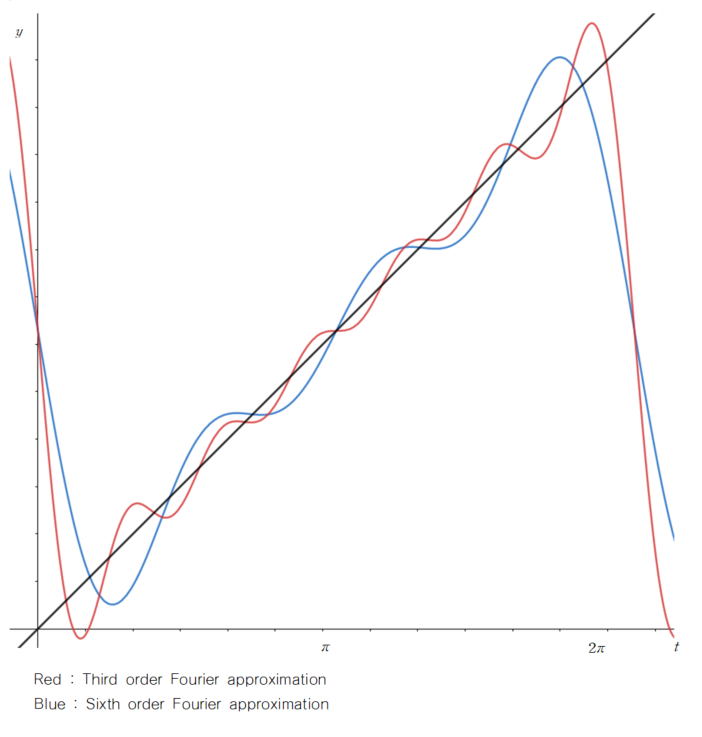

이번 포스트에서는 Fourier Series에 대해 알아보겠습니다. 

 

### 1) Fourier Series

 

#### (1) Set of continuous functions

 

다음과 같은 집합 $S$를 생각해봅시다.

$$
S = \{f \mid f : [0, 2\pi] \rightarrow \mathbb R,  \ f : \ continuous\}
$$

Domain이 $[0, 2\pi]$이고 공역이 실수인 연속 함수들의 집합 $S$는 vector space가 됩니다. 이는, 함수에서의 zero vector 역할을 하는 상수함수 $y=0$은 연속함수이므로 다음 집합에 포함되고, 연속함수의 합과 scalar multiple 역시 연속함수이기 때문입니다. 즉, $S$는 vector space가 되고 이를

$$
S = C[0, 2\pi]
$$

로 표현할 수 있습니다. 

 

#### (2) Fourier approximation

 

$C[0, 2\pi]$에서, inner product를 다음과 같이 정의해봅시다.

$$
\langle f, g \rangle = \int_0^{2\pi}f(t)g(t)dt
$$

다음 연산은 inner product가 되기 위한 조건을 만족합니다. 이는

1. $\langle f, g \rangle = \langle g, f \rangle$
2. $\langle f, g+h \rangle = \int_0^{2\pi}f(t)\{g(t)+h(t)\}dt = \int_0^{2\pi}f(t)g(t)dt + \int_0^{2\pi}g(t)h(t)dt = \langle f, g \rangle + \langle f, h \rangle$
3. $\langle cf, g \rangle = \int_0^{2\pi}cf(t)g(t)dt = c\int_0^{2\pi}f(t)g(t)dt = c\langle f, g \rangle$
4. $\langle f, f \rangle =\int_0^{2\pi}\{f(t)\}^2dt \geq 0, \ \ \langle f, f \rangle = 0$ if and only if $f=0$

다음 네 조건을 모두 만족하기 때문입니다. 즉, 다음의 inner product를 이용한 inner product space $C[0, 2\pi]$를 얻을 수 있습니다.

Inner product space $C[0, 2\pi]$에서 basis가 다음과 같은 subspace $W$를 생각해봅시다.

$$
\{1, \cos t, \cos2t, ..., \cos nt, \sin t, \sin 2t, ..., \sin nt\} \\
W = Span\{1, \cos t, \cos2t, ..., \cos nt, \sin t, \sin 2t, ..., \sin nt\}
$$

다음 basis는 orthogonal한 것을 알 수 있습니다. (appendix 참고)

$C[0, 2\pi]$에 속하는 모든 벡터(또는 함수)는 $W$에 속한 벡터로 근사할 수 있습니다. projection을 이용해서 말이죠. 

$$
f \in C[0, 2\pi] \\

Proj_W(f) = a_0+a_1\cos t + a_2\cos 2t + \cdots + a_n \cos nt + b_1 \sin t + b_2 \sin 2t + \cdots + b_n \sin nt
$$

여기서 $a_k, b_k$는 orthogonal projection 개념을 이용하여 구할 수 있습니다.

$$
a_k = \frac{\langle\cos kt, f \rangle}{\langle \cos kt, \cos kt \rangle}, \ \ \ b_k = \frac{\langle \sin kt, f \rangle}{\langle \sin kt, \sin kt\rangle}, \ \ k=1, ..., n
$$

이 때, $\langle \cos kt, \cos kt \rangle = \langle \sin kt, \sin kt \rangle = \pi$인 것을 이용하면 

$$
a_k = \frac{1}{\pi}\int_0^{2\pi}f(t)\cos kt dt , \ \ \ b_k = \frac{1}{\pi}\int_0^{2\pi}f(t) \sin kt dt, \ \ k=1, ..., n
$$

임을 알 수 있습니다. 또한 $a_0$는

$$
a_0 = \frac{\langle 1, f \rangle}{\langle1, 1 \rangle}, \ \ \langle1, 1 \rangle = \int_0^{2\pi}1dt = 2\pi, \ \ \langle1, f \rangle = \int_0^{2\pi}f(t)dt\\
a_0 = \frac{1}{2\pi}\int_0^{2\pi} f(t)dt
$$

인 것을 알 수 있습니다. Notation 편의를 위해 $a_0 = \frac{1}{\pi}\int_0^{2\pi}f(t)dt$ 로 설정하면 

$$
Proj_W(f) = \frac{a_0}{2}+a_1\cos t + \cdots + a_n \cos nt + b_1 \sin t + \cdots + b_n \sin nt
$$

와 같이 근사할 수 있습니다. 다음의 근사를 **nth-order Fourier approximation to $f$ on $[0, 2\pi]$**라고 합니다. 또한 $a_k, b_k$를 $f$의 **Fourier coefficient**라고 합니다.

 

*example*

$$
f(t) =t
$$

의 nth order Fourier approximation을 구해봅시다.

$$
\frac{a_0}{2} = \frac{1}{2\pi}\int_0^{2\pi}tdt = \frac{1}{2\pi}\left[\frac{1}{2}t^2\right]^{2\pi}_0 = \pi
$$

와

$$
a_k  = \frac{1}{\pi}\int_0^{2\pi} t\cos kt dt = \frac{1}{\pi}\left[\frac{1}{k}t\sin kt + \frac{1}{k^2}\cos kt\right]^{2\pi}_0 = 0 \\
b_k = \frac{1}{\pi}\int_0^{2\pi}t\sin kt dt = \frac{1}{\pi}\left[-\frac{1}{k}t\cos kt + \frac{1}{k^2}\sin kt\right]^{2\pi}_0 = -\frac{2}{k}
$$

을 통해

$$
f(t) = \frac{\pi}{2} -2\sin t -\sin 2t - \frac{2}{3}\sin 3t - \cdots - \frac{2}{n}\sin nt
$$

을 얻을 수 있습니다.  다음 식을 이용하여 3rd, 6th order Fourier approximation을 한 결과 그래프는 다음과 같습니다.

검은 직선 $f(t) =t$에 대한 3rd, 6th order Fourier approximation 결과를 살펴보면 order가 클수록 approximation을 잘하는 것을 알 수 있습니다. 따라서, Fourier approximation에서 n을 무한대로 보내는, 급수형태로 표현한다면 매우 정확하게 $f$를 근사할 수 있을 것입니다. 

 

#### (3) Fourier Series

 

Fourier approximation에서 order가 증가할수록, 주어진 함수를 더욱 더 잘 근사할 수 있습니다. 따라서 Fourier approximation에서 order를 무한으로 늘리면 다음과 같이 무한 급수 형태로 식을 작성할 수 있습니다.

$$
f(t) = \frac{a_0}{2} + \sum_{m=1}^\infty(a_m\cos mt + b_m \sin mt)
$$
 

$f(t)$를 다음의 series로 표현하는 방법을 **Fourier series** for $f$ on $[0, 2\pi]$라고 합니다. 여기서, $a_m \cos mt$는 $f$를 $Span \{ \cos mt \}$로의 projection, $b_m \sin mt$는 $f$를 $Span\{ \sin mt \}$로의 projection으로 해석할 수 있습니다.

지금까지 Fourier Series에 대해 알아보았습니다. 다음 포스트에서는 symmetric matrix와 spectral decomposition에 대해 알아보겠습니다. 질문이나 오류 있으면 댓글 남겨주세요! 감사합니다!

 

### Appendix : Proof of property

 

**Property**

Let $W$ be a subspace of the inner product space $C[0, 2\pi]$. The basis of $W$ 

$$
\{1, \cos t, \cos2t, ..., \cos nt, \sin t, \sin 2t, ..., \sin nt\}
$$

is orthogonal basis for $W$

 

* **Proof**

1. $\cos mt, \cos nt$ case ($m\neq n$)

$$
\begin{aligned}

\langle \cos mt, \cos nt \rangle &= \int_0^{2\pi} \cos mt \cos nt dt = \int_0^{2\pi}\frac{1}{2}(\cos(m+n)t + \cos(m-n)t) dt \\
&= \frac{1}{2}\left[\frac{1}{m+n}\sin (m+n)t +\frac{1}{m-n}\sin(m-n)t\right]^{2\pi}_0 \\
&=0

\end{aligned}
$$

2. $\cos mt, \sin nt$ case ($m\neq n$)

$$
\begin{aligned}
\langle \cos mt, \sin nt \rangle &= \int_0^{2\pi} \cos mt \sin nt dt = \int_0^{2\pi} \frac{1}{2}(\sin (m+n)t -\sin(m-n)t)dt \\
&= -\frac{1}{2}\left[\frac{1}{m+n}\cos (m+n)t -\frac{1}{m-n}\cos(m-n)t\right]^{2\pi}_0 \\
&=0

\end{aligned}
$$

3. $\sin mt, \sin nt$ case ($m\neq n$)

$$
\begin{aligned}
\langle \sin mt, \sin nt \rangle &= \int_0^{2\pi} \sin mt \sin nt dt = \int_0^{2\pi} -\frac{1}{2}(\cos (m+n)t -\cos(m-n)t)dt \\
&= -\frac{1}{2}\left[\frac{1}{m+n}\sin (m+n)t -\frac{1}{m-n}\sin(m-n)t\right]^{2\pi}_0 \\
&=0

\end{aligned}
$$

4. $\cos mt, \sin mt$ case

$$
\begin{aligned}
\langle \cos mt, \sin mt \rangle &= \int_0^{2\pi} \cos mt \sin mt dt = \int_0^{2\pi} \frac{1}{2}\sin 2mt dt \\
&= \left[-\frac{1}{4m}\cos 2mt\right]^{2\pi}_0 \\
&=0

\end{aligned}
$$

따라서, 

$$
\{1, \cos t, \cos2t, ..., \cos nt, \sin t, \sin 2t, ..., \sin nt\}
$$

는 $W$의 orthogonal basis입니다.

 

**Property**

$$
\langle \sin kt, \sin kt \rangle = \langle \cos kt, \cos kt \rangle = \pi
$$

 

* **Proof**

1. $\langle \sin kt, \sin kt \rangle$

$$
\begin{aligned}

\langle \sin kt, \sin kt \rangle &=\int_0^{2\pi} \sin kt \sin kt dt = \int_0^{2\pi}\sin^2ktdt = \int_0^{2\pi}\frac{1-\cos 2kt}{2}dt \\
&= \left[\frac{1}{2}(1-\frac{1}{4k}\sin 2kt)\right]^{2\pi}_0 \\
&=\pi

\end{aligned}
$$

2. $\langle \cos kt, \cos kt \rangle$

$$
\begin{aligned}

\langle \cos kt, \cos kt \rangle &=\int_0^{2\pi} \cos kt \cos kt dt = \int_0^{2\pi}\cos^2ktdt = \int_0^{2\pi}\frac{1+\cos 2kt}{2}dt \\
&= \left[\frac{1}{2}(1+\frac{1}{4k}\sin 2kt)\right]^{2\pi}_0 \\
&=\pi

\end{aligned}
$$

