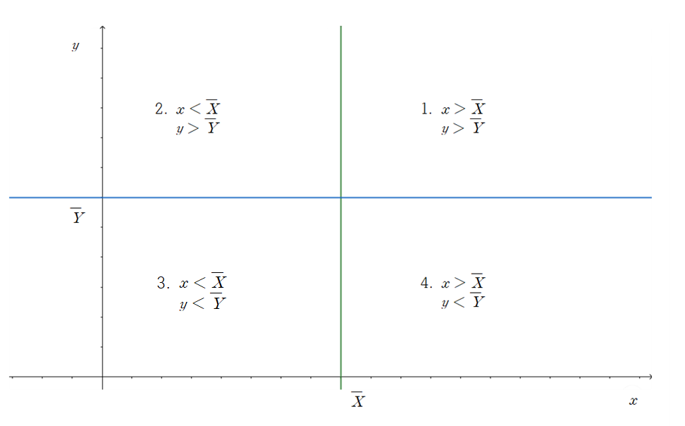
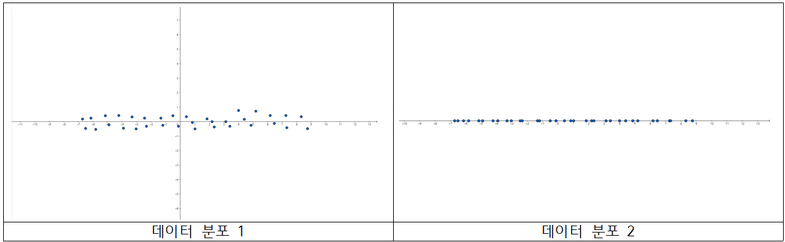
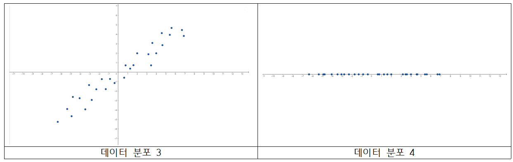
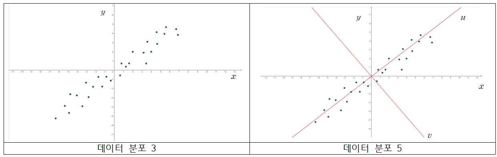
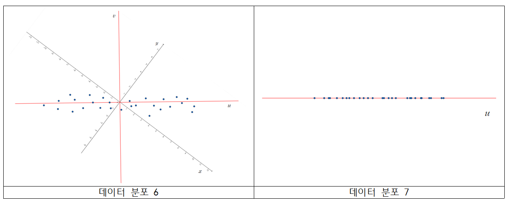

이번 포스트에서는 Principal Component Analysis(주성분 분석)에 대해서 알아보겠습니다.

 

### 1) Principal Component Analysis

 

#### 1) Basic Statistics

 

주성분분석을 하기에 앞서 기본적인 통계 용어와 개념이 필요합니다. 

 

**Definition : Mean, Variance, Covariance, Correlation coefficient**

Given random variables $X, Y$, with pdf $f_X(x), f_Y(y)$, the mean of $X$ is (with $E(\begin{vmatrix} X \end{vmatrix})<\infty$)

$$
E(X) = \begin{cases} \sum xf_X(x) & x : discrete \\ \int xf_X(x) & x : continuous\end{cases}
$$

If $E(X^2)<\infty$ and $E(X)<\infty$, the variance of $X$ is 

$$
Var(X) = E[(X-E(X))^2] 
$$

If $E(X^2)<\infty, E(Y^2)<\infty, E(XY)<\infty$, the covariance of $X, Y$ is

$$
Cov(X, Y) = E[(X-E(X))(Y-E(Y))]
$$

and the correlation coefficient of $X$ and $Y$ is

$$
Corr(X, Y) = \frac{Cov(X, Y)}{\sqrt{Var(X)}\sqrt{Var(Y)}}
$$

확률 변수를 정의하고 확률분포를 알게 되면 평균(mean)과 분산(variance)을 구할 수 있습니다. 추가적으로, 두 개의 확률변수의 관계를 나타내는 값으로 공분산(covariance)과 상관계수(correlation coefficient) 정의할 수 있습니다.

하지만 우리는 데이터를 얻었을 때 전체 데이터(모집단이라고 합니다.)를 얻을 수 없기 때문에, 그 중 일부분을 추출한 데이터(표본)를 바탕으로 전체 데이터가 어떤 형태를 가지는지 추측을 합니다.

 

**Definition : Sample mean, Sample variance, Sample covariance, Sample correlation coefficient, Sample Covariance matrix**

Given the data $(x_1, y_1), (x_2, y_2), ..., (x_n, y_n)$, the sample mean of $X$ and $Y$  is

$$
\bar X  = \frac{1}{n}\sum_{i=1}^n x_i,  \ \ \bar{Y} = \frac{1}{n}\sum_{i=1}^ny_i
$$

The sample variance of $X$ and $Y$ is 

$$
\hat{Var}(X) = \frac{1}{n-1}\sum_{i=1}^n (x_i-\bar{X})^2, \ \ \hat{Var}(Y) = \frac{1}{n-1}\sum_{i=1}^n(y_i-\bar Y)^2
$$

The sample covaraince of $X$ and $Y$ is

$$
\hat{Cov}(X, Y) = \frac{1}{n-1}\sum_{i=1}^n (x_i-\bar{X})(y_i-\bar{Y})
$$

The sample correlation coefficient of $X$ and $Y$ is

$$
\hat{Corr}(X, Y) = \frac{\hat{Cov}(X, Y)}{\sqrt{\hat{Var}(X)}\sqrt{\hat{Var}(Y)}}
$$

표본 평균, 분산, 공분산, 상관계수에서 생각해야 하는 점은 다음과 같습니다.

1. **분산이 클수록 데이터가 sample mean에서 퍼져있고, 분산이 작을수록 데이터가 sample mean에 몰려있다.**

   - Sample variance의 정의를 보면 데이터에서 데이터의 평균을 뺀 값들을 제곱하여 더한 뒤, sample 개수-1로 나눈 값입니다. 만약 데이터가 평균에 몰려있다면, 데이터에 평균을 뺀 값은 0에 가까울 것이고, 제곱을 하면 0에 가까운 값이 나올 것입니다. 따라서 이를 다 더한 뒤 특정 값으로 나눈 sample variance는 작은 값을 가집니다. 한편 데이터가 평균에서 퍼져있다면, 데이터에 평균을 뺀 결과가 큰 값들이 존재할 것이고, 이를 제곱하면 0에서 먼 값, 즉 상당히 큰 값이 나올 것입니다. 이를 더한 뒤 특정 값으로 나눈 sample variance는 큰 값을 가집니다.

2. **Sample covariance가 양의 값을 가지면 두 변수는 양의 상관관계, 음의 값을 가지면 두 변수는 음의 상관관계를 가진다.**

   * Sample covariance는 두 데이터 간의 관계를 나타내주는 값입니다. $x_i$가 $\bar X$보다 클 때, $y_i$는 $\bar Y$보다 클 수도, 작을 수도 있습니다. 다음의 그림과 같이 데이터의 위치에 따라 4 가지 경우로 나눌 수 있습니다.

     

     만약 데이터가 1과 3 부분에 많이 존재한다면, sample covariance 계산 식인 $(x_i-\bar X)(y_i-\bar Y)$ 값은 양수가 될 것입니다. 따라서 이를 다 더하고 sample 개수-1로 나눈 값 또한 양수가 될 것입니다. 1번과 3번 부분에 데이터가 많이 존재한다는 것은, $X$가 증가할 때 $Y$도 증가한다는 것을 의미합니다. 따라서 양의 상관관계를 가진다고 할 수 있습니다.

     두 번째로, 데이터가 2번과 4번 부분에 많이 존재한다면, sample covariance 계산 식 값은 음수가 될 것입니다. 이를 다 더하고 sample 개수-1로 나눈 값 또한 음수가 됩니다. 2번과 4번 부분에 데이터가 많이 존재한다는 것은 $X$가 증가할 때 $Y$는 감소하는 것을 의미합니다. 따라서 음의 상관관계를 가진다고 할 수 있습니다. 

     마지막으로 데이터가 1, 2, 3, 4에 고르게 분포할 경우, sample covariance의 값은 0에 근접한 값을 가지게 됩니다. 

3. **Sample correlation coefficient는 상관관계 강도까지 나타낸 값으로, -1과 1에 가까울수록 강한 상관관계를 가진다.**

   * Sample correlation은 sample covariance에 각 변수의 sample variance의 root값을 나눈 값으로, 최소 -1에서 최대 1의 값을 가지게 됩니다. Sample covaraince에서는 단순히 양의 상관관계가 있는지, 음의 상관관계가 있는지만을 확인할 수 있었다면, Sample correlation coefficient는 그 강도가 얼마나 강한지까지 알 수 있는 지표입니다. 1에 가까울수록 강한 양의 상관관계(기울기가 양수인 직선 형태), -1에 가까울수록 강한 음의 상관관계(기울기가 음수인 직선형태)를 띄게 됩니다.
   
     마지막으로, correlation coefficient가 0인 경우, 두 변수는 uncorrelated이다고 정의합니다.

 

#### (2) Data and Dimension

 

Principal Component Analysis(PCA)의 목적은 dimension을 줄이는데 있습니다. 그렇다면 데이터를 분석하는데 있어 dimension을 줄이는 이유는 무엇인지, 줄였을 때 어떤 효과를 얻을 수 있는지 알아보겠습니다.

데이터를 설명하는 변수가 많아질 때 우리가 가질 수 있는 이점은 무엇일까요? 변수가 추가될 때 마다 현재 데이터가 가지는 정보를 설명해주기 때문에, 변수가 많아지면 많아질수록 우리가 데이터로부터 얻을 수 있는 정보는 많아집니다. 

그렇다고 데이터를 설명하는 변수가 많아진다고 해서 좋은 점만 있는 것은 아닙니다. 변수가 많을수록 변수를 통제하거나 데이터에서 해당 변수가 가지는 의미를 설명하기가 어려워집니다. 다음 두 식을 살펴봅시다.

$$
y = \alpha_0 + \alpha_1 x_1 \ \cdots \ 1. \\ 
y = \beta_0 + \beta_1 x_1 +\beta_2 x_2 \ \cdots 2.
$$

1번 식보다 2번 식이 $y$를 설명하는 변수가 하나 더 많습니다. **$x_2$라는 변수 또한 $y$를 설명하는데 사용이 되었기 때문에, 2번 식이 1번 식보다 $y$에 대한 정보가 많다고 생각할 수 있습니다.**

그렇다면 $x_1, x_2$가 $y$에 어떠한 영향을 주는지 해석해보겠습니다. 1번 식의 경우 간단히,

 

* $x_1$이 1 증가하면 $y$는 $\alpha_1$만큼 증가한다.

와 같이 해석할 수 있습니다. 하지만, 2번 식의 경우 1번 식과 같이 해석을 할 수 없습니다. $\beta_2 x_2$이 존재하기 때문입니다. 따라서 $x_1$이 $y$에 주는 영향을 

* **$x_2$가 고정이 되었을 때**, $x_1$이 1 증가하면 $y$는 $\beta_1$만큼 증가한다

로 해석해야 합니다. 부가적인 조건이 붙게 됩니다. 

이처럼 변수가 무작정 많아진다고 해서 좋은 것도 아니고, 엄청 적다고 해서 좋지는 않습니다. 데이터를 설명하는 적절한 변수 개수와 적당한 변수를 선택하는 문제는 통계학/머신러닝에서 중요한 문제 중 하나입니다. 

그럼 내가 원하는 변수를 내가 원하는 개수만큼 선택해서 분석을 진행하면 되지 않나? 생각을 할 수 있습니다. 하지만 무작정 자신이 원하는 변수나 변수 개수를 선택하면 문제가 발생할 수 있습니다.

 다음의 두 데이터 분포를 봅시다.

변수 $X, Y$에 대한 데이터 분포입니다. 첫 번째 분포는 $X, Y$ 두 변수 모두를 고려하여 산점도를 그렸습니다.(가로축 : $x$축, 세로축 : $y$축) 그리고 두 번째 분포는 $X$  변수만 고려하여 산점도를 그렸습니다.(가로축 : $x$축) 즉 데이터 분포 1에서의 x좌표만 나타낸 분포가 데이터 분포 2입니다.

데이터 분포 1을 살펴봅시다. 현재 $X$변수는 고르게 퍼져있고, $Y$ 변수는 0에 근접한 값들이 많습니다. 이를 다시 말하면, $X$ 변수는 상대적으로 분산(또는 표본 분산)이 크고, $Y$ 변수는 상대적으로 분산이 작은 것을 알 수 있습니다. 

데이터 분포 1과 2를 비교해봅시다. 데이터의 경향성에 큰 변화가 있다고 느껴지시나요? $Y$값들이 0 근처의 값에 몰려 있다 보니, 굳이 $Y$값을 사용하지 않더라도 데이터 경향성(정보)에 큰 변화가 없습니다. 

그렇다면 다음 데이터 분포를 살펴봅시다.

세 번째 분포가 첫 번째 분포와 조금 다릅니다. 똑같이 세 번째 분포는 $X, Y$ 두 변수를 모두 고려하여 산점도를 그렸고(가로축 : $x$축, 세로축 : $y$축) 네 번째 분포는 $X$ 변수만 고려하여 산점도를 그렸습니다.(가로축 : $x$축) 마찬가지로 데이터 분포 3에서 x좌표만 나타낸 분포가 데이터 분포 4입니다.

데이터 분포 3을 보면 $X, Y$ 각각 평균에서 떨어진 값들이 존재합니다. 따라서, 두 변수 모두 분산이 큰 값을 가진다고 해석할 수 있습니다. 여기서 포인트는 $Y$ 값 또한 분산이 높다는 것입니다.

데이터 분포 3과 4를 비교해봅시다. 경향성에 큰 차이가 있는 것이 보이시나요? 데이터 분포 3의 경우 기울기가 양의 값을 가지는 직선 형태의 분포를 가지는 반면, 데이터 분포 4는 x축 직선 모양을 가집니다.(물론 $Y$값을 제거했으니 당연한 이야기입니다.) **중요한 점은, 데이터를 설명하는 변수 중 $Y$ 또한 많은 정보를 담고 있는 것입니다. $Y$값이 0에서 멀리 떨어진 데이터의 $Y$ 값을 전부 무시하고 데이터 분포 4를 만들었으니, 데이터 경향성에 큰 변화가 생긴 것을 알 수 있습니다. 이런 경우 데이터의 정보 손실이 많아져 합리적인 분석을 하는데 문제가 발생합니다.** 

위와 같이 두 개의 변수 뿐만 아니라, 수십개, 수백개의 변수 중에서 위와 같은 경우가 존재할 수 있습니다. 무턱대고 변수를 제거하면 데이터 정보의 큰 손실을 초래할 수 있습니다. **PCA는 데이터의 정보의 손실을 최소화하면서, 변수 개수를 줄일 수 있는 방법론 중 하나입니다.**

 

#### (3) Idea of PCA

 

PCA는 선형 대수의 지식을 이용하여 **데이터 분포 3을 데이터 분포 1처럼 보이게 만들어주는 작업입니다.** 그럼 어떤 방법을 이용하여 데이터 분포 3을 데이터 분포 1로 바꾸어주는지 확인해 봅시다.

데이터 분포 3을 다시 봅시다. 현재 $X, Y$ 변수 사이 양의 상관관계가 있는 것을 알 수 있습니다. PCA는 여기서 새로운 축을 생성을 합니다. **새로운 축을 형성할 때, 새로운 축 변수의 분산이 가장 크도록 생성을 해줍니다.** 데이터 분포 5에서 $u$ 축이 해당 조건을 만족하는 새로운 변수이고, 축입니다. **두 번째는 $u$ 축과 수직이면서, 그 다음으로 축 변수의 분산이 가장 크도록 생성을 해줍니다.** 데이터 분포 5에서 $v$ 축이 해당 조건을 만족하는 새로운 변수이고, 축입니다.

이 후, $x, y$축, 또는 $X, Y$ 변수가 아닌, 새로운 축인 $u, v$축, 또는 $U, V$ 변수를 이용하여 데이터를 해석합니다. 그 결과가 아래의 데이터 분포가 됩니다.

데이터 분포 6은 데이터 분포 5에서 $u$축과 $v$축을 기준으로 하기 위해 회전시킨 산점도이고, 데이터 분포 7은 $U, V$ 중 $U$ 변수만 고려하여 그린 산점도입니다. 데이터분포 1, 2와 같은 형태를 띄는 것이 보이시나요? **$V$ 변수의 분산이 작기 때문에, $V$ 변수가 가지는 데이터 정보가 적어서, $V$를 제거하고 $U$만 고려해도 데이터 정보의 손실이 적은 것을 알 수 있습니다.** 

정리하면, **Principal Component Analysis(PCA)는 데이터의 분산을 가장 크게 만드는 축을 찾고, 그 축과 수직이면서 그 다음으로 분산이 큰 축들을 차례대로 찾아주는 방법입니다.** 이 후 분산이 작은 축들은 제거를 해도 데이터 정보의 손실이 적고, 해석하기도 용이해집니다. 

 

### 2) Derivation of PCA

 

그럼 어떤 방법으로 분산이 가장 큰 축을 찾는지 수식으로 확인해 봅시다.

 

#### (1) Covariance matrix

 

위에서 시각적 표현을 쉽게 하기 위해 변수 2개만 사용하였지만, 실제로는 변수의 개수가 많을 수 있습니다. 따라서 변수의 개수가 $p$일 때 변수간의 관계를 설명하기 위해 벡터와 matrix를 사용합니다.

 

**Notation**

Given the random variable $X_1, ..., X_p$, the covariance matrix is

$$
\begin{bmatrix} Var(X_1) & Cov(X_1, X_2) & \cdots & Cov(X_1, X_p) \\ Cov(X_2, X_1) & Var(X_2) & \cdots & Cov(X_2, X_p) \\\vdots & \vdots & \ddots & \vdots & \\ Cov(X_p, X_1) & Cov(X_p, X_2) & \cdots & Var(X_p)\end{bmatrix}
$$

Given the data $(x_{11}, ..., x_{1p}), ..., (x_{n1}, ..., x_{np})$, we can set $n\times p$ matrix

$$
X = \begin{bmatrix} x_{11} & ... & x_{1p} \\ \vdots & \ddots & \vdots \\ x_{n1} & \cdots & x_{np} \end{bmatrix}
$$

If we set the sample mean

$$
\bar X_{j} = \frac{1}{n}\sum_{i=1}^nx_{ij}, \ \ j=1,...,p
$$

then the sample covariance matrix is

$$
\hat {Cov}(\boldsymbol X) = \begin{bmatrix} \hat{Var}(X_1) & \hat{Cov}(X_1, X_2) & \cdots & \hat{Cov}(X_1, X_p) \\ \hat{Cov}(X_2, X_1) & \hat{Var}(X_2) & \cdots & \hat{Cov}(X_2, X_p) \\\vdots & \vdots & \ddots & \vdots & \\ \hat{Cov}(X_p, X_1) & \hat{Cov}(X_p, X_2) & \cdots & \hat{Var}(X_p)\end{bmatrix}
$$

여러 개의 변수에 대해 sample mean과 sample variance, sample covariance를 정의할 수 있고, 이를 matrix 형태로 나타낸 것이 sample covariance matrix입니다. 

$X$에서 각각의 변수에 sample mean을 뺀 새로운 matrix를 $\tilde X$

$$
\tilde X = \begin{bmatrix} x_{11}-\bar X_1 & ... & x_{1p}-\bar X_p \\ \vdots & \ddots & \vdots \\ x_{n1}-\bar X_1 & \cdots & x_{np}-\bar X_p \end{bmatrix}
$$

로 정의하면 sample covariance matrix는

$$
\hat{Cov}(\boldsymbol X) = \frac{1}{n-1}\tilde X^T\tilde X
$$

 가 됩니다.

이제 이 covariance matrix를 적절하게 변형시켜, variance 항만 살아있고, 나머지 covariance항은 0이 되도록 변형시킬 예정입니다. 

 

#### (2) Spectral Decomposition 

 

지금 sample covariance matrix에서 $\tilde X^T\tilde X$를 보면 symmetric matrix입니다. 따라서, 해당 matrix는 orthogonally diagonalizable합니다. 즉

$$
\tilde X^T \tilde X = PDP^T
$$

로 분해가 가능합니다. 

여기서, 새로운 변수(새로운 축을 담당합니다.) $Y$를 

$$
Y = \tilde XP
$$

로 설정을 하면

$$
\frac{1}{n-1}Y^TY = \frac{1}{n-1}P^T\tilde X^T\tilde XP = \frac{1}{n-1}P^TPDP^TP = \frac{1}{n-1}D
$$

가 되어, **새롭게 표현한 데이터 $Y$ 변수간 sample covariance matrix가 diagonal matrix가 됩니다.** 즉, 현재 $Y$ 또한 $n\times p$ matrix, 즉 변수가 $p$개 존재하는데, $p$개의 변수간 sample covariance가 모두 0이 됩니다. 이 때 $D$의 diagonal element가 variance가 되구요.

 

#### (3) New Axis

 

$Y$가 가지는 의미에 대해서 알아봅시다. $Y$는 $n\times p$ matrix로

$$
Y = \tilde XP \\
\Rightarrow \tilde X = YP^T
$$

를 만족합니다. 여기서 양변에 transpose를 취하면

$$
\tilde X ^T = PY^T
$$

가 됩니다. $\tilde X^T$는 $p \times n$ matrix로

$$
\tilde X^T = \begin{bmatrix}\tilde x_{11} & \tilde x_{21} & \cdots & \tilde x_{n1} \\ 
\tilde x_{12} & \tilde x_{22} & \cdots & \tilde x_{n2} \\ \vdots & \vdots  & \ddots & \vdots \\ \tilde x_{1p} & \tilde x_{2p} & \cdots & \tilde x_{np}  \end{bmatrix}
$$

각각의 column이 data, observation 역할을 합니다. 이 때, $P = p\times p$ matrix로

$$
P = \begin{bmatrix}\boldsymbol p_1 & \boldsymbol p_2 & ... & \boldsymbol p_p \end{bmatrix}
$$

로 표현할 수 있습니다. 위의 $\tilde X^T$의 첫 번째 column을 $P, Y$로 나타내면

$$
\begin{bmatrix}\tilde x_{11} \\ \tilde x_{12} \\ \vdots \\ \tilde x_{1p} \end{bmatrix} = P\begin{bmatrix}y_{11} \\ y_{12} \\ \vdots \\ y_{1p} \end{bmatrix} = y_{11}\boldsymbol p_1 + y_{12}\boldsymbol p_{2} + \cdots + y_{1p}\boldsymbol p_p
$$

가 됩니다. **즉, $\tilde X^T$의 첫 번째 column, 첫 번째 observation을 standard basis가 아닌 $P$의 column으로 이루어진 basis를 통하여 표현하였을 때의 coordinate vector가 $Y^T$의 첫 번재 column이 됩니다.** 

이를 확장하면 **$\tilde X^T$의 $j$번째 column, $j$번째 observation을 standard basis가 아닌 $P$의 column을 이루어진 basis를 통하여 표현하였을 때의 coordinate vector가 $Y^T$의 $j$번째 column입니다.**

따라서 PCA idea 설명 부분에서 만든 새로운 축이라는 뜻은 **$P$의 column을 basis로 하였을 때 $\mathbb R^p$를 표현하는 축입니다. **

 

#### (4) Meaning of eigenvalue and eigenvector

 

$\tilde X^T \tilde X$를 spectral decomposition(또는 diagonalization)을 통해 $PDP^T$로 분해하여, 새로운 변수 $Y$를 만들었습니다. spectral decomposition을 진행할 때 $\tilde X^T \tilde X$의 eigenvalue와 eigenvector를 이용하는데, PCA의 결과로 얻은 새로운 축과 eigenvalue, eigenvector간 관계에 대해 알아봅시다.

$$
\tilde X^T \tilde X = PDP^T
$$

로 분해할 수 있고

$$
P = \begin{bmatrix} \boldsymbol p_1 & ... & \boldsymbol p_p \end{bmatrix}, \ \ D = diag(\lambda_1, ..., \lambda_p)
$$

입니다. 여기서 $\lambda_1, ..., \lambda_p$는 $\tilde X^T \tilde X$의 eigenvalue이고, $\boldsymbol p_1, ...\boldsymbol p_p$는 각각의 eigenvalue에 해당하는 크기 1의 eigenvector입니다.

$$
Y = \tilde XP
$$

 로 설정하였을 때, $Y$를 이루는 변수의 sample covariance matrix

$$
\frac{1}{n-1}Y^TY = \frac{1}{n-1}D
$$

의 diagonal term이 eigenvalue로 이루어져 있습니다. **즉 $Y$의 각 축들의 variance를 $n-1$로 곱한 값이 $\tilde X^T\tilde X$의 eigenvalue입니다.** 

다음은 eigenvector입니다. $Y$는 $\tilde X$를 $P$의 column을 basis를 이용하여 표현하였을 때의 coordinate vector들을 모아놓은 matrix입니다. 따라서 $P$의 column은 $\mathbb R^p$를 나타내는 새로운 축으로 생각할 수 있습니다. 그런데 $P$는

$$
P = \begin{bmatrix} \boldsymbol p_1 & ... & \boldsymbol p_p \end{bmatrix}
$$

이고, column 모두 eigenvector이므로, **$\tilde X^T \tilde X$의 eigenvector는 PCA를 진행한 후 생성되는 새로운 축을 의미합니다. 그 새로운 축에 대한 분산이 eigenvector에 대응하는 eigenvalue에 $n-1$을 나눈 값이 되구요.**

 

#### (5) Dimension reduction

 

마지막으로 실제로 차원을 낮추는 단계입니다. $\tilde X^T \tilde X$의 eigenvalue가 해당 축의 variance에 비례하는 것을 이용하여, variance 비교를 통해 필요없는 변수를 제거하는 과정을 거칩니다. 하지만 variance가 작다는 것을 어떻게 정의할까요? 이를 위해 condition number를 정의합니다.

 

**Definition : Condition number**

If $\lambda_1, ..., \lambda_p$ are eigenvalue of $\tilde X^T \tilde X$, then the condition number of $j$th variable is

$$
\frac{\lambda_j}{\sum_{i=1}^p\lambda_i}
$$

Condition number는 전체 variance 대비 각 변수별 variance 비율을 나타내는 값입니다. condition number가 클 수록, 해당 축의 variance가 크다는 것을 의미합니다. 따라서 이 값이 작은 변수는 제거함으로써 dimension reduction을 진행할 수 있습니다. 

두 번째로, Scree plot을 통해 적절한 변수 개수를 선택할 수 있습니다. PCA를 진행할 때, 분산이 최대가 되도록 축을 생성합니다. 따라서 축이 추가될 때마다 해당 축의 분산은 작아집니다. 따라서 x축을 축 index, y축을 해당 축에 대한 condition number(또는 cummulated condition number)를 지정하여 꺾은선 그래프를 만들 수 있습니다. 이러한 꺾은선 그래프를 Scree plot이라고 합니다.

Scree plot에서 기울기가 완만해지는 지점의 변수 개수를 최적의 변수개수로 지정하여 분석을 진행할 수 있습니다.

 

지금까지 Principal Component Analysis에 대해서 알아보았습니다. 이번 포스트까지 해서 학부에서 배울 수 있는 선형 대수학에 대한 기본적인 지식 포스트가 완료 되었습니다. 추가적으로 다른 포스트에서 선형대수와 관련이 있는 내용을 다룰 때 추가적으로 포스트할 예정입니다. 질문이나 오류 있으면 댓글 남겨주세요! 감사합니다!

