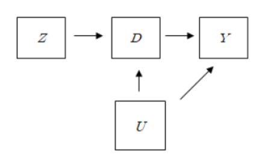
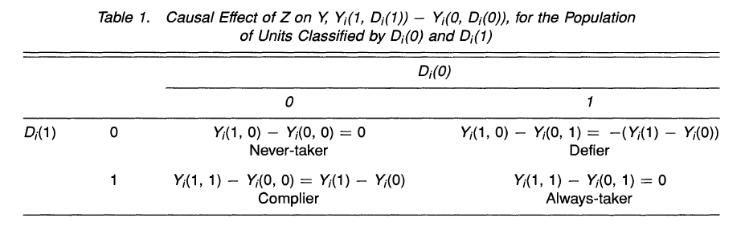

인과 추론에서의 방법론 중 하나인 도구 변수, instrumental variable에 대한 논문입니다. 구조방정식으로 정의를 하였던 도구 변수를 potnetial outcome framework에서 어떠한 방식으로 적용이 되는지에 대한 논문입니다. 

[논문 site](https://www.tandfonline.com/doi/abs/10.1080/01621459.1996.10476902>)

Key words : Compliers, Intention-to-treat analysis, Local average treatment effect, Noncompliance, Nonignorable treatment assignment, Rubin-Causal-Model, Structural equation models

### 0. Notation 

위 논문의 예시를 베트남 전쟁 참가자와 건강과의 인과 관계를 예시를 들어 도구 변수를 설명하고 있습니다. 모델에서 사용되는 변수들을 정의하면 다음과 같습니다. 

$D$ : treatment, binary

$Z$ : Assignment, binary

$Y$ : Outcome, binary

궁극적인 목적은 treatment $D$와 Outcome $Y$ 간의 인과관계가 존재하는지 확인하는 것입니다. 

도구 변수를 적용한 샘플 데이터의 변수는 다음과 같습니다.

$D$ : treatment, Serving in the military or not ($D=1$ : Yes, $D=0$ : No )

$Z$ : Assignment, Draft status, determined by lottery number($Z=1$ : Low number, $Z=0$ : High number)

$Y$ : Outcome, Health status ($Y=1$ : Death, $Y=0$ : Alive)

베트남 전쟁에 참전할 병사를 뽑는 과정에서, 랜덤하게 번호를 추첨하여, 낮은 번호를 가진 사람은 출전을 하고, 높은 번호를 가진 사람은 출전을 안해도 되는 rule이 있었다고 합니다. 따라서 $Z$ 변수와 $D$ 변수는 상관관계를 가지고 있습니다. 다만, 모든 사람이 $Z$에 의해서만 참전여부를 결정하지는 않았습니다. (자의로 참전을 원하는 사람은 $Z$ 값에 상관없이 참전을 하였고, 특수한 사정이 있는 경우에는 $Z$값에 상관없이 참전을 하지 않았다고 합니다.)

### 1. Structural Equation

위 논문에서 structural equation을 다음과 같이 정의합니다.

Following Goldberger (1972) We define structural equation models as "stochastic models in which each equation represents a causal link, rather than a mere empirical association"

즉, 인과 관계가 있는 여러 방정식을 이용한 stochastic model로 정의 합니다. 

Treatment와 assignment, Outcome을 structural equation을 이용하여 정의하면 다음과 같습니다.

$$
\begin{aligned}
Y_i &= \beta_0 + \beta_1 D_i + \epsilon_i \\
D_i^*&=\alpha_0+\alpha_1Z_i+\nu_i \\

D_i &= 1\  if\ D_i^*>0 \\
&= 0\  if\ D_i^*\leq0

\end{aligned}
$$

여기서, $\beta_1$이 $Y$에 대한 $D$의 causal effect가 됩니다. 

$\beta_1$이 causal effect로 온전히 설명되기 위해서 필요한 조건이 있습니다. 그 중 첫 번째로 $Z_i$는 $\epsilon_i, \nu_i$와 uncorrelated어야 합니다. 

$$
E[Z_i \epsilon_i]=0, \ E[Z_i \nu_i]=0
$$

$Z_i$와 $epsilon_i$가 uncorrelated하다는 것은, $Y_i$에 대한 $Z_i$의 causal effect를 설명하려면 반드시 $D_i$를 통해서만 설명을 할 수 있음을 뜻합니다. 

두 번째로는, $D_i$와 $Z_i$는 correlated되어야 한다는 점입니다.

$$
Cov (Z_i, D_i) \neq 0
$$

즉, 위 structural equation에서 $\alpha_i \neq0$이 되어야 한다는 것을 뜻합니다. 

Linear regression에서의 가정 중에서, explanatory variable과 error term이 uncorrelated하다는 가정이 있습니다. 하지만 많은 observational study에서는, 위의 가정이 성립하지 않으며, $Y_i$와 $D_i$에 동시에 영향을 주는 다른 변수(confounder)가 존재하여, 둘 간의 인과관계 설명을 방해하는 요소가 존재합니다. 위 structural equation에서는 $D_i$와 $\epsilon_i$가 correated되었다는 것을 뜻하며, 이는 $D_i$가 not ignorable하다는 것을 의미합니다.

Instrumental variable, 도구 변수는 위 상황을 해결하기 위해 나온 방법으로, $\epsilon_i$와 correlated되지 않고, $D_i$와는 correlated되어 있는 새로운 변수 $Z_i$를 이용하여 $Y_i$와 $D_i$간의 causal effect를 계산합니다. 위 두 조건을 만족한다면, $Z_i$는 도구 변수로 사용이 가능하고, 이를 이용하여 $\beta_1$을 추정할 수 있습니다.

하지만 structural equation을 이용한 instrumental variable을 정의하고 추론하는 방법은 통계학자 사이에서 널리 퍼지지는 않았다고 합니다. 그 이유는 첫번째로, model의 assumption에 대한 senstivity와 실험의 결과를 생산하는데의 한계 때문이었다고 합니다. 다른 이유로는, 중요한 가정들이 실제로 주어진 데이터가 아닌, disturbance, error term에 집중되어 있다는 점이라고 합니다. 따라서, 위 두 관점을 해결하기 위해서, Rubin Causal Model에서 instrumental variable을 정의를 합니다. 

### 2. Causale Estimands with Instrumental Variables

#### 1) The Rubin Causal Model

Rubin Causal Model은 각각의 observation의 potential outcome(conterfactural outcome)을 이용하여 causal effect를 계산합니다.

이를 위해서 변수와 기호 notation을 새롭게 정의합니다. 

$\boldsymbol{Z}$ : N-dimensional vector of assignments with $i$th element $Z_i$

$D_i(\boldsymbol{Z})$ : An indicator for whetehr person $i$ would serve given the randomly allocated vector of assignments $\boldsymbol{Z}$

$Y_i(\boldsymbol{Z}, \boldsymbol{D})$ : The response for person $i$ given the vector of service indicators $\boldsymbol{D}$ and the vector of draft priorties $\boldsymbol{Z}$

모든 individual의 assignment를 vector로 정의하고, 그 상황에서의 $i$번 째 individual의 treatment 결과를 $D_i(\boldsymbol{Z})$로 정의합니다. 마찬가지로 모든 individual의 assignment와 treatment가 부여되었을 때, $i$번 째 individual의 outcome 결과를 $Y_i(\boldsymbol{Z}, \boldsymbol{D})$로 정의를 합니다.

만약 여기서, 모든 사람들이 $\boldsymbol{Z}$에 의해서 완벽하게 treatment가 결정이 되었다면(이를 perfect compliance with assignment라고 합니다. ), $D_i(\boldsymbol{Z}) = Z_i$가 됩니다. 

하지만 앞서 언급을 하였듯이, $Z$의 결과와 상관없이 treatment를 받거나, 받지 않는 경우 또한 존재하기 때문에, perfect compliance가 된다고 말하기는 쉽지 않습니다.

여기서, $D_i(\boldsymbol{Z})$와 $Y_i(\boldsymbol{Z}, \boldsymbol{D})$를 potential outcome으로 정의를 합니다. $\boldsymbol{Z}$에 따라 $D_i$와 $Y_i$ 값이 달라질 수 있기 때문입니다.  이를 이용하여 $D, Y$에 대한 $Z$의 causal effect, $Y$에 대한 $D$의 causal effect를 정의를 합니다. 

 $D, Y$에 대한 $Z$의 causal effect, $Y$에 대한 $D$의 causal effect를 정의하기 위해서는 몇 가지 조건이 필요합니다. Causal effect를 정의하기 위한 조건에 대해서 알아보겠습니다.

#### Assumption 1: Stable Unit Treatment Value Assumption (SUTVA)

(a) If $Z_i = Z_i'$, then $D_i(\boldsymbol{Z})=D_i(\boldsymbol{Z'})$

(b) If $Z_i = Z_i'$  and $D_i=D_i'$, then $Y_i(\boldsymbol{Z}, \boldsymbol{D})$=$Y_i(\boldsymbol{Z'}, \boldsymbol{D'})$

위 조건은 outcome의 결과가 관측된 individual 자신에게만 영향을 받고, 다른 individual의 treament나 assignment에는 영향을 받지 않는 것을 의미합니다. 위 조건을 만족하게 되면, 앞서 정의한 $D_i(\boldsymbol{Z})$와 $Y_i(\boldsymbol{Z}, \boldsymbol{D})$를

$$
D_i(\boldsymbol{Z})=D_i(Z_i) \\
Y_i(\boldsymbol{Z}, \boldsymbol{D})=Y_i(Z_i, D_i)
$$
로 사용할 수 있습니다. 

위 assumption을 가정하면, $Y$에 대한 $Z$의 causal effect, $D$에 대한 $Z$의 causal effect를 정의할 수 있습니다.

* Definition 1: Casual Effects of $Z$ on $D$ and $Z$ on $Y$

The causal effect for individual $i$ of $Z$ on $D$ is $D_i(1)-D_i(0)$

The causal effect for individual i of $Z$ on $Y$ is $Y_i(1, D_i(1))-Y_i(0, D_i(0))$

위에서 정의한 causal effect를 추정하기 위해서, $Z_i$가 ignorable하다는 조건이 필요합니다. 따라서 두번 째 가정으로 $Z_i$가 random하게 selected되었다는 것을 가정합니다.

#### Assumption 2: Random Assignment

The treatment assignment $Z_i$ is random:

$$
Pr(\boldsymbol{Z}=\boldsymbol{c})=Pr(\boldsymbol{Z}=\boldsymbol{c'})
$$

for all $\boldsymbol{c}$ and $\boldsymbol{c'}$ such that $l^T\boldsymbol{c}= l^T\boldsymbol{c'}$ where $l$ is N-dimensional column vector with all elements equal to 1

위 두 가정을 만족을 하면, $Y, D$에 대한 $Z$의 average causal effect는 $Z=1$인 sample의 $Y, D$의 proportion과 $Z=0$인 sample의 $Y, D$의 proportion의 차로 설명할 수 있습니다. 

Average Causal Effect of $Z$ on $Y$

$$
\frac{\Sigma Y_iZ_i}{\Sigma Z_i} - \frac{\Sigma Y_i(1-Z_i)}{\Sigma (1-Z_i)}
$$

Average Causal Effect of $Z$ on $D$ 

$$
\frac{\Sigma D_iZ_i}{\Sigma Z_i} - \frac{\Sigma D_i(1-Z_i)}{\Sigma (1-Z_i)}
$$

#### 2) Instrumental Variables 

우리가 궁극적으로 구하고 싶은 causal effect는 $Y$에 대한 $D$의 causal effect입니다. 하지만, 앞서 가정한 두 조건만으로는 $D, Y$에 대한 $Z$의 causal effect만을 정의할 수 있지, $Y$에 대한 $D$의 causal effect를 정의할 수 없습니다. 비록 $Z_i$가 random하게 assign되었다고 하더라도, $D_i$가 ignorable하다고 말할 수 없기 때문입니다. 

다음의 그래프를 보면 쉽게 이해를 할 수 있습니다. 

다음과 같은 상황이 주어졌다고 가정해봅시다. 여기서 $U$는 $D$와 $Y$에 동시에 영향을 주는 변수입니다. 위 상황에서 아무리 $Z$가 random하게 assign되었다고 하더라도, $D$를 설명하는 변수에는 $U$가 존재합니다. 그리고 $U$는 동시에 $Y$에도 영향을 주는 변수입니다. 위와 같은 변수를 confounder라고 부르며, 이러한 변수가 존재할 수 있기 때문에, $Z$가 random하게 assign되었다고 하더라도, $D$가 ignorable하다고 말할 수 없습니다. 따라서 추가적인 가정을 통해, $Z$를 이용하여 $Y$에 대한 $D$의 causal effect를 설명합니다.

#### Assumption 3: Exclusion Restriction

$\boldsymbol{Y}(\boldsymbol{Z}, \boldsymbol{D}) = \boldsymbol{Y}(\boldsymbol{Z'}, \boldsymbol{D})$ for all $\boldsymbol{Z}, \boldsymbol{Z'}$ and for all $\boldsymbol{D}$

위 가정에 따르면, $Y_i(1, d) = Y_i(0, d)$ 이 $d=1, 0$에 대해서 성립을 합니다. 즉, $D$가 정해져 있다면, $Z$값이 변하더라도 outcome $Y$에는 영향을 주지 않습니다. 즉 $Y$에 대한 $Z$의 causal effect는 반드시 $D$를 통해서만 설명될 수 있습니다.

또한, 세 번째 조건을 만족하면, $Y$의 potentail outcome을 $Z$를 제외하고 $D$를 이용하여 정의할 수 있습니다. 비로소 $Y$에 대한 $D$의 causal effect를 정의할 수 있습니다.

* Definiton 2: Causal Effects of $D$ on $Y$

The causal effect of $D$ on $Y$ for person $i$ is $Y_i(1)-Y_i(0)$

위 가정을 통해서 causal effect를 적용하더라도, 실제로 individual $i$에 대해서 causal effect를 계산을 할 수 없습니다. 왜냐하면, 한 individual에게 treatment를 주는 경우와 주지 않는 경우를 동시에 진행할 수 없기 때문입니다. 즉, 우리가 얻은 data에서는 $Y_i(1)$과 $Y_i(0)$  둘 중 하나의 값만을 outcome으로 얻게 됩니다. 따라서, 개개인에 대한 cuasal effect를 게산하는 것 대신, treatment group과 control group간의 average outcome을 이용하여 causal effect를 확인합니다. 

Instrumental Variable을 적용하기 위한 2개의 가정은 다음과 같습니다.

#### Assumption 4: Nonzero Average Causal Effect of $Z$ on $D$

The average causal effect of $Z$ on D, $E[D_i(1)-D_i(0)]$ is not equal zero

위 조건은 $Z$ 와 $D$가 관계가 있어야 한다는 조건입니다. (관계가 있음을 이용하여 $Y$에 대한 $D$의 causal effect를 $Z$를 이용하여 대신 설명을 할 수 있습니다.)

#### Assumpiton 5: Monotonicity

$D_i(1) \geq D_i(0)$ for all $i= 1, 2, ..., N$

위 다섯 가정을 만족시키는 변수 $Z$를 Y에 대한 $D$의 causal effect의 instrumental variable이라고 정의합니다.

* Definition: Instrumental variable for the Causal Effect of $D$ on $Y$

A varaible $Z$ is an instrumental variable for  the causal effect of $D$ on $Y$ if: its average effect on $D$ is nonzero, it satisfies the exclusion restriction and the monotonicity assumption, it is randomly (or ignorably) assigned, ans SUTVA holds

(i.e., if Assumptions 1-5 holds)

### 3) Interpreting the Instrumental Variables Estimand

위 다섯 조건을 만족하는 instrumental variable을 이용하여, $Y$에 대한 $D$의 casual effect를 계산할 수 있습니다.

(1) unit level

SUTVA 조건과 exclusion restriction 조건을 이용하면, 각각의 unit에 대하여 $Y$에 대한 $Z$의 causal effect는 다음과 같이 표현할 수 있습니다.

$$
Y_i(1, D_i(1))-Y_i(0, D_i(0)) \\

\begin{aligned}

&=Y_i(D_i(1))-Y_i(D_i(0)) \\
&=[Y_i(1)D_i(1)+Y_i(0)(1-D_i(1))] - [Y_i(1)D_i(0)+Y_i(0)(1-D_i(0))] \\
&=(Y_i(1)-Y_i(0))(D_i(1)-D_i(0))
\end{aligned}
$$

이를 정리하면, Causal effect of $Z$ on $Y$ for person $i$는 Causal effect of $D$ on $Y$와 Causal effect of $Z$ on $D$의 곱으로 나타낼 수 있습니다.

(2) Average causal effect

위 조건을 이용하면, average causal effect 또한 구할 수 있습니다.

$$
E[Y_i(1, D_i(1)) - Y_i(0, D_i(0))]\\
\begin{aligned}

&=E[(Y_i(1)-Y_i(0))(D_i(1)-D_i(0))] \\
&=E[(Y_i(1)-Y_i(0)) | D_i(1)-D_i(0)=1]P(D_i(1)-D_i(0)=1)\\
&- E[(Y_i(1)-Y_i(0)) | D_i(1)-D_i(0)=-1]P(D_i(1)-D_i(0)=-1)
\end{aligned}
$$

여기서 계산되는 값은 $D_i(1)-D_i(0) \neq 0$인 individual에 한해서 계산된어진 결과입니다.  추가적으로, monotonicity 조건을 적용하면, $D_i(1) \geq D_i(0)$이므로

$$
E[Y_i(1, D_i(1)) - Y_i(0, D_i(0))]\\
\begin{aligned}

&=E[(Y_i(1)-Y_i(0)) | D_i(1)-D_i(0)=1]P(D_i(1)-D_i(0)=1)\\

\end{aligned}
$$

을 얻을 수 있습니다. 

여기서, $P(D_i(1)-D_i(0)=1) = E(D_i(1)-D_i(0))$과 같으므로, 위 식을 정리하여 $Y$에 대한 $D$의 causal effect를 $Z$를 이용하여 확인할 수 있습니다. 

* Proposition 1: Causal interpretation of the IV Esstimand

Given Assumptions 1, 3, 4 and 5, the instrumental variables estimand is 

$$
E[Y_i(1)-Y_(0) | D_i(1)-D_i(0)=1]\\ = \frac{E[Y_i(D_i(1), 1), Y_i(D_i(0), 0)]}{E[D_i(1)-D_i(0)]}
$$

위 식의 값을 Local Average Treatment Effect라고 정의합니다.

(3) Local Average Treatment Effect

Local Average Treatment Effect에서 가장 주목해야 하는 점은 $Y$에 대한 $D$의 causal effect를 $Z$를 통해서 설명을 할 수 있는데, $D_i(1)-D_i(0)=1$을 만족하는 individual에 한해서 causal effect를 설명했다는 점입니다. 식을 보면 $D_i(1)-D_i(0)=1$일 때의 $Y_i(1)-Y_i(0)$의 기댓값이 $Y, D$에 대한 $Z$의 causal effect 식으로 나타내어져 있습니다. 즉, 전체 individual에 대해서 causal effect를 계산한 것이 아닌, $D_i(1)-D_i(0)=1$ 을 만족하는 individual에 한해서만 causal effect를 계산한 것입니다. 

$D_i(1)-D_i(0)=1$가 의미하는 바는 다음과 같습니다. 

(출처 : 논문)

$D_i(Z)$는 $Z$, $D_i$의 값에 따라 4 가지 유형으로 나눌 수 있습니다. 

1. $D_i(1)=1, D_i(0)=1$ : Alwaystaker
2. $D_i(1)=1, D_i(0)=0$ : Complier
3. $D_i(1)=0, D_i(0)=1$ : Defier
4. $D_i(1)=0, D_i(0)=0$ : Nevertaker

첫 번째 경우를 살펴보면, $Z_i$의 값이 어떤 값이든 간에 $D_i=1$입니다. 즉, $Z_i$가 $D_i$에 영향을 주지 못한 individual입니다. draft status의 값에 상관없이 자의로 전쟁에 참여한 사람이 위 케이스에 해당합니다. 이러한 케이스를 alwaystaker라고 합니다.

네 번째 경우는, $Z_i$의 값이 어떤 값이든 간에 $D_i=0$입니다. 위 경우 역시 $Z_i$가 $D_i$에 영향을 주지 못한 individual입니다. draft status의 값에 상관없이 특수한 사정(집안 사정, 개인 사정)으로 전쟁에 참여하지 않은 사람이 위 케이스에 해당합니다. 이러한 케이스를 nevertaker라고 합니다.

alwaystaker와 nevertaker의 경우, exclusion restriction 가정에 의해서 causal effect 값이 0이 됩니다. 따라서 instrumental variable estimand에서는 위 두 케이스에 대한 causal effect를 구할 수 없습니다.

두 번째 경우는, $Z_i$의 값에 따라 $D_i$의 값이 변화되는 경우입니다. $Y$에 대한 $D$의 causal effect를 계산할 때, $D$를 대신하여 $Z_i$ 이용하면 실제로 사용되는 individual은 다음 케이스입니다. 이러한 케이스를 complier라고 합니다.

세 번째 경우는, $Z_i$의 값에 따라 $D_i$가 변화되는 경우이지만, $Z$가 증가하면 $D$는 감소합니다. 이러한 케이스를 defier라고 부릅니다. 하지만 instrumental variable의 가정 중 monotonicity 조건으로 인해서, 위의 경우는 존재하지 않습니다. 

정리하면, insturmental variable을 이용하여 causal effect를 계산하는 경우, 전체 individual 중 complier에 해당하는 individual에 한해서 causal effect를 계산하게 됩니다. 따라서 instrumental variables estimand를 local average causal effect라고 합니다.

 하나 주의해야 할 점은, observational study에서 임의로 complier 또는 alwaystaker, nevertaker를 지정할 수 없다는 점입니다. 따라서 local average treatment effect를 global average treatment effect로 확장시킬 수 없고, complier와 alwaystaker, nevertaker가 누구인지 알 수 없으므로 subpopulation 또한 진행할 수 없습니다. (subpopulation을 진행하기 위해서는 추가적인 가정이 필요합니다.)

### 3. Comparing the Structural Equation and Potential Outcomes Framework

Structural Equation에서 instrumental variable $Z$에 대한 식과 조건은 다음과 같습니다.

$$
\begin{aligned}
Y_i &= \beta_0 + \beta_1 D_i + \epsilon_i \\
D_i^*&=\alpha_0+\alpha_1Z_i+\nu_i \\

D_i &= 1\  if\ D_i^*>0 \\
&= 0\  if\ D_i^*\leq0

\end{aligned}
$$

$Z_i$ are uncorrelated with $\epsilon_i$, $\nu_i$, $Z_i$ are correlated with $D_i$ 

#### 1) The Exclusion Restriction and Ignorable Treatment Assignment

Structural Equation에서는 $Z_i$가 $\epsilon_i$와 $\nu_i$와 uncorrelated하다는 조건이 있었습니다. Potential outcome framework에서는 $Z_i$가 $\epsilon_i$와 uncorrelated하다는 것을 exclusion restriction 가정을 통하여 제시하였습니다.  또한 $Z_i$와 $\nu_i$가 independent하다는 조건을 $Z_i$가 random selection(or ignorable)되었다는 조건을 통하여 제시하였습니다. 

(1) Exclusion Restriction

Exclustion Restriction 가정에서의 핵심은 instrumental variable은 반드시 treatment $D$를 통해서만 outcome $Y$에 영향을 끼쳐야 한다는 점입니다. 따라서 instrumental variable을 사용할 때, 반드시 위 가정을 만족하는지 확인해야 합니다. 하지만, treatment가 같고 instrumental variable이 다르더라도, 반드시 outcome이 같다는 보장, 즉 exclusion restriction을 만족한다고 말할 수 없습니다. 예를 들어 non complier의 경우, 특정한 상황에 의해 assignment $Z$가 outcome $Y$에 $D$를 거치지 않고 영향을 끼칠 수 있으므로, 이 점을 유의하며 분석을 진행하여야 합니다. 

Complier의 경우, $D_i(0)=0$, $D_i(1)=1$인 경우이므로, exclusion restriction을 만족하는지 안하는지 데이터를 통해 확인할 수 없습니다.  ($Y_i(1, D_i(0))=Y_i(0, D_i(0)), Y_i(1, D_i(1))=Y_i(0, D_i(1))$을 확인해야 하기 때문입니다.)

(2) Ignorable treatment assignment

instrumental variable과 $\epsilon_i$가 uncorrelated되어 있다는 structural equation에서의 조건은 $Z_i$가 random하게 선택되었다는 가정을 통하여 제시하였습니다. 위 조건이 만족이 되었을 때, $Y$에 대한 $D$의 causal effect를 $Z$에 관한 식으로 나타낼 수 있었습니다. 하지만, 실제 응용에서는, instrumental variable 또한 random하게 선택되지 않는 경우가 많기 때문에, 분석을 할 때 위 가정을 반드시 확인을 하여야 합니다.

#### 2) The Monotonicity Condition

Structural Equation에서 monotonicity condition에 해당하는 조건은 명시되어 있지 않습니다. 하지만, monotonicity condition과 관련된 식은 $Z_i, D_i, D_i^* $와 관련된 식입니다. Structural equation에서는  $D_i^* $의 기울기가 상수 ($\alpha_1$)으로 고정된 조건으로 나타났지만, potential outcome framework에서는 이 가정에서 추가하여 $D_i^* $가 증가하면  $Z_i$ 또한 증가하는 조건이 추가된 것으로 해석할 수 있습니다.

#### 3) Reduced Form and Structural Parameters

Structural equation에서 $Y$에 대한 $D$의 causal effect를 나타내는 parameter는 $\beta_1$입니다. 이 때, $\beta_1$은 complier에 한정한 average treatment effect가 됩니다. 하지만, 위 structural equation에서는, 전체 population에 대한 causal effect와 complier에 대한 causal effect를 구분하지 않습니다. 하지만 potential outcome framework에서는 local average treatment effect와 entire population에 대한 average treatment effect를 구분하고 있고, instrumental variable을 통해서는 local average treatment effect만을 알 수 있습니다. 따라서, 특정 subpopulation에 한정하여 casual effect를 알고 싶을 때, instrumental variable을 이용할 수 있습니다.

