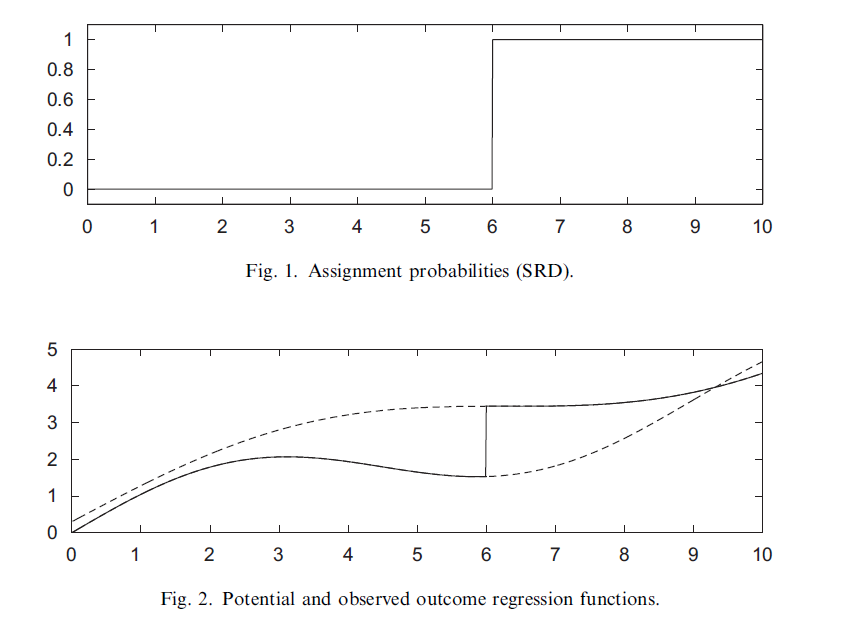
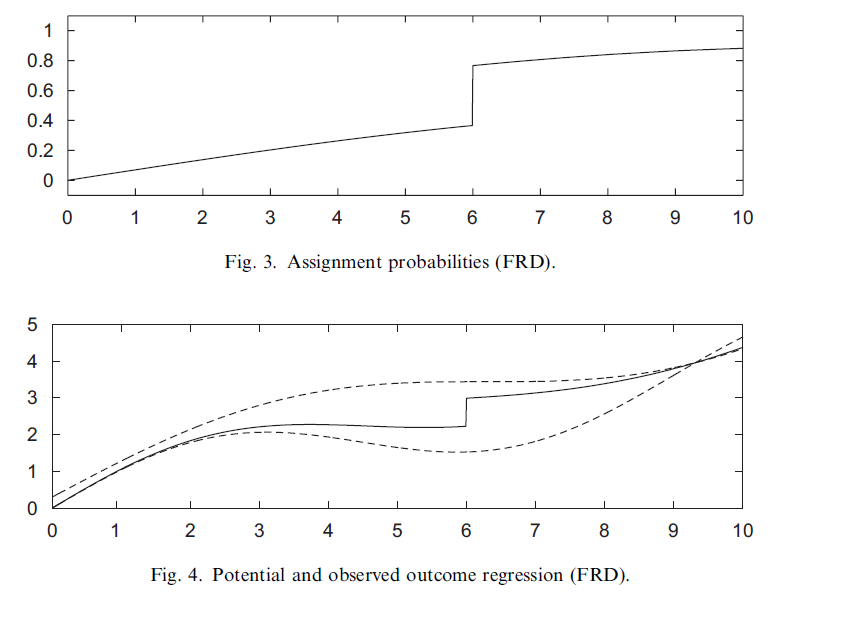

이번 논문은 인과 추론의 방법 중 Regression Discontinuity Design에 대한 대략적인 가이드 논문입니다. Cutoff에 의해서 treatment 부여 여부가 결정될 때, cutoff 근방의 outcome을 비교하여 treatment effect를 파악하는 Regression discontinuity design에 대해 알아보겠습니다.

 

### 1. Sharp and FRD designs

 

#### 1.1 Basic Idea

 

Potential outcome framework에서는 각각의 individual에 대해서 만약 treatment를 부여하였을 때의 결과값, treatment를 부여하지 않았을 때의 결과값인 potential outcome, 또는 conterfactual outcome를 비교하여 causal effect를 구합니다. 

* **Notation**

$Y_i(1)$ : $i$th individual이 treatment를 부여받았을 때의 outcome

$Y_i(0)$ : $i$th individual이 treatment를 부여받지 않았을 때의 outcome

$Y_i(1)-Y_i(0)$ : Causal effect(treatment effect) of the individual $i$

Causal inference에서의 가장 근본적인 문제는 각각의 individual $i$에 대해서 $Y_i(1)$과 $Y_i(0)$을 동시에 구할 수 없다는 것입니다. 따라서, 개개인에 대한 casual effect를 구하지 않고, 전체 집단((sub)population)의 outcome의 average를 비교하여 causal effect를 구합니다. 

$$
E(Y_i(1)-Y_i(0))
$$

이를 **Average treatment effect**라고 합니다.

위의 $Y_i(1), Y_i(0)$은 treatment를 부여받았을 때, 받지 않았을 때의 outcome이므로, 실제로 관측된 outcome을 $Y_i(1), Y_i(0)$을 이용하여 표현할 수 있습니다.

* **Notation**

$W_i$ : The treatment received

$W_i=1$ : $i$th individual이 treatment를 받음

$W_i=0$ : $i$th individual이 treatment를 받지 않음

위와 같이 $W_i$를 정의하면, $Y_i$는 다음과 같이 정의됩니다.

$$
Y_i=(1-W_i)Y_i(0)+W_iY_i(1)
$$

Randomized experiment가 아닌 observational study에서는 treatment 이외에도 outcome에 영향을 주는 변수들이 존재합니다. 

* **Notation**

  

$(X_i, \boldsymbol{Z_i})$ : Vector of covariates, $X_i$ is scalar, $\boldsymbol{Z_i}$ is M-vector

RD design에서는 $X_i$에 의해서 treatment $W_i$가 결정이 됩니다. 

각각의 individual마다 

$$
(Y_i, W_i, X_i, \boldsymbol{Z_i})
$$

를 관측할 수 있습니다.

RD design은 **Treatment** $W_i$가 $X_i$**의 cutoff에 의해서 결정이 될 때, Cutoff 근방의 Outcome을 비교하여 causal effect를 계산하는 방법입니다. ** 여기서 cutoff 근방은 cutoff에서 최대로 가까운 값들을 의미하고, 이를 정의하기 위해서 극한의 개념을 도입합니다. 즉 **cutoff 기준 outcome의 좌극한과 우극한을 비교하여** causal effect를 계산합니다. 

 

*example*

특정 학교에서 중간 시험성적이 특정 점수(ex:70)보다 낮은 학생들을 대상으로 보충 수업을 실시했습니다. 이 후 기말 시험 성적을 비교하여 보충 수업의 효과를 파악하고 싶습니다. 이 때,

$Y_i$ : $i$번 째 학생의 기말시험 성적

$W_i$ : $i$번 째 학생의 보충수업 수강 여부

$X_i$ : $i$번 째 학생의 중간시험 성적

만약 $X$가 cutoff(70점) 근방인 학생들의  outcome을 비교하였을 때, 만약 차이가 있다면, 이 차이는 보충 수업의 효과로 해석할 수 있습니다. 

 

#### 1.2 The sharp regression discontinuity design

 

sharp regression discontinuity design에서는 $X_i$의 cutoff를 기준으로, cutoff보다 작으면 treatment $W_i$를 부여하지 않고, cutoff보다 크거나 같으면 treatment를 부여하는 case에서 사용합니다. SRD에서 $W_i$는 다음과 같이 정의됩니다.

$$
W_i=I\{X_i\geq c\}
$$

즉, $X_i<c$인 모든 individual에 대해서는 $W_i=0$, $X_i \geq c$인 모든 individual에 대해서는 $W_i=1$입니다. 이 때, 전체 treatment effect가 아닌, $X_i=c$에서의 treatment effect를 계산합니다.

$$
\lim_{x\downarrow c}E(Y_i | X_i=x) - \lim_{x\uparrow c}E(Y_i | X_i=x)
$$

위의 값이 **discontinuity point $X_i=c$에서의 average treatment effect**라고 합니다.

$$
\tau_{SRD} = E(Y_i(1)-Y_i(0) | X_i=c)
$$

다음 그래프를 보면 SRD design와 $\tau_{SRD}$를 시각적으로 확인할 수 있습니다. Figure 1 그래프에서는 $W_i$와 $X_i$의 그래프가 나와있습니다.  $X_i=6$을 기준으로 treatment가 정해집니다. 입니다. 즉 $X_i=6$을 기준으로 6보다 작으면 $W_i=0$이고, 6보다 크거나 같으면 $W_i=1$입니다. 

Figure 2 그래프에서는 $X_i$와 $Y_i$의 그래프가 나와있습니다. 검읜색 직선은 실제로 관측된 outcome에 대한 함수이고, 점선은 각각 $W_i=0, W_i=1$에 대한 potential outcome $Y_i(0), Y_i(1)$에 대한 그래프입니다. 보는 것과 같이 cutoff $X_i=6$에서 discontinuity가 발생하였으므로, causal effect가 존재한다고 해석할 수 있습니다.

Figure 2 그래프의 outcome과 $X_i$에 대한 그래프  식은 다음과 같이 나타낼 수 있습니다.

$$
E(Y | X=x)  = E(Y|X=x, W=1)P(W=1|X=x) + E(Y | X=x, W=0)P(W=0 | X=x)
$$

$\tau_{SRD}$를 해석하기 위해서는 몇가지 가정이 필요합니다. 

* **Assumption 1** Unconfoundedness assumption

$$
Y_i(0), Y_i(1) \perp W_i | X_i
$$

$X_i$가 given되었을 때, potential outcome과 treatment는 독립임을 가정합니다. 즉, conditional exchangeability를 가정합니다. 이는 $X_i$가 given되었을 때, 다른 covariates $\boldsymbol{Z_i}$는 treatment에 영향을 끼치지 않음을 의미합니다. 

Unconfoundedness auusmption은 observational study를 randomized experiment로 해석하기  위해 필요한 가정 중 하나입니다. 위 가정에 더불어 observational study에서는 positivity 가정을 추가합니다.

* Positivity

$$
0 < Pr(W_i=1|X_i=x)<1 \ for \ all \ x
$$

하지만, 위 가정은 RD design에서는 성립할 수 없습니다. SRD design의 경우 cutoff보다 작은 $X_i$에 대해서 $W_i=0$ 이기 때문입니다. 

즉, 모든 $X$값에 대해 treatment가 부여된 individual과 부여되지 않은 individual이 존재해서, average treatment effect를 구하는데, **RD design에서는 positivity 조건을 만족하지 않는 경우가 존재하기 때문에, 전체에 대해서 average treatment effect를 구할 수 없습니다.** 대신, **RD design에서는 cutoff 근방의 outcome을 비교해서 cutoff 근방의 average treatment effect를 구합니다.**

$$
\tau_{SRD}=E(Y(1)-Y(0)|X=c)=E(Y(1)|X=c)-E(Y(1)|X=c)
$$

SRD에서 $X=c$에서 $Y(1)$과 $Y(0)$를 동시에 구할 수 없습니다. 따라서, **$X=c$에서의 $Y(1)$과 $Y(0)$의 좌극한, 우극한 값을 이용하여 $\tau_{SRD}$를 구합니다.** 극한값을 정의하기 위해서 몇 가지 가정을 추가합니다. 

* **Assumption 2.1** Continuity of Conditional Regression Functions

$$
E(Y(0)|X=x), E(Y(1) | X=x)
$$

are continuous in $x$

일반적으로, conditional expectation이 아닌 conditional distribution이 $x$에 대해 continuous하다를 가정합니다.

* **Assumption 2.2** Continuity of Conditional Distribution Functions

$$
F_{Y(0)|X}(y|x), F_{Y(0)|X}(y|x)
$$

are continuous in $x$ for all $y$

위 두 가정 하에서

$$
E(Y(0)|X=c)=\lim_{x\uparrow c}E(Y(0)|X=x) = \lim_{x\uparrow c}E(Y(0)|X=x, W=0) = \lim_{x\uparrow c}E(Y|X=x)
$$

가 되고,

$$
E(Y(1)|X=c)=\lim_{x\downarrow c}E(Y(1)|X=x) = \lim_{x\downarrow c}E(Y(1)|X=x, W=1) = \lim_{x\downarrow c}E(Y|X=x)
$$

즉, potential outcome $Y(0), Y(1)$의 conditional expectaion을 outcome의 conditional expectation으로 구할 수 있게 됩니다. 

 

#### 1.3 The FRD design

 

Fuzzy regression discontinuity design에서는, treatment $W_i$가 부여될 확률이 $X_i$의 cutoff를 기준으로 불연속적으로 변합니다. SRD design에서는 cutoff보다 작은 모든 $X_i$에 대해서 $W_i=0$,  cutoff보다 크거나 같은 모든 $X_i$에 대해서 $W_i=1$를 부여했다면, FRD에서는

$$
\lim_{x\downarrow c}Pr(W_i=1 | X_i=x) \neq \lim_{x\uparrow c}Pr(W_i=1 | X_i=x)
$$

$W_i$가 부여될 확률이 불연속적으로 변합니다. 따라서, SRD보다 일반적인 경우를 다루는 design이 FRD design입니다. 

FRD design에서는 cutoff에서의 treatment effect를 다음과 같이 정의합니다.

$$
\tau_{FRD} = \frac{\lim_{x\downarrow c}E(Y|X=x)-\lim_{x\uparrow c}E(Y|X=x)}{\lim_{x\downarrow c}E(W=1 | X=x) - \lim_{x\uparrow c}E(W=1 | X=x)}
$$

와 같이 정의합니다. 

$\tau_{FRD}$를 해석하기 위해서, $W_i(x)$를 정의합니다.

* **Notation**

$W_i(x)$ : Potential treatment status given cutoff point $x$, for $x$ in some small neighborhood around $c$

Treatment가 $x$에 의해서 결정되기 때문에, $x$값이 변화함에 따라서 treatment 부여 여부 또한 변화할 수 있습니다. 따라서 $W_i(x)$ 또한 potential treatment status로 생각할 수 있습니다. 즉, $x$가 우리가 원하는대로 조작할 수 있다는 가정(manipulable)하에서 potential treatment status를 정의합니다. 

* **Assumption 2.3** Monotonicity

$$
W_i(x)
$$

is non-increasing in $x$ at $x=c$

위 가정을 적용하면, complier 개념을 이용하여 $\tau_{FRD}$를 해석할 수 있습니다. 

* **Notation** Compiler

**Complier** is a unit such that

$$
\lim_{x\downarrow X_i}W_i(x)=0, \lim_{x\uparrow X_i}W_i(x)=1
$$

즉, cutoff를 기준으로 treatment 부여 여부가 바뀌는 individual을 complier라고 합니다. (instrumental variable에서의 complier와 같은 개념입니다.)

FRD design에서는 treament 부여여부가 확률적으로 결정되기 때문에, $x=X_i$를 기준으로 결정되는 $W_i$에 따라서, 3가지 유형의 individual로 구분할 수 있습니다. 

* **Notation**

**Nevertakers** are units with

$$
\lim_{x\downarrow X_i}W_i(x)=0, \lim_{x\uparrow X_i}W_i(x)=0
$$

**Alwaystakers** are units with

$$
\lim_{x\downarrow X_i}W_i(x)=1, \lim_{x\uparrow X_i}W_i(x)=1
$$

즉, $x=X_i$ 근방의 값과 상관없이 항상 treatment값이 0인 unit을 nevertaker, 항상 treatment값이 1인 unit을 alwaystaker, 마지막으로 $x=X_i$를 기준으로 treatment 부여 여부가 바뀌는 unit을 complier라고 합니다. 

이를 생각하면, $\tau_{FRD}$에서의 분모

$$
\lim_{x\downarrow c}E(W=1 | X=x) - \lim_{x\uparrow c}E(W=1 | X=x)
$$

는 $X=c$에서 complier일 확률을 뜻합니다. 

따라서

$$
\begin{aligned}\tau_{FRD} &= \frac{\lim_{x\downarrow c}E(Y|X=x)-\lim_{x\uparrow c}E(Y|X=x)}{\lim_{x\downarrow c}E(W=1 | X=x) - \lim_{x\uparrow c}E(W=1 | X=x)} \\
&=E(Y_i(1)-Y_i(0) | \ unit \ i \ is \ a \ complier \ and \ X_i=c  )
\end{aligned}
$$

즉, $\tau_{FRD}$는 $X_i=c$에서의 complier들의 average treatment effect가 됩니다. 

다음 그래프를 보면 FRD design을 시각적으로 확인할 수 있습니다. Figure 3은 $X$와 $Pr(W|X=x)$를 나타낸 그래프입니다. SRD design과는 다르게, $X=x$일 때, treatment 부여 여부가 확률값으로 존재하고, cutoff인 $X=6$을 기준으로 불연속입니다. 

Figure 4에서는 potential and observed outcome regression입니다. 실선이 observed outcome regression, 점선이 $Y(1), Y(0)$의 outcome regression 그래프를 나타냅니다. $X=6$에서 불연속이 발생하는데, 이를 통해 causal effect가 있다고 해석할 수 있습니다.

observed outcome regression의 값은 다음과 같이 구할 수 있습니다.

$$
E(Y|X=x) = E(Y(0)|X=x, W=0)P(W=0|X=x) + E(Y(1)|X=x, W=1)P(W=1|X=x)
$$

 

#### 1.4 The FRD design and unconfoundedness

 

Unconfounded assumption에서는

$$
Y(0), Y(1) \perp W |X
$$

를 가정하고, 이 때 $X=c$에서의 average treatment effect는

$$
E(Y(1)-Y(0)|X=x )= E(Y|W=1, X=c) - E(Y | W=0, X=c)
$$

로 해석할 수 있습니다. 즉, $X=c$에서의 treatment group($W=1$)과 control group($W=0$)간의 outcome의 비교를 통해 treatment effect를 정의합니다.

하지만, FRD design에서는 위 방법으로 정의한 average treatment effect는 잘못된 접근입니다. 왜냐하면, **treatment group에 속하는 unit 중 complier 뿐만 아니라 nevertaker, alwaystaker 또한 존재하기 때문입니다.** 마찬가지로, control group에 속하는 unit 중에서도 nevertaker, alwaystaker 또한 존재합니다. nevertaker, alwaystaker는 $X=c$에서 $W$가 변화하지 않기 때문에, FRD에서 구하는 $\tau_{FRD}$에 영향을 끼치지 않습니다. 따라서, complier와 nevertaker와 alwaystaker를 모두 고려한 treatment group과 control group간 outcome 비교는 의미가 없습니다. 

Observational study에서 unconfoundedness를 가정하는 이유 중 하나는, covariates들이 비슷하고 treatment만 다른 두 group의 outcome의 차이에 영향을 끼치는 것은 오직 treatment임을 말하기 위해서입니다. 하지만, FRD에서는 covariates에 따라서 treatment를 받을 확률이 cutoff에서 불연속이기 때문에, unconfoundedness 가정이 attractive하지 않습니다. 즉, **$X$가 cutoff인 $c$ 근방에 존재하는 unit들에 대해서, $X=c$보다 작은 group과 큰 group 사이에는 treatment 부여 확률이 다르기 때문에, 두 group에는 어떠한 차이가 존재한다고 말할 수 있습니다. (비슷하다고 말할 수 없습니다.)**

 

 

#### 1.5 External validity

 

SRD, FRD design의 가장 큰 특징이자 단점은 $X=c$에서의 average treatment effect를 추정한다는 점입니다. 만약 우리가 전체 데이터에 대해 treatment effect를 계산하는 것이 목적이라면, SRD design과 FRD design으로는 한계가 발생합니다. FRD는 이에 추가하여, $X=c$에서의 unit 중 complier에 해당하는 unit들의 average treatment effect를 계산하기 때문에, SRD design에서보다 추정되는 unit이 적습니다. 따라서, local estimate가 global estimate가 된다는 강한 가정 없이는 전체 population에 대한 average treatment effect를 추정할 수 없습니다. 

하지만, RD design은 다른 분석방법과 비교하여 $X=c$에서의 average caual effect는 확실히 보일 수 있습니다. 즉 locality, internal validity 측면에서는 강한 분석방법입니다. 

 

### 2. Graphical analyses

 

SRD, FRD design을 적용하기 전에, 데이터를 파악하여 SRD, FRD design의 가정을 만족하는지 확인하는 작업이 필요합니다. 데이터 시각화는 이러한 가정을 만족하는지 안하는지 확인하는데 큰 도움이 됩니다. 대부분의 graphical analysis는 cutoff에서의 불연속성과 관련되어 있습니다.

 

#### 2.1 Forcing variable vs Outcome

 

첫 번째로 분석할 plot은 forcing variable과 outcome을 비교한 histogram-type estimate plot입니다. 

binwidth $h$와 cutoff $c$의 좌우에 존재하는 bin 개수$K_0, K_1$에 대해서 bins $(b_k, b_{k+1}]$을 만듭니다. ($k=1, ...., K=K_0+K_1$)

$$
b_k=c-(K_0-k+1)h
$$

이 후

$$
N_k=\Sigma_{i=1}^N I\{b_k<X_i\leq b_{k+1}\}
$$
와 

$$
\bar{Y}_k = \frac{1}{N_k}\Sigma_{i=1}^N Y_i I\{b_k < X_i \leq b_{k+1}\}
$$

를 통해 bin마다 average outcome을 계산하여 plot에 표시합니다. (bin의 중앙값을 $x$값, $\bar{Y}_k$를 $y$값으로 가지는 점을 찍어 plot을 그립니다.)

다음의 plot을 통해 확인해야 하는점은

* $X=c$에서 실제로 discontinuity가 발생했는지 여부
* cutoff 이외의 다른 점에서 discontinuity가 발생했는지 여부

 Cutoff에서 discontinuity 발생 여부를 통해 RD design을 시행하기 전 시각적으로 treatment가 outcome에 영향을 주었는지 확인 할 수 있습니다. 

 Cutoff 이외의 다른 점에서 discontinuity가 발생하였다면, RD design 해석에서 오류가 발생합니다. Cutoff 이외의 점은 treatment 값의 변화가 연속적입니다. 그럼에도 불구하고 불연속점이 발생하였다면, observation 사이에 treatment가 아닌 알 수 없는 다른 변수가 존재하여 outcome에 영향을 끼치는 것을 생각할 수 있습니다. 이러한 다른 변수는 cutoff에서의 discontinuity에 또한 영향을 끼칠 수 있기 때문에, 위 상황에서 RD design을 통해 구한 average treatment effect에는 오차가 발생합니다. 

 

#### 2.2 Forcing variable vs Covariates

 

RD design에서 $X=c$ 에서의 outcome을 비교할 때, $X$값이 아닌 다른 $\boldsymbol{Z}$를 신경쓸 필요가 없는 이유 중 하나는, $X=c$ 근방의 데이터 값들은 $\boldsymbol{Z}$ 값들 또한 비슷하기 때문입니다. 따라서 $X=c$ 근방의 unit에 대해서 $\boldsymbol{Z}$ 가 outcome에 가하는 영향은 비슷하기 때문에, 굳이 $\boldsymbol{Z}$를 신경쓸 필요 없이 $X$와 outcome만의 비교를 통해 causal effect를 추정할 수 있습니다. 이러한 논리가 적용되기 위해서는 $\boldsymbol{Z}$ 의 모든 element가 $X=c$에서 연속이어야 한다는 가정이 필요합니다. 따라서, $X$와 outcome $Y$의 histogram-type estimate plot처럼, 각각의 $Z_j$(\boldsymbol{Z}의 $j$th element)와 $X$의 histogram-type estimate plot을 이용하여 $X=c$에서 $Z_j$가 불연속인지 연속인지 확인을 해주어야 합니다.

 

#### 2.3 Density of the forcing variable

 

마지막으로 forcing variable인 $X$의 desity plot(or histogram)을 이용하여 $X=c$에서 density가 불연속인지 확인을 해주어야 합니다. $X=c$에서 density가 불연속이라면, 이는 각각의 unit들이 의도적으로 $X=c$보다 큰 값 또는 작은 값을 선택한 것으로 해석할 수 있습니다.(individuals are manipulable). 이는 RD design 해석에 오류를 발생시킬 수 있습니다. 즉, treatment의 효과를 개개인이 알고, cutoff 또한 알고 있어서 의도적으로 treatment를 받으려고(또는 받지 않으려고) forcing variable을 조정하면, 실제 treatment effect를 확인하는데 오차가 발생합니다.

 

### 3. Estimation: Local linear regression

 

#### 3.1 Nonparametric regression at the boundary

 

$\tau_{SRD}$ , $\tau_{FRD}$   추정에서는 두 가지의 큰 특징을 가집니다. 

1) 관심 있는 값은 $x=c$에서의 $E(Y|X=x)$ 또는 $P(W=j|X=x)$입니다.
2) 관심 있는 값인 $x=c$에서의 $E(Y|X=x)$ 또는 $P(W=j|X=x)$의 좌극한, 우극한 값이 필요합니다. 즉, $x=c$가 boundary point가 됩니다. 

따라서, nonparametric method 중 kernel regression만을 적용하면, 좋지 않은 결과를 얻습니다.  Bounary point에서, kernel regression을 이용하여 얻은 estimators는  convergence rate가 느립니다. 

* **Notation**

$\mu_l(x)=\lim_{z\uparrow x}E(Y(0)|X=z)$

$\mu_r(x)=\lim_{z\downarrow x}E(Y(1)|X=z)$

로 정의하면

$$
\tau_{SRD}=\mu_r(c)-\mu_r(c)
$$

가 됩니다. 

따라서, $\mu_{l}(x)$와 $\mu_r(x)$를 추정하여 $\tau_{SRD}$를 추정할 수 있습니다. 

standard nonparametric regression method를 적용하여 $\mu_{l}(x)$와 $\mu_r(x)$를 추정해보겠습니다. 

 $\int K(u)du=1$를 만족하는 kernel $K(u)$를 사용하여  $\mu_{l}(x)$와 $\mu_r(x)$를 추정하면

$$
\hat{\mu_{l}}(x)=\frac{\Sigma_{i:X_i<c}(Y_i K((X_i-x)/h))}{\Sigma_{i:X_i<c}(K((X_i-x)/h))}\\

\hat{\mu_{r}}(x)=\frac{\Sigma_{i:X_i\geq c}(Y_i K((X_i-x)/h))}{\Sigma_{i:X_i\geq c}(K((X_i-x)/h))}
$$

로 추정할 수 있습니다. ($h$ : bandwidth)

따라서 $\hat{\tau}_{SRD}$는

$$
\hat{\tau}_{SRD}=\hat{\mu_{r}}(x)-\hat{\mu_{l}}(x)=\frac{\Sigma_{i:X_i\geq c}(Y_i K((X_i-x)/h))}{\Sigma_{i:X_i\geq c}(K((X_i-x)/h))}-\frac{\Sigma_{i:X_i<c}(Y_i K((X_i-x)/h))}{\Sigma_{i:X_i<c}(K((X_i-x)/h))}
$$
로 구할 수 있습니다.

만약 kernel function $K(u)$ 를 rectangular kernel(uniform kernel)

$$
K(u)=\frac{1}{2} \ for \ -1<u<1
$$

을 이용하면, $\hat{\tau}_{SRD}$은

$$
\begin{aligned}

\hat{\tau}_{SRD}&=\frac{\Sigma_{i=1}^N(Y_i I\{c\leq X_i<c+h\})}{\Sigma_{i=1}^N(I\{c\leq X_i<c+h\})} - \frac{\Sigma_{i=1}^N(Y_i I\{c-h\leq X_i<c\})}{\Sigma_{i=1}^N(I\{c-h\leq X_i<c\})} \\
&=\bar{Y}_{hr}-\bar{Y}_{hl}
\end{aligned}
$$

이 됩니다. 즉 cutoff $x=c$로부터 $h$ 거리만큼에 있는 $Y$값의 평균의 차로 $\hat{\tau}_{SRD}$를 구할 수 있습니다.

위의 standard nonparametric regression method를 이용해 구한 $\hat{\tau}_{SRD}$의 approximate bias를 구해보겠습니다. 

rectangular kernel을 사용하였을 때 $\hat{\mu_r}(c)$의 probability limit은

$$
p\lim[\hat{\mu_r(c)}]=\mu_r(c)+\lim_{x\downarrow c}\frac{\partial}{\partial x}\mu(x)\cdot\frac{h}{2} + O(h^2)
$$
가 됩니다. 이를 이용하여 $\hat{\tau}_{SRD}$의 approximate bias는

$$
p\lim[\hat{\mu_r}(c)-\hat{\mu_l}(c)]-(\mu_r(c)-\mu_l(c)) = \frac{h}{2}\cdot (\lim_{x\downarrow c}\frac{\partial}{\partial x}\mu(x) +
\lim_{x\uparrow c}\frac{\partial}{\partial x}\mu(x)) + O(h^2)
$$

입니다. 즉, $h$의 linear하게 bias가 형성됩니다. 

위의 bias를 줄이는 방법 중 하나가 local linear regression을 이용하는 방법입니다.

 

#### 3.2 Local linear regression

 

$x=c$에서의 local linear function을 fit하기 위한 식은 다음과 같습니다.

$$
\min_{\alpha_l, \beta_l}\Sigma_{i:c-h<X_i<c}(Y_i-\alpha_l-\beta_l(X-c))^2 \\

\min_{\alpha_r, \beta_r}\Sigma_{i:c\leq X_i<c+h}(Y_i-\alpha_r-\beta_r(X-c))^2
$$

($h$ : bandwidth)

이 때, 

$$
\hat{\mu_l}(c)=\hat{\alpha_l}+\hat{\beta_l}(c-c)=\hat{\alpha_l} \\
\hat{\mu_r}(c)=\hat{\alpha_r}+\hat{\beta_r}(c-c)=\hat{\alpha_r}
$$

따라서,

$$
\hat{\tau}_{SRD} = \hat{\alpha_r}-\hat{\alpha_l}
$$

이 됩니다.

위 식과 같은 결과를 얻을 수 있는 다른 식은 다음과 같습니다.

$$
\min_{\alpha, \beta, \tau, \gamma} \Sigma_i^NI\{c-h \leq X_i \leq c+h\}\cdot(Y_i-\alpha-\beta(X_i-c) - \tau W_i - \gamma(X_i-c)W_i)^2
$$

$W_i$ 값이 $X_i$의 범위에 의해 결정되기 때문에 위의 식과 일치합니다. 

 위의 local linear regression에서는 $x<c, x\geq c$일 때의 그래프의 기울기가 다르다고 가정하였습니다. 대신, cutoff 기준 좌우의 locall linear regression function의 기울기가 같다라고 가정하고 model을 fit할 수도 있습니다. 하지만 기울기가 같다는 가정을 하는 순간, $x<c$인 부분에서 local linear regression을 fit할 때 $x\geq c$인 부분의 데이터에 영향을 받습니다.(기울기가 같다는 가정을 하였기 때문입니다.)  RD design에서는 $x<c$인 부분과 $x\geq c$인 부분이 독립적으로 fit하기를 원하기 때문에, 위의 가정은 큰 결점을 가집니다.

 또한 현재 local linear regression에서의 kernel을 rectangular kernel을 사용하였습니다. 따라서 rectangular kernel 이외의 다른 kernel을 사용하여 fit을 할 수도 있습니다. 하지만, 다른 복잡한 kernel을 사용한다 하더라도 효과가 미미하고, bandwidth $h$에 매우 sensitive한 결과를 가져옵니다. 따라서 실제 사용에서는 rectangular kernel을 사용합니다. 

 inference 측면에서는, sample size가 커짐에 따라 bandwidth가 0에 가까워지는 조건 하에서, estimates는 점근적으로 정규분포를 따릅니다. 최적의 bandwidth는 $h \propto N^{-1/5}$라고 합니다. 

 

#### 3.3 Covariates

 

 Local linear regression function에 $X$가 아닌 다른 covariate $\boldsymbol{Z}$를 넣어, $\boldsymbol{Z}$로 인해 발생하는 bias를 줄일 수 있습니다. graphical analysis에서 확인했던, cutoff에서 $Z_j$가 연속이라면, $Z_j$를 local linear regression에 추가하더라도, $X=c$에서의 treament effect에 끼치는 영향이 매우 작습니다. 즉 $X=c$에서 individual의  $Z_j$ 값 또한 비슷합니다. 따라서 $Z_j$가 $Y$에 미치는 영향 또한 비슷해므로 local linear regression을 fit할 때 $\boldsymbol{Z}$를 추가할 수 있습니다. 마지막으로, 만약 $Z_j$와 $Y$가 상관관계가 존재한다면, 모델의 정확도가 올라가, bias가 작아질 수 있습니다.  

하지만, $Z_j$가 cutoff에서 불연속이라면, 위의 효과는 물론, RD design이 잘못된 결과를 나타낼 수 있습니다. Cutoff에서의 discontinuity가 treatment가 아닌 $Z_j$에 의한 효과로도 생각할 수 있고, 이를 $X=c$ 근방의 값을 이용하여 $Z_j$의 효과와 $W$의 효과를 구분할 수 없기 때문에, 이 경우에서는 다른 방법을 통하여 causal effect를 계산해주어야 합니다.

 

#### 3.4 FRD design

 

FRD design에서는 구해야하는 값이 treatment와 outcome 두가지입니다. 따라서, bandwidth가 $h$로 같은 local linear regression을 outcome과 treatment에 각각 시행합니다.

Outcome에 대해 local linear regression을 적용하면

$$
(\hat{\alpha}_{yl}, \hat{\beta}_{yl}) = \arg\min_{\alpha_{yl}, \beta_{yl}}\Sigma_{c-h\leq X_i<c}(Y_i-\alpha_{yl}-\beta_{yl}(X_i-c))^2 \\

(\hat{\alpha}_{yr}, \hat{\beta}_{yr}) = \arg\min_{\alpha_{yr}, \beta_{yr}}\Sigma_{c\leq X_i\leq c+h}(Y_i-\alpha_{yr}-\beta_{yr}(X_i-c))^2
$$

를 구할 수 있고, 

$$
\hat{\tau}_y=\hat{\alpha}_{yr}-\hat{\alpha}_{yl}
$$

입니다. 

Treatment에 대해 local linear regression을 적용하면

$$
(\hat{\alpha}_{wl}, \hat{\beta}_{wl}) = \arg\min_{\alpha_{wl}, \beta_{wl}}\Sigma_{c-h\leq X_i<c}(W_i-\alpha_{wl}-\beta_{wl}(X_i-c))^2 \\

(\hat{\alpha}_{wr}, \hat{\beta}_{wr}) = \arg\min_{\alpha_{wr}, \beta_{wr}}\Sigma_{c\leq X_i\leq c+h}(W_i-\alpha_{wr}-\beta_{wr}(X_i-c))^2
$$

를 구할 수 있고

$$
\hat{\tau}_w=\hat{\alpha}_{wr}-\hat{\alpha}_{wl}
$$

입니다.

위 둘을 종합하여

$$
\hat{\tau}_{FRD}=\frac{\hat{\tau}_{y}}{\tau_{w}}=\frac{\hat{\alpha}_{yr}-\hat{\alpha}_{yl}}{\hat{\alpha}_{wr}-\hat{\alpha}_{wl}}
$$

를 구할 수 있습니다. 

위 방법은 $\hat{\tau}_{FRD}$를 구하기 위해 outcome에 대해 local linear regression을 진행하고, treatment에 대해 local linear regression을 진행하였기 때문에, two stage least squares estimator(TSLS)로 생각할 수 있습니다. 

$$
V_i=\begin{bmatrix}1 \\ I\{X_i<c\}(X_i-c) \\I\{X_i \geq c\}(X_i-c) \end{bmatrix},\
\delta=\begin{bmatrix}\alpha_{yl} \\ \beta_{yl} \\ \beta_{yr}\end{bmatrix}
$$

로 $V_i, \delta$를 정의하면

$$
Y_i = \delta'V_i + \tau W_i + \epsilon_i
$$

로 생각할 수 있고, $\tau$를 추정할 때 TSLS 방법을 이용하여 추정할 수 있고, 이 때 $\tau$는 $\hat{\tau}_{FRD}$이 됩니다. ($I\{X_i\geq c\}$를 excluded instrument, $V_i$를 exogenous variable 집합입니다.)

 

### 4. Bandwidth selection

 

RD design에서 local linear regression을 이용할 때, 최적의 bandwidth $h$를 선택해주어야 합니다. 이 논문에서는 cross validation을 이용하여 best $h$를 선택합니다. 

SRD design에서 우리가 구해야 하는 값은

$$
\tau_{SRD}=\lim_{x\downarrow c}\mu(x) - \lim_{x\uparrow c}\mu(x)
$$

입니다. 

$$
\hat{\lim_{x\downarrow c}\mu(x)} = \hat{\alpha_r}(c) \\
\hat{\lim_{x\uparrow c}\mu(x)} = \hat{\alpha_l}(c)
$$

이고, $\hat{\alpha_r}(c)$, $\hat{\alpha_l}(c)$, $\hat{\beta_r}(c)$, $\hat{\beta_l}(c)$은 local linear regression의 estimator입니다.

위의 값들은 $h$에 대한 식으로 나타내어집니다. 따라서, best $h$를 찾기 위해서는

$$
Q_r(x, h) = E((\lim_{z\downarrow x}\mu(z)-\hat{\alpha}_r(x))^2)\\
Q_l(x, h) = E((\lim_{z\uparrow x}\mu(z)-\hat{\alpha}_l(x))^2)
$$

을 최소화시키는 $h$를 찾아야 합니다. 하지만, $x\geq c, x<c$에 대해 식이 2개 있으므로, 각각을 최소화시키는 $h$가 다를 수 있기 때문에 이 둘의 결합하여

$$
\begin{aligned}
Q(c, h) &= \frac{1}{2}(Q_l(c, h) + Q_r(c, h)) \\ 
&=\frac{1}{2}(E((\lim_{z\downarrow x}\mu(z)-\hat{\alpha}_r(x))^2) + E((\lim_{z\uparrow x}\mu(z)-\hat{\alpha}_l(x))^2))

\end{aligned}
$$

를 minimizing시키는 $h$를 cross validation을 이용하여 구합니다.

 

#### 4.1 Bandwidth selection for the SRD design

 

bandwidth가 $h$일 때, 

$$
\begin{aligned}

\hat{\mu}(x)&=\hat{\alpha_l}(x) \ if \ x<c \\
&=\hat{\alpha_r}(x) \ if \ x\geq c

\end{aligned}
$$

local linear regression을 이용하여 $\hat{\alpha_l}(x)$, $\hat{\alpha_r}(x)$을 구할 때, cutoff를 기준으로 각 side마다 구간을 나누어서 local linrear regression을 진행합니다. 또한 local linear regression을 이용할 때, 각 side에 해당하는 구간이 $(x-h, x), (x, x+h)$이므로, $Y_i$는 $\hat{\mu}(X_i)$와 독립니다. (leave one out of cross validation)

cross - validation criterion은 다음과 같습니다.

$$
CV_Y(h)=\frac{1}{N}\Sigma_{i=1}^N(Y_i-\hat{\mu}(X_i))^2
$$

따라서, best $h$는

$$
h^{opt}_{CV} = \arg\min_hCV_Y(h)
$$

가 됩니다. 

$CV_Y(h)$의 expectation의 $h$항만 나타내면

$$
E(CV_Y(h))=C+E(Q(X, h)) = C+\int Q(x, h)f_Xdx
$$

가 됩니다. 현재 expectation에서는 전체 $x$값을 사용합니다. 하지만 RD design에서의 목적은 $x=c$에서의 estimate를 추정하는 것이기 때문에, cross validation을 할 때 사용하는 $x$의 값을 $x=c$ 근방으로 줄일 필요가 있습니다. 

따라서 $x=c$에서 멀리 있는 $x$값을 제외하고 cross validation을 실시합니다. 

* **Notation**

$q_{X, \delta, l}$ : $\delta$ quantile of the empirical idstribution of $X$ for the subsample with $X_i<c$

$q_{X, 1-\delta, r}$ : $1-\delta$ quantile of the empirical distribution of $X$ for the subsample with $X_i \geq c$

즉, $q_{X, \delta, l}, q_{X, 1-\delta, r}$ 사이에 존재하는 $X_i$에 대해서만 cross validation 식에 포함시킵니다.

$$
CV_Y^\delta(h)=\frac{1}{N}\Sigma_{i:q_{X, \delta, l}\leq X_i \leq q_{X, 1-\delta, r}}(Y_i-\hat{\mu}(X_i))^2
$$

따라서 RD design를 고려하여 얻은  best $h$는 

$$
h^{\delta, opt}_{CV} = \arg\min_hCV^\delta_Y(h)
$$

구간을 고려한 CV의 expectation은 $h$항만 비교하였을 때

$$
E(Q(X, h) | q_{X, \delta, l}<X<q_{X, 1-\delta, r})
$$

에 비례합니다. $\delta$의 값을 작게 설정할 수록, $Q(c, h)$에 가까워지만, $E(CV^\delta_Y(h))$에 오차가 더 크게 발생합니다. 일반적으로 $\delta=\frac{1}{2}$를 사용합니다.

 

#### 4.2 Bandwidth selection for the FRD design

 

FRD design에서는, 설정해야 할 $h$가 총 4개입니다. outcome에 local linear regression을 적용할 때 cutoff 기준 양 side 각각 $h$, treatment에 local linear regression을 적용할 때 cutoff 기준 양 side 각각 $h$로 총 4개입니다. 

SRD에서 outcome에 local linear regression을 적용할 때 $h$를 양 side를 통합한 $CV^\delta_Y(h)$를 사용한 것처럼, FRD에서도 outcome을 추정할 때 best $h$를 같은 방법으로 구합니다. 그리고, treatment에 local linear regression을 적용할 때, outcome과 마찬가지로, cutoff 양 side를 통합하여 만든 $CV_W^\delta(h)$를 이용하여 best $h$를 구합니다. 즉, outcome과 treatment의 best $h$는 구분하여 구하되, 구하는 방법은 동일합니다. 이를 통해 얻게 되는 best $h$는

$$
h^{opt}_{CV}=min(\arg\min_hCV^{\delta}_Y(h), \arg\min_hCV_W^{\delta}(h))
$$

가 됩니다. 

 

### 5. Inference

 

추가 예정

 

### 6. Specification testing

 

RD design은 treatment가 어떤 forcing variable의 cutoff에 의해 결정이 나거나 영향을 받을 때, cutoff 근방의 outcome을 비교하여 treatment effect를 추정하는 방법입니다. 하지만, RD design을 적용하려면 필요한 몇가지 조건이 필요합니다. 마지막 chapter에서는 RD design에서 필요한 조건과 조건을 충족하는지 확인하는 방법, 충족하지 않았을 때 대처방법에 대해 알아보겠습니다. 

 

#### 6.1 Test involving covariates

 

 Forcing variable이 아닌 다른 covariate $Z_j$가 $X$의 cutoff $x=c$에서 불연속이면, RD design의 추정값과 treatment effect 간 bias가 발생합니다. 이는 $Z_j$가 cutoff 기준으로 다른 값이 형성되기 때문에, $Y$의 변화가 treatment로 인한 변화 뿐만 아니라, $Z_j$로 인한 변화로 해석할 수 있기 때문입니다. 확인은 graphical analysis에서 forcing variable과 covariate의 plot을 이용하여 확인할 수 있습니다.

 

#### 6.2 Tests of continuity of the density

 

 Forcing variable이 cutoff인 $x=c$에서 불연속이라면, RD design 해석 결과에 오류가 발생할 수 있습니다. 만약 forcing variable이 cutoff에서 불연속이면, 이는 $x=c$ 근방의 unit들이 cutoff에 대해서 알고, treatment와 outcome에 대해 알고 있어, 의도적으로 treatment를 받도록 또는 받지 않도록 $x$값을 조정한 것으로 의심할 수 있습니다. 즉, 각각의 unit들이 manipulable한 상태에서는 실제 cutoff에서 treatment effect를 확인할 때 오류가 발생합니다. 이 또한 graphical analysis에서, forcing variable의 density plot을 통해 확인할 수 있습니다. 

 

#### 6.3 Testing for jumps at non-discontinuity points

 

 Forcing variable의 cutoff가 아닌 곳에서 outcome이 불연속인 지점이 발생한다면, 마찬가지로 RD design 해석 결과에 오류가 발생할 수 있습니다. 즉 treatment가 아닌 다른 변수가 outcome에 영향을 끼친 것을 의심할 수 있고, cutoff에서의 outcome의 차이 또한 treatment가 아닌 다른 변수에 의해 발생한 것으로 생각할 수 있기 때문입니다. 이는 graphical analysis에서 forcing variable과 outcome의 plot을 통해 확인하거나, subsample간 outcome 비교를 통해 확인할 수 있습니다. 

 Subsample을 통한 확인은, $X<c, X\geq c$인 unit들을 기준으로 $q_{x, \delta, l}, q_{x, 1-\delta, r}$을 이용하여 subsample을 나눕니다. 그 후 subsample에서 forcing variable이 median인 unit의 outcome의 비교를 통해 불연속점이 있는지 없는지 확인하는 방법입니다. 이 방법을 여러번 진행함으로써 cutoff 이외의 불연속점이 있는지 확인할 수 있습니다. 

 

#### 6.4 RD designs with misspecification

 

이 논문에서 RD design의 forcing variable은 continuous한 case만을 다루었습니다. 하지만, forcing variable이 discrete한 case에도 RD design을 적용할 수 있습니다. 

 

#### 6.5 Sensitivity to the choice of bandwidth

 

Cross valdiation을 이용하여 best $h$를 선택한다고 하더라도, $h$의 변화에 따라 결과가 얼마나 역동적으로 바뀌는지 확인하는 과정 또한 RD design에서 중요한 과정입니다. 즉 $h$ selection에서 sensitivity analysis를 적용할 수 있습니다. 

 

#### 6.6 Comparisons to estimates based on unconfoundedness in the FRD design

 

 FRD design에서 unconfoundedness를 가정하지 않았습니다. 따라서, FRD design의 결과와, unconfoundedness를 가정하는 다른 방법론과의 비교를 통해 FRD design의 정확성을 확인할 수 있습니다. 만약 FRD design의 결과와 다른 방법론의 결과가 비슷하다면, casual effect를 합리적으로 설명할 수 있습니다. 

 

### 7. Conclusion: a summary guide to practice

 

 마지막으로, SRD design과 FRD design을 실제로 진행할 때 분석 방법에 대해 알아보겠습니다.

**SRD design**

1. data를 시각화하여, cutoff에서 outcome이 불연속인지 확인합니다. 

2. Local linear regression을 통해서 cutoff 기준 양 side의 estimate 값을 구한 뒤, treatment effect를 구합니다. 이 때 standard erreor는 standard least square methods를 이용하여, best $h$는 cross validation을 통하여 구합니다
3. 결과에 대해서 RD design의 조건을 만족하는지 test합니다.

* Forcing variable과 outcome plot을 통해, cutoff 이외의 점에서 불연속이 발생하는지 확인합니다. 
* Forcing variable과 covariate plot을 통해, cutoff에서 covariate값이 불연속이 발생하는지 확인합니다.
* Forcing variable의 density plot을 통해 cutoff에서 불연속이 발생하는지 확인합니다. 
* Sensitivity analysis를 통해 bandwidth $h$의 변화에 따라 결과가 얼마나 바뀌는지 확인합니다.

**FRD design**

FRD design은 SRD design에서 다음의 분석이 추가됩니다.

1. 시각화 과정에서, forcing variable과 treatment plot을 이용하여 cutoff에서 treatment 부여 비율이 불연속인지 확인합니다.
2. TSLS 방법을 이용하여 outcome에 대한 estimate, treatment에 대한 estimate를 구하고, 그 후 $\hat{\tau}_{FRD}$을 구합니다. 
3. FRD design에서는 unconfoundedness 가정에서의 다른 방법론의 결과를 비교할 수 있습니다. 