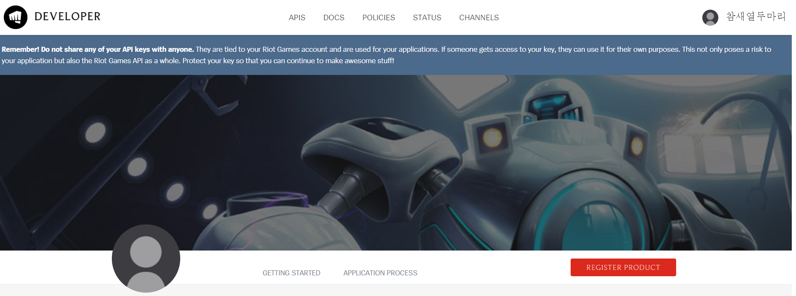
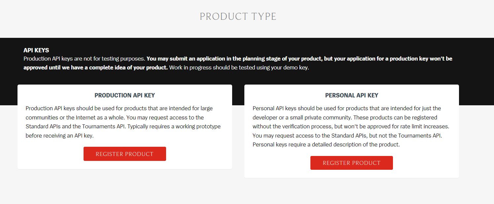

### TFT

(필자의 프로필, 이번 시즌 처음으로 패스를 끝까지 진행했다.)

흔히 롤토체스라고 불리는 게임으로, 필자가 즐겁게 하고 있는 게임이다.

시즌 2 때 부터 즐기고 있는데, 이번 시즌에 추가된 새로운 시스템들이 다양해서, 시간이 지나도 게임이 질리지 않는다. 

일반 게임보다 랭크 게임을 선호하고 필자의 랭크는 플레티넘 2다. (매우매우 낮고 많이 못한다...)

플레티넘 이전에는 티어 덱 몇개를 알고 있는 상태로 많은 게임을 하면 자연스럽게 순위방어와 1위를 할 수 있었는데, 이 구간쯤 들어오니 아래 티어에서 했던 플레이로는 아무것도 못하고 8위를 하는 사태를 겪었다... 

게임에도 공부가 필요하다고 판단하여 여러 유튜브를 보면서 공부 중에, 라이엇은 게임 데이터를 개인에게 api로 제공한다는 것을 알게 되었다. 이를 보고

TFT 게임 데이터를 분석해보면 어떨까?

라고 생각을 하였다.

메타를 주름잡고 있는 덱의 승률과, 순위방어율를 매주 시각화를 하고, 패치의 영향, 결과를 데이터를 통해 분석할 수 있다면, TFT 메타 흐름 파악에 큰 도움이 될 것이라고 생각이 들었다.

또한 TFT 데이터 분석 결과를 제공하는 사이트들 (ex: [롤체지지](https://lolchess.gg/))에서도 메타 덱과 천상계 플레이 결과, 추천 아이템만 제공할 뿐, 메타 덱에 대한 시각화 자료는 제공하지 않았다. 

따라서 side project로, tft 데이터를 시각화하고 가능하다면 통계적 분석까지 해볼 예정이다. 이를 통해 데이터 다루는 방법과 시각화 방법에 대해서 부가적으로 공부할 것이고, 추가적으로 TFT 랭크가 올랐으면 좋겠다! 

이 포스트에서는 project 시작 배경과 api 신청 과정을 포스팅할 것이다. 

### 1. API 신청하기

TFT api를 신청하기 위해서는 먼저 라이엇 게임즈 아이디가 필요하다. (league of legend나 TFT, Legend of Runeterra를 즐기는 사람이라면 이미 아이디가 있을 것이다.)

아이디가 없다면 아이디를 생성하고, 아이디가 있다면 [Riot Developer Portal](https://developer.riotgames.com/)  홈페이지에 들어가서 로그인을 하면 된다.

그럼 다음과 같은 사이트가 뜨고, register product 버튼을 클릭하여 api를 신청할 수 있다. 

신청을 클릭하면 두 타입 중 하나를 선택해야 한다. 

Production API key

공개서비스를 제공할 때 필요한 API Key이다. 어플리케이션이나 웹사이트에 데이터를 이용한 결과물을 제공할 때 사용한다. 필자는 분석 결과를 이 블로그에 올릴 예정이므로 이 타입을 선택했다.

Personal API key

개발자 개인 혼자 사용하거나 소규모 비공개 그룹에 제공할 제품을 만들 때 사용하는 API Key이다.

두 타입 중 원하는 타입을 선택하여, 신청서를 작성하여 제출하면 완료되고, riot games에서 확인 후 승인을 받을 때까지 기다리면 된다. (필자는 지금 기다리는 중이다.)

(승인이 되는대로 추가로 포스트 예정입니다.)